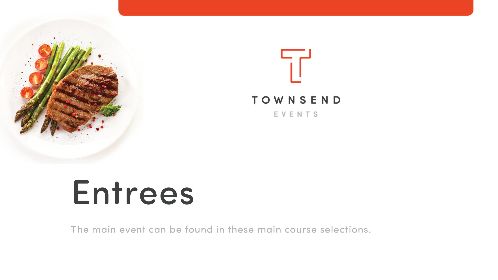
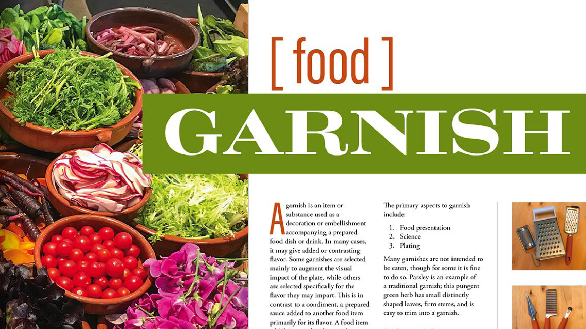

# Visão geral do Acrobat de 60 segundos

O Acrobat de 60 segundos oferece tutoriais em tamanho reduzido para ajudar você a aprender um novo truque no Acrobat em um minuto ou menos. Essas dicas baseadas em tarefas ajudam você a adquirir novas habilidades para trabalhar com arquivos de PDF, desbloqueando algumas das gems ocultas do Acrobat. Você pode assistir a um deles para obter uma resposta rápida ou assistir a cinco para aumentar a produtividade do seu documento, e ainda ter tempo para aproveitar a pausa para o café.

## Tutoriais do Acrobat de 60 segundos

## Editar

<table style="table-layout:fixed">
<tr>
   <td>
    
  </td>
  <td>
    
  </td>
  <td>
    
  </td>
   <td>
    
  </td>
</tr>
<tr>
  <td>
    
  </td>
  <td>
    
  </td>
  <td>
      
        

         
  </td>
  <td>
      
        

         
  </td>
</tr>
</table>

## Converter

<table style="table-layout:fixed">
<tr>
  <td>
    
  </td>
 <td>
    
  </td>
  <td>
    
  </td>
  <td>
    
  </td>
</tr>
</table>

## Criar

<table style="table-layout:fixed">
<tr>
  <td>
    
  </td>
  <td>
    
  <td>
    
  </td>
  <td>
      
  </td>
</tr>
<tr>
  <td>
    
  </td>
  <td>
      
  </td>
  <td>
      
        

         
  </td>
  <td>
      
        

         
  </td>
</tr>
</table>

## Assinar

<table style="table-layout:fixed">
<tr>
  <td>
    
  </td>
  <td>
      
        

         
  </td>
  <td>
      
        

         
  </td>
  <td>
      
        

         
  </td>
</tr>
</table>

## Proteger

<table style="table-layout:fixed">
<tr>
  <td>
    
  </td>
  <td>
    
  </td>
  <td>
      
        

         
  </td>
  <td>
      
        

         
  </td>
</tr>
</table>

## Compartilhar e revisar

<table style="table-layout:fixed">
<tr>
  <td>
    
  </td>
  <td>
    
  </td>
  <td>
    
  </td>
   <td>
    
  </td>
</tr>
</table>

## Preparar

<table style="table-layout:fixed">
<tr>
  <td>
    
  </td>
 <td>
    
  </td>
  <td>
      
        

         
  </td>
  <td>
      
        

         
  </td>
</tr>
</table>

## Tópicos adicionais

<table style="table-layout:fixed">
<tr>
  <td>
    
  </td>
 <td>
    
  </td>
  <td>
      
        

         
  </td>
  <td>
      
        

         
  </td>
</tr>
</table>