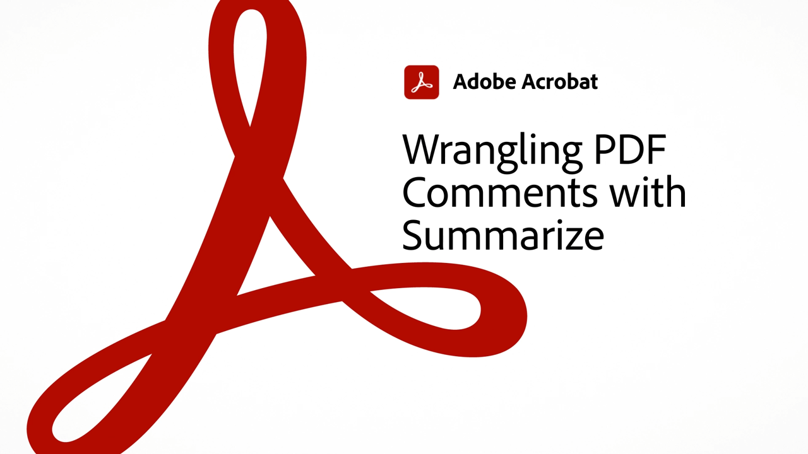
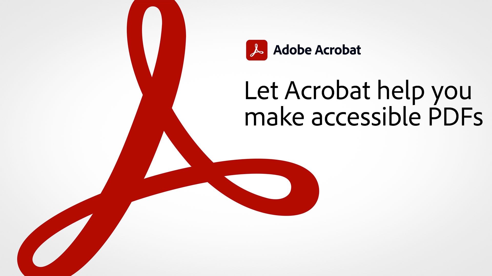

# Visão geral do Acrobat de 60 segundos

O Acrobat de 60 segundos oferece tutoriais detalhados para ajudar você a aprender um novo truque no Acrobat em um minuto ou menos. Essas dicas baseadas em tarefas ajudam você a aprender novas habilidades para trabalhar com arquivos PDF, desbloqueando algumas das gems ocultas do Acrobat. Você pode assistir a um para obter uma resposta rápida ou assistir a cinco para aumentar a produtividade de seus documentos, sem perder tempo aproveitando o café da manhã.

## Tutoriais do Acrobat de 60 segundos

## Editar

<table style="table-layout:fixed">
<tr>
   <td>
    
    

    <a href="edit.md"><strong>Editar PDF com o Acrobat Web</strong></a>
    

    <em>Faça edições simples em texto e imagens sem baixar o PDF</em>
     
  </td>
  <td>
    
    

     <a href="textrecognition.md"><strong>Reconhecer texto em um arquivo PDF digitalizado</strong></a>
    

    <em>Converter um PDF digitalizado para que você possa procurar texto no PDF</em>
     
  </td>
  <td>
    
    

    <a href="combine-to-one-pdf.md"><strong>Combinar arquivos em um PDF</strong></a>
    

    <em>Crie rapidamente um novo documento combinando vários tipos diferentes de arquivos em um único PDF</em>
     
  </td>
   <td>
    
    

    <a href="organize.md"><strong>Organize páginas em um piscar de olhos</strong></a>
    

    <em>Aprenda a usar a ferramenta Organizar páginas para ter uma visão panorâmica da sua PDF</em>
     
  </td>
</tr>
<tr>
  <td>
    
    

    <a href="editphoto.md"><strong>Editar uma foto na PDF</strong></a>
    

    <em>Saiba mais sobre como fazer edições avançadas em uma foto em seu PDF usando o Photoshop</em>
     
  </td>
  <td>
    
    

    <a href="editgraphic.md"><strong>Editar um gráfico no PDF</strong></a>
    

    <em>Saiba como fazer edições avançadas em um gráfico no seu PDF usando o Illustrator</em>
     
  </td>
  <td>
      
        

         
  </td>
  <td>
      
        

         
  </td>
</tr>
</table>

## Converter

<table style="table-layout:fixed">
<tr>
  <td>
    
    

    <a href="convert-pdf-word.md"><strong>Converter um PDF em Word</strong></a>
    

    <em>Converter um arquivo PDF em um documento do Microsoft Word totalmente editável</em>
     
  </td>
 <td>
    
    

    <a href="convert-pdf-excel.md"><strong>Converter um PDF em Excel</strong></a>
    

    <em>Converter um arquivo PDF em um documento totalmente editável do Microsoft Excel</em>
     
  </td>
  <td>
    
    

    <a href="convert-pdf-powerpoint.md"><strong>Converter um PDF em PowerPoint</strong></a>
    

    <em>Converter um arquivo PDF em um documento do Microsoft PowerPoint totalmente editável</em>
     
  </td>
  <td>
    
    

    <a href="exportwordphone.md"><strong>Export PDF para Word no telefone</strong></a>
    

    <em>Converta um arquivo PDF em um documento do Microsoft Word totalmente editável com o aplicativo Acrobat para dispositivos móveis</em>
     
  </td>
</tr>
</table>

## Criar

<table style="table-layout:fixed">
<tr>
  <td>
    
    

     <a href="word-to-pdf.md"><strong>Criar um PDF a partir do Microsoft Word</strong></a>
    

    <em>Criar um PDF a partir do Microsoft Word</em>
     
  </td>
  <td>
    
    

     <a href="create-from-acrobat.md"><strong>Criar PDF do Acrobat</strong></a>
    

    <em>Crie PDF a partir de arquivos do Microsoft 365 diretamente no aplicativo de desktop Acrobat</em>
     
  </td>
  <td>
    
    

     <a href="wordform.md"><strong>Converter Word em PDF incluindo campos de formulário</strong></a>
    

    <em>Converta arquivos e formulários do Word em PDF e crie campos de formulário automaticamente</em>
     
  </td>
  <td>
      
      

      <a href="photo.md"><strong>Crie uma PDF de fotos em um instante</strong></a>
      

      <em>Saiba como arrastar e soltar um monte de JPG no ícone do Acrobat para criar um PDF</em>
       
  </td>
</tr>
<tr>
  <td>
    
    

    <a href="phone.md"><strong>Converta um arquivo PPT em PDF no telefone</strong></a>
    

    <em>Saiba como converter um anexo de email do PowerPoint em PDF no telefone</em>
     
  </td>
  <td>
      
      

      <a href="optimize.md"><strong>Crie arquivos PDF mais eficientes em um piscar de olhos</strong></a>
      

      <em>Use a ferramenta Optimize PDF para reduzir significativamente o tamanho dos arquivos PDF</em>
       
  </td>
  <td>
      
        

         
  </td>
  <td>
      
        

         
  </td>
</tr>
</table>

## Assinar

<table style="table-layout:fixed">
<tr>
  <td>
    
    

    <a href="sign.md"><strong>Assinar eletronicamente um documento em papel</strong></a>
    

    <em>Aprenda a usar o Adobe Scan para assinar um formulário impresso</em>
     
  </td>
  <td>
      
        

         
  </td>
  <td>
      
        

         
  </td>
  <td>
      
        

         
  </td>
</tr>
</table>

## Proteger

<table style="table-layout:fixed">
<tr>
  <td>
    
    

    <a href="protect.md"><strong>Protect seus arquivos PDF com uma senha</strong></a>
    

    <em>Protect um PDF para que uma senha seja necessária para abrir ou editar o PDF</em>
     
  </td>
  <td>
    
    

    <a href="redaction.md"><strong>Redação: O caminho certo</strong></a>
    

    <em>Conheça a maneira correta de remover informações confidenciais de um PDF</em>
     
  </td>
  <td>
      
        

         
  </td>
  <td>
      
        

         
  </td>
</tr>
</table>

## Compartilhar e revisar

<table style="table-layout:fixed">
<tr>
  <td>
    
    

    <a href="share-comment.md"><strong>Compartilhar um PDF para comentários</strong></a>
    

    <em>Saiba como compartilhar uma PDF para coletar rapidamente feedback de várias pessoas em um único arquivo</em>
     
  </td>
  <td>
    
    

    <a href="share-comment-teams.md"><strong>Compartilhar e comentar em arquivos PDF no Teams</strong></a>
    

    <em>Saiba como colaborar em tempo real em um arquivo PDF em Microsoft Teams</em>
     
  </td>
  <td>
    
    

    <a href="summarize-comments.md"><strong>Comentários de PDF conflitantes com Resumir</strong></a>
    

    <em>Saiba como criar um resumo de todos os comentários e marcações no arquivo PDF</em>
     
  </td>
   <td>
    
    

    <a href="indesign.md"><strong>Carregar comentários de PDF no InDesign</strong></a>
    

    <em>Saiba como carregar comentários de PDF de volta no InDesign após uma revisão compartilhada do Acrobat</em>
     
  </td>
</tr>
</table>

## Preparar

<table style="table-layout:fixed">
<tr>
  <td>
    
    

    <a href="accessible.md"><strong>Deixe o Acrobat ajudá-lo a tornar PDF acessíveis</strong></a>
    

    <em>Verifique se um PDF está acessível</em>
     
  </td>
 <td>
    
    

    <a href="conform.md"><strong>Conformar um PDF a um formato padrão</strong></a>
    

    <em>Saiba como validar o conteúdo do PDF em relação aos critérios padrão do PDF, como PDF/X, PDF/A ou PDF/E</em>
     
  </td>
  <td>
      
        

         
  </td>
  <td>
      
        

         
  </td>
</tr>
</table>

## Tópicos adicionais

<table style="table-layout:fixed">
<tr>
  <td>
    
    

     <a href="compare.md"><strong>Encontre as diferenças com o PDF Compare</strong></a>
    

    <em>Saiba como detectar as diferenças entre dois arquivos PDF usando a ferramenta Comparar arquivos no Acrobat</em>
     
  </td>
 <td>
    
    

     <a href="search.md"><strong>Pesquisar vários arquivos PDF de uma vez</strong></a>
    

    <em>Inicie uma pesquisa em um arquivo PDF, abra a Pesquisa avançada e pesquise uma pasta inteira de arquivos PDF</em>
     
  </td>
  <td>
      
        

         
  </td>
  <td>
      
        

         
  </td>
</tr>
</table>