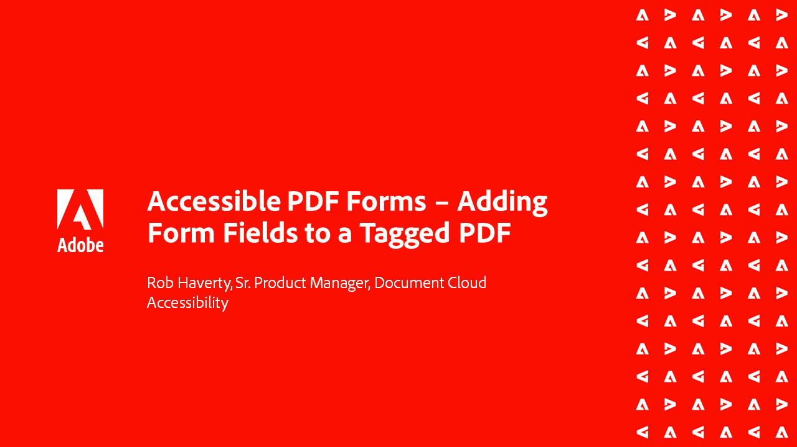

# Série Acessibilidade do Acrobat

Nesta série de webinários sob demanda em seis partes, vá do básico de Acessibilidade para um aprofundamento da marcação de seus arquivos de PDF. Cada sessão inclui arquivos de prática para acompanhar.

<table style="table-layout:fixed">
<tr>
  <td>
    
    

    <a href="accessibilitysession1.md"><strong>Introdução à Acessibilidade PDF</strong></a>
    

    <em>Nesta sessão por demanda, saiba o que significa tornar um PDF acessível, como configurar o Acrobat Pro (Premium ou Studio) para trabalhar em PDF para acessibilidade e o processo de conversão de um documento de origem em um PDF</em>
     
  </td>
  <td>
    
    

    <a href="accessibilitysession2.md"><strong>Corrigindo um PDF inacessível</strong></a>
    

    <em>Nesta sessão por demanda, saiba mais sobre o fluxo de trabalho para converter um documento do Word e corrigir alguns problemas básicos de marcação usando as ferramentas do Acrobat Pro (Premium ou Studio) mostradas no webinário de introdução</em>
     
  </td>  
  <td>
    
    

    <a href="accessibilitysession3.md"><strong>Tabelas complexas</strong></a>
    

    <em>Esta sessão por demanda resolve um dos problemas mais comuns e desafiadores na correção de um PDF de acessibilidade — tabelas complexas</em>
     
  </td>
</tr>
<tr>
  <td>
    
    

    <a href="accessibilitysession4.md"><strong>Documentos digitalizados e listas complexas</strong></a>
    

    <em>Esta sessão por demanda aborda os problemas mais complexos que as pessoas costumam enfrentar, como documentos digitalizados e listas complexas</em>
     
  </td>
  <td>
    
    

    <a href="accessibilitysession5.md"><strong>Adicionando campos de formulário a um PDF marcado</strong></a>
    

    <em>Esta sessão por demanda se concentra em adicionar campos de formulário a um PDF marcado anteriormente</em>
     
  </td>  
  <td>
    
    

    <a href="accessibilitysession6.md"><strong>Adicionando campos de formulário a um PDF não marcado</strong></a>
    

    <em>Esta sessão por demanda aprofunda-se na criação de campos de formulário manuais e propriedades adicionais de campos de formulário</em>
     
  </td> 
</tr>
</table>
