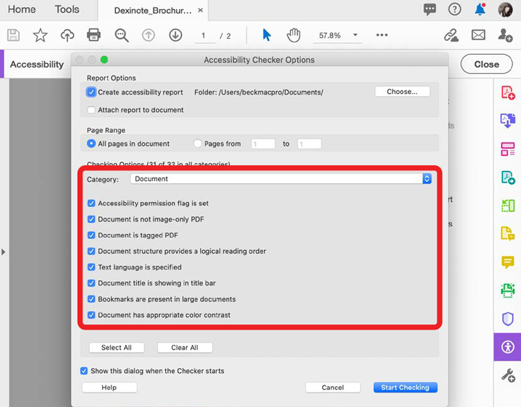

# Verificar acessibilidade do PDF

Saiba como verificar se o seu PDF é universalmente acessível a pessoas com deficiência, incluindo pessoas com deficiência motora, cegas, baixa visão, surdas, com deficiência auditiva ou com deficiência cognitiva.

>[!NOTE]
>
>Disponível somente no Acrobat Pro, Premium ou Studio.

## Verificação de acessibilidade

1. Selecione **[!UICONTROL Acessibilidade]** no centro de Ferramentas ou no painel à direita.

   

1. Selecione **[!UICONTROL Verificação de acessibilidade]** no painel à direita.

   

1. Selecione uma categoria na lista suspensa e itens na lista de verificação.

   Deixe cada caixa marcada para um relatório completo.

1. Selecione **[!UICONTROL Iniciar Verificação]** para iniciar o relatório.

   

   O painel de navegação esquerdo é aberto para mostrar os resultados do relatório. Expanda uma seção para ver os detalhes.

   

Você também pode usar a ação [!UICONTROL Tornar acessível] na ferramenta [Action Wizard](https://experienceleague.adobe.com/docs/document-cloud-learn/acrobat-learning/advanced-tasks/action.html), que passa por um conjunto básico de etapas para criar um PDF acessível.

## Corrigir problemas de acessibilidade

Na janela do relatório de acessibilidade, clique com o botão direito do mouse em um item para abrir o menu de contexto. O menu de contexto para qualquer item com falha na verificação de acessibilidade oferece a opção de corrigir o problema.

>[!NOTE]
>
>Alguns problemas não podem ser corrigidos automaticamente e exigem intervenção manual para corrigi-los. Nesses casos, > Acrobat apresenta uma caixa de diálogo informando o que corrigir.