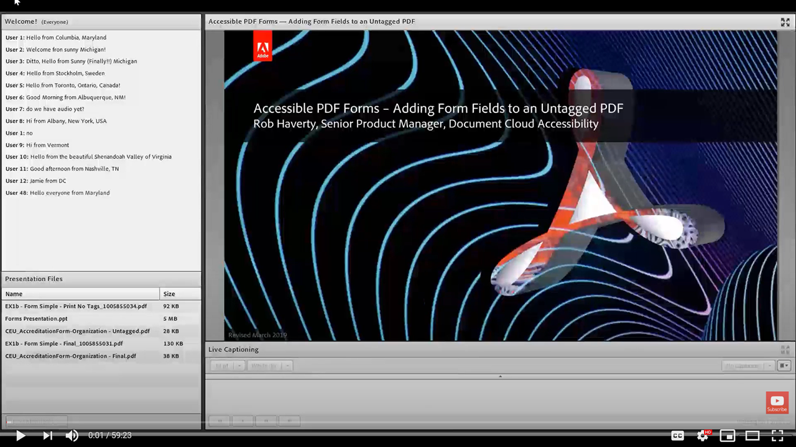

# Adição de campos de formulário a um PDF não marcado

Esta sessão por demanda se aprofunda na criação manual de campos de formulário e em propriedades adicionais de campos de formulário.

Clique em [aqui](../assets/accessibilitysession6.zip) para baixar um arquivo zip dos arquivos práticos desta sessão.

Selecione a imagem para exibir o vídeo em uma guia separada do navegador.

{target="_blank"}
