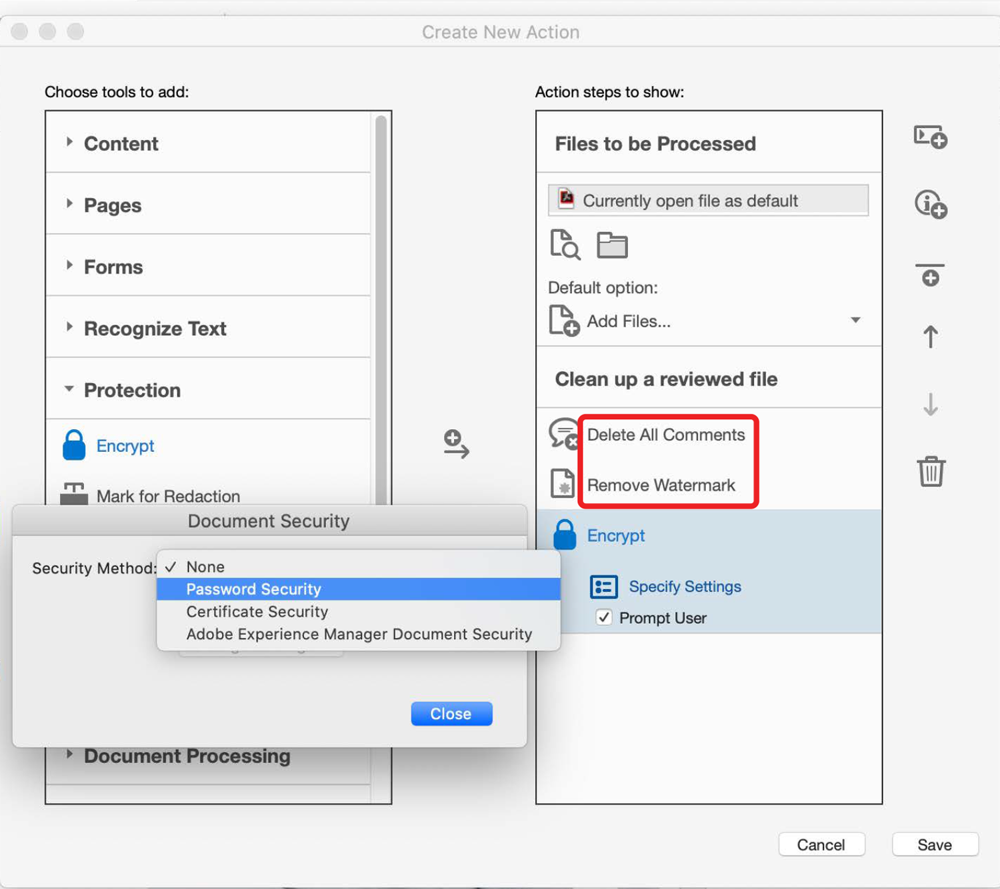

# Action Wizard

Oferecer as melhores experiências do cliente requer que o conteúdo seja criado mais rápido do que nunca. Poupe tempo e teclas usando uma Ação para aplicar automaticamente um conjunto de comandos a um ou vários arquivos.

>[!NOTE]
>
>Disponível somente no Acrobat Pro.

1. Selecionar **[!UICONTROL Action Wizard]** do [!UICONTROL Ferramentas] painel central ou à direita.

   

   As ações predefinidas são exibidas no **Lista de Ações**.

1. Selecionar **[!UICONTROL Nova ação]** no menu superior para criar uma ação personalizada.

   

1. Selecione uma tarefa na lista à esquerda e, em seguida, selecione a seta central para adicioná-la à coluna à direita na **[!UICONTROL Criar nova ação]** caixa de diálogo.

   *As configurações de cada tarefa são predeterminadas nessa caixa de diálogo ou você pode solicitar que o usuário tome qualquer decisão necessária à medida que a ação é executada.*

   

1. Selecionar **[!UICONTROL Salvar]** e nomeie a ação para que ela apareça na caixa **[!UICONTROL Lista de Ações]**.

Agora você pode executar a ação personalizada sempre que precisar executar essas séries específicas de etapas em um ou mais arquivos PDF.

>[!TIP]
>
>Este vídeo faz parte do curso [Trabalhe com mais inteligência com o Acrobat DC e o Microsoft 365](https://experienceleague.adobe.com/?recommended=Acrobat-U-1-2021.microsoft365) que está disponível gratuitamente no Experience League!
