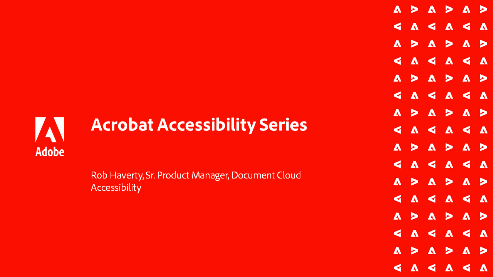

# Visão geral das tarefas avançadas

Vá além dos conceitos básicos com essas ferramentas avançadas no Acrobat DC. Saiba como criar uma ação para repetir tarefas comuns, remover informações confidenciais, reduzir e otimizar arquivos grandes, reunir rapidamente dados de formulário e criar arquivos de PDF universalmente acessíveis.

## Tutoriais da Acrobat

<table style="table-layout:fixed">
<tr>
  <td>
    
    

    <a href="enhance.md"><strong>Aprimore seu PDF</strong></a>
    

    <em>Transforme sua PDF adicionando aprimoramentos gráficos e numeração automática</em>
     
  </td>
  <td>
    
    

    <a href="compare.md"><strong>Detectar diferenças entre dois PDF</strong></a>
    

    <em>Detecte com rapidez e precisão as diferenças entre dois arquivos de PDF para melhorar os fluxos de trabalho de revisão de documentos</em>
     
  </td>
  <td>
    
    

    <a href="action.md"><strong>Action Wizard</strong></a>
    

    <em>Economize tempo e pressionamentos de tecla usando uma ação para aplicar automaticamente um conjunto de comandos a um ou vários arquivos</em>
     
  </td>  
</tr>
<tr>
  <td>
    
    

    <a href="redact.md"><strong>Redact &amp; Sanitize</strong></a>
    

    <em>Remova permanentemente as informações privadas ou confidenciais do seu PDF</em>
     
  </td>
  <td>
    
    

    <a href="reduce.md"><strong>Reduza o tamanho do arquivo e otimize</strong></a>
    

    <em>Reduza arquivos grandes e otimize suas PDF sem comprometer a qualidade para compartilhamento, publicação ou arquivamento</em>
     
  </td>
  <td>
    
    

    <a href="formdata.md"><strong>Trabalho com dados de formulário</strong></a>
    

    <em>Compilar dados de formulário em uma única planilha</em>
     
  </td>
</tr>
<tr>
  <td>
    
    

    <a href="accessibility.md"><strong>Verificar acessibilidade de PDF</strong></a>
    

    <em>Saiba como verificar se seu PDF é universalmente acessível a pessoas com deficiência</em>
     
  </td>
  <td>
    
    

    <a href="accessibility-series.md"><strong>Série Acrobat Accessibility</strong></a>
    

    <em>Nesta série de webinários sob demanda de seis partes, vá dos conceitos básicos de acessibilidade a um profundo mergulho de marcação de arquivos de PDF</em>
     
  </td>
  <td>
   
    

     
  </td>
</tr>
</table>
