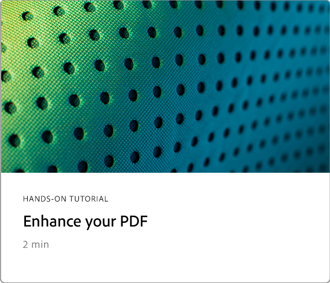
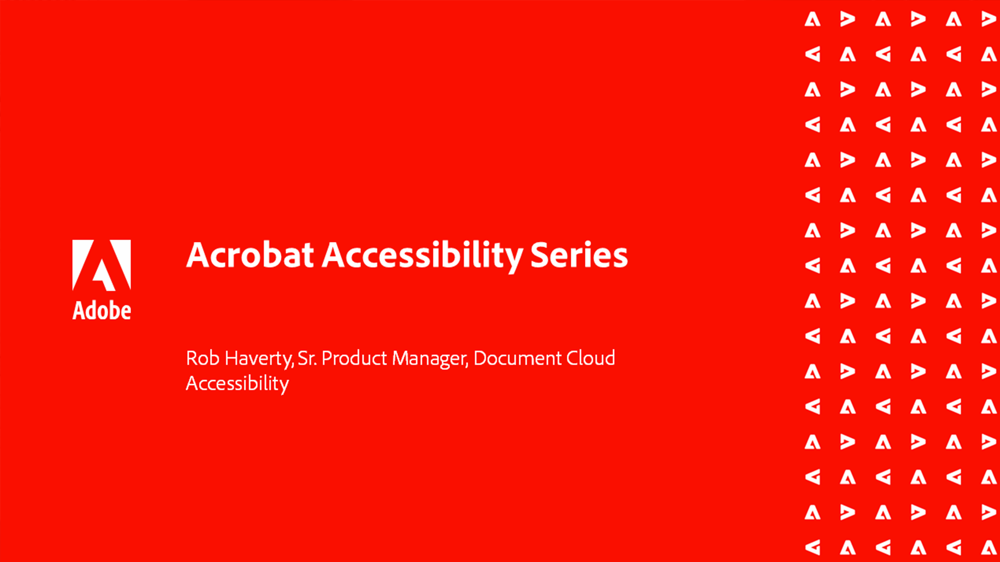

# Visão geral de tarefas avançadas

Vá além do básico com essas ferramentas avançadas no Acrobat. Saiba como criar uma Ação para repetir tarefas comuns, remover informações confidenciais, reduzir e otimizar arquivos grandes, coletar dados de formulários rapidamente e criar arquivos PDF acessíveis universalmente.

## Novidades

* [Optimize PDF para SEO (Otimização do Mecanismo de Pesquisa)](optimizeseo.md)
Saiba como otimizar um PDF para melhorar a capacidade de descoberta e a classificação do mecanismo de pesquisa na Web

## Tutoriais de tarefas avançadas

<table style="table-layout:fixed">
<tr>
  <td>
    
  </td>
  <td>
    
  </td>
  <td>
    
  </td>
  <td>
    
  </td>
</tr>
<tr>
 <td>
    
  </td>
  <td>
    
  </td>
  <td>
    
  </td>
 <td>
    
  </td>
</tr>
<tr>
  <td>
    
  </td>
  <td>
    
  </td>
 <td>
    
  </td>
  <td>
    
  </td>
</tr>
<tr>
 <td>
    
  </td>
 <td>
    
  </td>
  <td>
   
    

     
  </td> 
  <td>
   
    

     
  </td>  
</tr>
</table>
