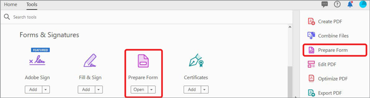
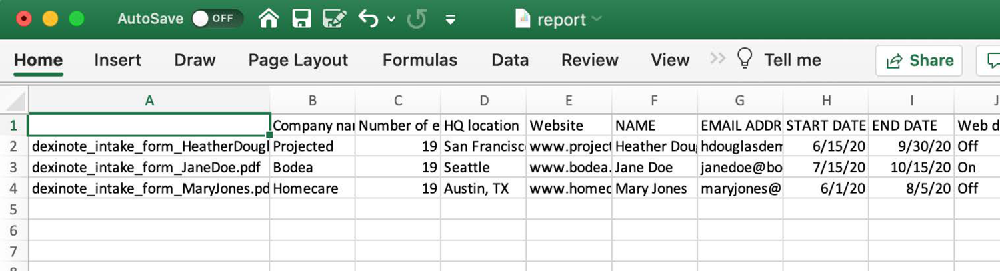

# Trabalhar com dados de formulário

Se você tiver um conjunto de formulários preenchidos e precisar compilar os dados, poderá usar o Acrobat para mesclar as respostas em uma única planilha.

1. Comece colocando todos os seus PDF forms concluídos em uma pasta no computador.

   

1. Abra um dos arquivos de formulário preenchidos e selecione **[!UICONTROL Prepare Form]** no centro de Ferramentas ou no painel à direita.

   

1. Selecione **[!UICONTROL Mais]** **>** **[!UICONTROL Mesclar Arquivos de Dados em Planilha]** no painel à direita.

   

1. Selecione a pasta criada com os formulários preenchidos.

   O Acrobat extrai os dados de cada formulário e cria uma planilha com todos os dados.

   
