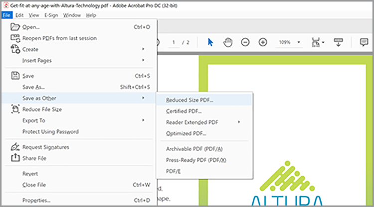

# Optimize PDF para SEO (Otimização do Mecanismo de Pesquisa)

Saiba como otimizar uma PDF para melhorar a descoberta e a classificação dos mecanismos de pesquisa na Web.

## 1. Crie conteúdo exclusivo

Crie conteúdo PDF diferente das informações das páginas da Web.

+++Exibir detalhes sobre como criar conteúdo exclusivo

O conteúdo de PDF deve ser único e estruturado da seguinte forma:

* Usar um único título/título principal começando com uma palavra-chave
* Usar subtítulos de palavras-chave organizados em uma estrutura hierárquica
* Usar parágrafos curtos contendo palavras-chave e listas
* Adicionar hiperlinks internos e externos (conteúdo no seu site ou em outros sites)
* Adicionar um sumário com hiperlink para documentos com mais de 25 páginas
* Executar [reconhecimento de texto](https://experienceleague.adobe.com/docs/document-cloud-learn/acrobat-learning/getting-started/scan-and-ocr.html) em todos os documentos digitalizados
* Crie PDF que sejam compatíveis com dispositivos móveis Para verificar a experiência de exibição móvel do seu PDF, abra o arquivo no [aplicativo Acrobat Reader para dispositivos móveis](https://www.adobe.com/acrobat/mobile/acrobat-reader.html) e ative o Liquid Mode. Inclua subposições adicionais se necessário para melhorar a navegação.

  

+++

  

## 2. Adicionar Propriedades do Documento

Os arquivos PDF têm um título e uma descrição meta, assim como uma página da Web.

+++Exibir detalhes sobre como adicionar Propriedades do Documento

Adicionar chave **[!UICONTROL Propriedades do documento]** do seguinte modo:

1. Selecionar **[!UICONTROL Arquivo > Propriedades]** ou use o atalho de teclado *Ctrl+D* no Windows ou *Cmd+D* no Mac e selecione o **[!UICONTROL Descrição]** guia.
1. Insira um título otimizado por palavra-chave no **[!UICONTROL Título:]** campo.
1. Verifique se o **[!UICONTROL Autor:]** não identifica um indivíduo específico na sua organização.
1. Insira um resumo otimizado por palavra-chave do seu documento no **[!UICONTROL Assunto:]** campo.
Tente iniciar o resumo usando um verbo de ação como Aprender, Descobrir, Explorar etc.
1. Selecionar **[!UICONTROL Metadados adicionais]** adicionar informações de copyright ou domínio público, se aplicável.

   

+++

  

## 3. Marque sua PDF

Marcar conteúdo no seu PDF não apenas cria o arquivo [Acessível](https://experienceleague.adobe.com/docs/document-cloud-learn/acrobat-learning/advanced-tasks/accessibility.html) para pessoas com deficiência, também melhora o SEO.

+++Exibir detalhes sobre como marcar um PDF

Marque um PDF da seguinte maneira:

1. Selecionar **[!UICONTROL Acessibilidade]** no **[!UICONTROL Ferramentas]** central.
1. Selecionar **[!UICONTROL Marcar Documento Automaticamente]** no painel direito.
1. Siga as dicas de reparo no painel esquerdo **[!UICONTROL Relatório de reconhecimento]**.
1. Executar **[!UICONTROL Definir texto alternativo]** se necessário.
1. Use palavras-chave para descrever a imagem no **[!UICONTROL Texto alternativo]**.

   

+++

>[!NOTE]
>
>Disponível somente no Acrobat Pro.

  

## 4. Prepare-se para a Web

Otimize a experiência de interação com seu PDF preparando-o para exibição na Web e [reduzindo o tamanho do arquivo PDF](https://www.adobe.com/br/acrobat/online/compress-pdf.html){target="_blank"}.

+++Exibir detalhes sobre como preparar seu PDF para a Web

Prepare seu PDF para a Web da seguinte maneira:

Para preparar seu PDF para a Web, selecione **[!UICONTROL Arquivo > Salvar como outro > PDF de tamanho reduzido]**.

Essa etapa reduz o tamanho do arquivo e permite **Modo de Exibição Rápida da Web** no PDF. **Modo de Exibição Rápida da Web** permite que o arquivo seja aberto, visualizado e pesquisado imediatamente antes que todo o arquivo seja transmitido ou baixado, criando uma experiência ideal para o usuário final. Abrir **[!UICONTROL Propriedades do documento]** (*Ctrl+D* no Windows ou *Cmd+D* no Mac) para determinar se **Modo de Exibição Rápida da Web** está ativado.

>[!TIP]
>
>Se você tiver o Acrobat Pro, execute Otimizar para Web e dispositivos móveis na ferramenta Action Wizard. Esta ação converte cores em sRGB e incorpora fontes para a exibição consistente de PDF em navegadores e dispositivos móveis.

+++

  

## 5. Crie um nome de arquivo de palavra-chave

+++Exibir detalhes sobre como criar um nome de arquivo de palavra-chave

Crie um nome de arquivo de palavra-chave da seguinte maneira:

O nome do arquivo torna-se parte do URL quando um PDF é publicado na Web. Uma boa prática é combinar o título otimizado por palavra-chave com o nome do arquivo. Para ser fácil de pesquisar: use letras minúsculas, sem pontuação ou hashes e evite palavras de interrupção (a, an, the, and, it, for, or, but, in, my, your, our e their etc.). Se você usar palavras separadas, adicione hifens ou sublinhados entre as palavras.

+++

  

## 6. Proteja seu PDF

O último passo é [proteja sua PDF](https://www.adobe.com/br/acrobat/online/password-protect-pdf.html){target="_blank"} para impedir alterações não autorizadas.

+++Exibir detalhes sobre como proteger seu PDF

Proteja um PDF da seguinte maneira:

1. Abrir **[!UICONTROL Propriedades do documento]** (*Ctrl+D* no Windows ou *Cmd+D* no Mac) e selecione o **[!UICONTROL Segurança]** guia.
1. Verificar **[!UICONTROL Impressão, edição e impressão do documento. Uma senha será necessária para alterar essas configurações.]**
1. Sob **[!UICONTROL Alterações permitidas:]** selecionar **[!UICONTROL Nenhum]**.
1. Verificar **[!UICONTROL Habilite o acesso a texto para dispositivos leitores de tela para pessoas com deficiência visual.]**
1. Insira e confirme uma senha forte.
1. Selecionar **[!UICONTROL OK]** e salve o arquivo.

   

+++

Agora sua PDF está pronta para ser publicada na Web — com potencial de classificação de palavras-chave e interação do usuário final ideais.
