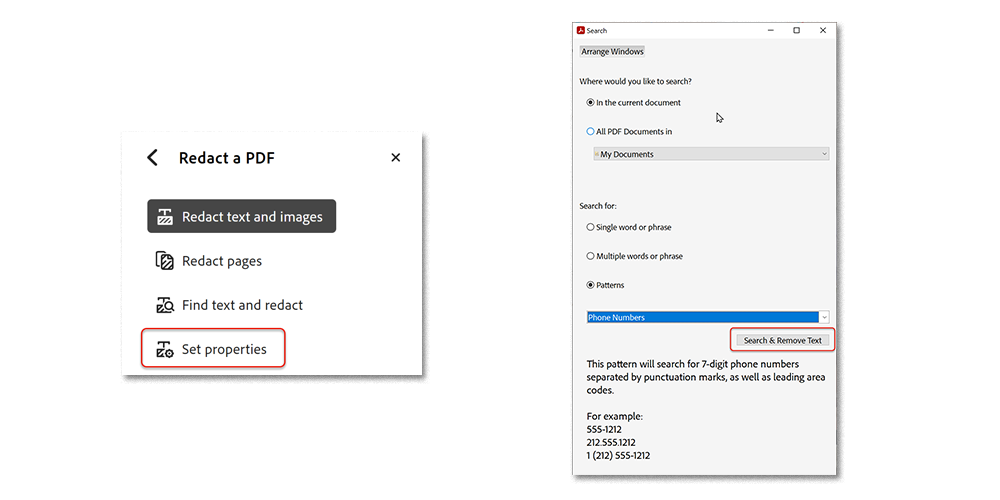

# Redact &amp; Sanitize

Aprenda a usar a ferramenta Redigir para remover permanentemente as informações confidenciais ou privadas do seu PDF. Use a ferramenta Sanitizar para remover informações que não estão visíveis no arquivo, como comentários, metadados ou camadas ocultas.

>[!NOTE]
>
>Disponível somente no Acrobat Pro DC.

## Redação de texto e imagens

1. Selecionar **[!UICONTROL Redação]** do [!UICONTROL Ferramentas] painel central ou à direita.

   

1. Selecionar **[!UICONTROL Redigir texto e imagens]** **>** **[!UICONTROL Propriedades]** para personalizar a aparência das suas redações, incluindo a cor das caixas de redação ou da sobreposição de texto.

   

   Para redigir informações, primeiro marque os itens para remoção e aplique as redações. Você pode editar páginas inteiras ou conteúdo selecionado.

1. Selecionar **[!UICONTROL Redigir páginas]**, escolha a página ou o intervalo de páginas para editar e selecione **[!UICONTROL OK]**.

   

   Ou use o cursor para selecionar o conteúdo a ser editado. Você pode ver uma visualização da redação passando o mouse sobre o conteúdo selecionado.

   

1. Selecionar **[!UICONTROL Redigir texto e imagens]** **>** **[!UICONTROL Localizar texto e redigir]** para localizar conteúdo específico para redação.

   Use a caixa de pesquisa para procurar uma palavra ou frase específica.

1. Selecionar **[!UICONTROL Padrões]** para localizar determinados tipos de informações, marque as caixas e selecione **[!UICONTROL Pesquisar e remover texto]**.

   

1. Selecionar **[!UICONTROL Aplicar]** no [!UICONTROL Redação] menu superior para aplicar as redações marcadas e salvar o arquivo redigido.

   

## Sanitizar documento

1. Selecionar **[!UICONTROL Sanitizar documento]** no [!UICONTROL Redação] menu superior.

1. Selecionar **[!UICONTROL OK]** para confirmar a remoção de informações ocultas. Ou, escolha **[!UICONTROL Clique aqui]** para remover seletivamente informações ocultas.

   

>[!TIP]
>
>Para acelerar o processo de redação, verifique o [Action Wizard](../advanced-tasks/action.md).

Selecione o ícone de PDF para baixar o *Redact &amp; Sanitize* tutorial.

.

>[!TIP]
>
>Este vídeo faz parte do curso [Trabalhe de forma mais inteligente com Acrobat DC e Microsoft 365](https://experienceleague.adobe.com/?recommended=Acrobat-U-1-2021.microsoft365) disponível gratuitamente no Experience League!
