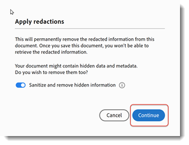

# Remover informações confidenciais

Saiba como usar a ferramenta Redigir para remover permanentemente informações confidenciais de um PDF e, em seguida, limpar o documento para remover informações não visíveis no arquivo, como comentários, metadados ou camadas ocultas. A remoção permanente de conteúdo sigiloso e dados ocultos é importante para que as informações não sejam transmitidas ao publicar sua PDF. Este tutorial usa a [Nova experiência do Acrobat](../getting-started/new-workspace.md).

>[!NOTE]
>
>Disponível somente no Acrobat Pro.

[!BADGE Impacto Organizacional]
Proteção de dados do cliente, gerenciamento de riscos

## Como redigir informações no Acrobat para desktop

1. Abra um arquivo e selecione **[!UICONTROL Todas as ferramentas]** na barra de ferramentas e escolha **[!UICONTROL Redigir um PDF]**.
   

1. Selecione **[!UICONTROL Definir propriedades]** para personalizar a aparência de suas censuras, incluindo a cor das caixas de censura ou a sobreposição do texto.

   

   Para censurar as informações, primeiro marque os itens para remoção e, em seguida, aplique as censuras. Você pode censurar páginas inteiras ou conteúdo selecionado.

1. Selecione **[!UICONTROL Redigir texto e imagens]** e use o cursor para selecionar o conteúdo a ser censurado.

   

   Você pode visualizar a redação passando o mouse sobre o conteúdo selecionado.

1. Selecione **[!UICONTROL Localizar texto e redigir]** para procurar uma palavra ou frase específica ou pesquisar um Padrão para localizar determinados tipos de informações. Defina sua pesquisa e selecione Pesquisar e remover texto.

   

1. Na caixa de diálogo de resultados da pesquisa, marque as caixas ao lado dos itens e selecione **[!UICONTROL Marcar resultados marcados para redação]**.

   

1. Selecione **[!UICONTROL Redigir páginas]** para marcar páginas inteiras para redação.

   

1. Selecione suas páginas e escolha **[!UICONTROL OK]**.

   

1. Selecione **[!UICONTROL Aplicar]** no painel Redigir um PDF para aplicar as censuras marcadas.

   

1. Selecione **[!UICONTROL Continuar]** para limpar e remover informações ocultas.

   

Depois de confirmar, as censuras e informações ocultas são removidas permanentemente e salvas em um novo arquivo.

>[!TIP]
>
>Para acelerar o processo de redação, confira o [Action Wizard](../advanced-tasks/action.md) no Acrobat Pro no desktop.
