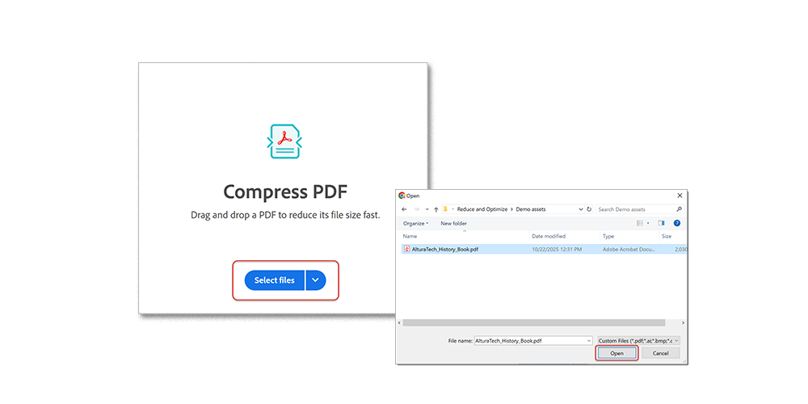
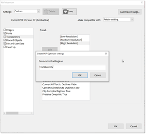

# Compactar e otimizar um PDF

Saiba como compactar e otimizar o tamanho de um arquivo de PDF. Compactar um PDF facilita o compartilhamento por email ou upload para sites com limitações de tamanho de arquivo. Você também pode aprimorar a experiência de visualização e economizar em custos de armazenamento otimizando sua PDF.

## Como compactar um PDF no Acrobat para desktop

1. Abra um arquivo e selecione **[!UICONTROL Todas as ferramentas]** na barra de ferramentas e escolha **[!UICONTROL Compactar um PDF]**.

   

1. Selecione **[!UICONTROL Arquivo único]** ou **[!UICONTROL Vários arquivos]** no painel **[!UICONTROL Compactar um PDF]**.

   

1. Clique em **[!UICONTROL Salvar]**.

   

   O arquivo é reduzido ao menor tamanho possível, sem prejudicar a qualidade do documento.

## Como compactar um PDF no Acrobat Web

1. Faça logon no [acrobat.adobe.com](https://acrobat.adobe.com/br/pt) em um navegador.

1. Selecione **[!UICONTROL Converter > Compactar um PDF]** no menu superior.

   

1. Escolha **[!UICONTROL Selecionar arquivos]**, seus arquivos e **[!UICONTROL Abrir]**.

   

1. Selecione um nível de compactação e escolha **[!UICONTROL Compactar]**.

   

## Como otimizar um PDF no Acrobat no desktop

>[!NOTE]
>
>A otimização de um PDF só está disponível no Acrobat Pro, Premium ou Studio no desktop.

1. Abra um arquivo e selecione **[!UICONTROL Todas as ferramentas]** na barra de ferramentas e escolha **[!UICONTROL Compactar um PDF]**.

   

1. Selecione **[!UICONTROL Otimização Avançada]** no painel **[!UICONTROL Compactar um PDF]**.

   

1. Na lista suspensa **Tornar compatível com**, escolha **Manter existente** para manter a versão atual do PDF ou escolha uma versão do Acrobat. Marque a caixa de seleção ao lado de um painel (por exemplo, Imagens, Fontes, Transparência), selecione as opções nesse painel, escolha **[!UICONTROL OK]** e salve o arquivo.

   

   Por padrão, o **Padrão** está selecionado no menu **Configurações**. Se você alterar qualquer configuração na caixa de diálogo Otimizador de PDF, o menu **Configurações** alternará automaticamente para **Personalizado**. Para impedir que todas as opções de um painel sejam executadas durante a otimização, desmarque a caixa de seleção desse painel.

1. (Opcional) Para salvar suas configurações personalizadas, selecione **[!UICONTROL Salvar]** e nomeie as configurações. Para excluir uma configuração salva, selecione-a no menu suspenso **Configurações** e selecione **[!UICONTROL Excluir]**.

   

>[!TIP]
>
>Para otimizar vários arquivos de PDF, tente usar o [Action Wizard](../advanced-tasks/action.md) no Acrobat Pro, Premium ou Studio no desktop.