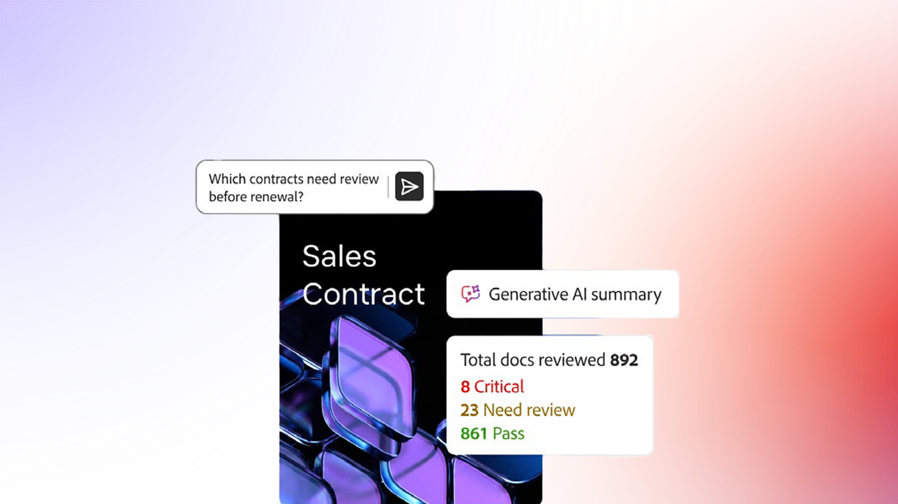
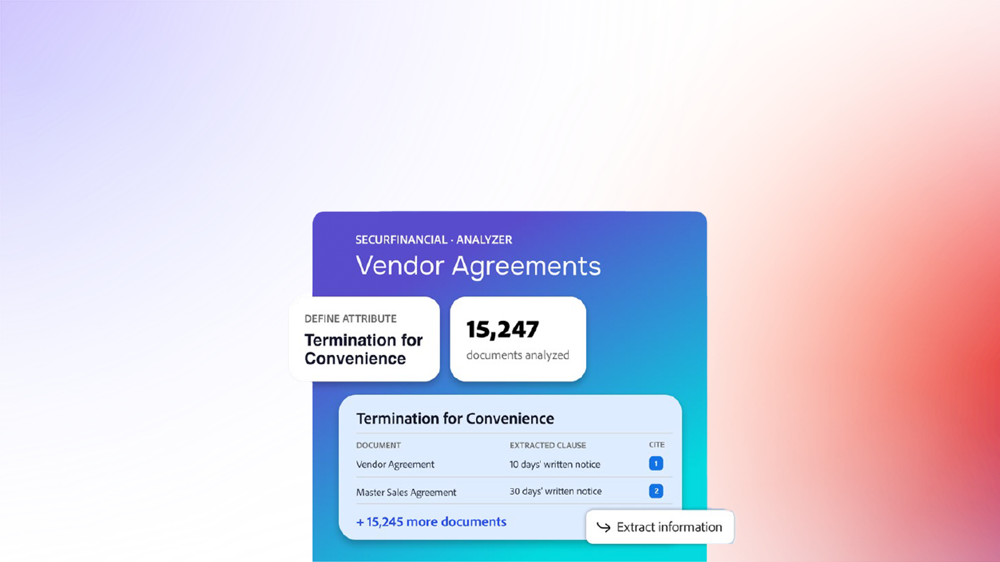
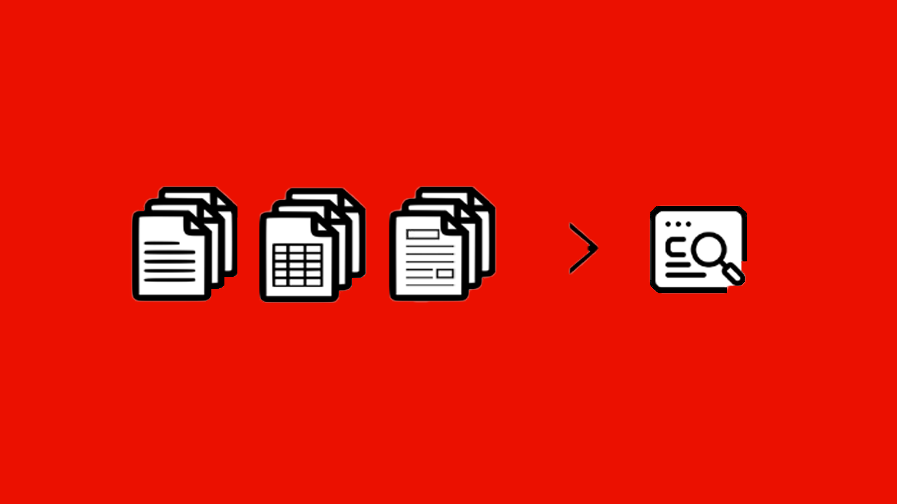

# Visão geral do Analyzer no Acrobat Studio

O Analyzer no Acrobat Studio ajuda os usuários corporativos a extrair insights estruturados e auditáveis de dezenas de milhares de documentos não estruturados para automatizar processos de negócios centrados em documentos.

## Novidades

>[!BEGINTABS]

>[!TAB Começar]

[Introdução](get-started.md) para saber como extrair dados estruturados e citados de grandes volumes de documentos.

>[!TAB Usar Coleções]

Saiba como criar [Coleções](collections.md) manuais e vinculadas, aplicar atributos e manter documentos organizados à medida que seu conteúdo cresce.

>[!ENDTABS]

## Tutoriais do Analyzer no Acrobat Studio

<table style="table-layout:fixed">
<tr>
  <td>
    
    

    <a href="get-started.md"><strong>Começar</strong></a>
    

    Saiba como o Analyzer no Acrobat Studio ajuda a extrair dados estruturados e citados de grandes volumes de documentos
     
  </td>
 <td>
    
    

    <a href="collections.md"><strong>Usar Coleções</strong></a>
    

    Saiba como criar coleções manuais e vinculadas, aplicar atributos e manter documentos organizados à medida que o conteúdo aumenta
     
  </td>
  <td>
    
    

    <a href="m-and-a-post-audit.md"><strong>Auditoria de contrato de pós-integração de fusões e aquisições</strong></a>
    

    Saiba como o Analyzer pode ajudar as empresas a executar uma auditoria de contrato de pós-integração de M&amp;A em minutos, em vez de semanas
     
  </td>
  <td>
      
      

       
    </td>
</tr>
</table>