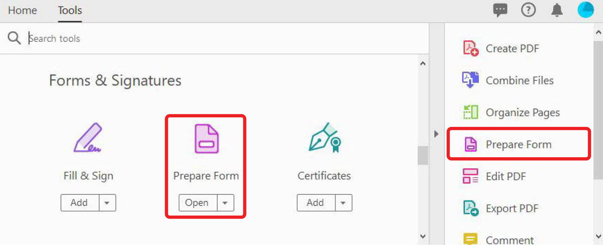
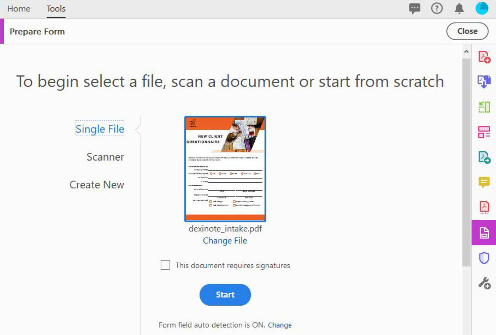

# Criar formulários preenchíveis

Transforme um formulário ou documento digitalizado criado no InDesign, no Microsoft Word, no Excel ou em outro aplicativo em um [formulário PDF preenchível](https://www.adobe.com/br/acrobat/online/sign-pdf.html).

1. Selecionar **[!UICONTROL Prepare Form]** do [!UICONTROL Ferramentas] painel central ou à direita.

   

1. Selecione um documento existente para usar como formulário (por exemplo, um arquivo do Word, Excel, InDesign ou PDF) e selecione **Iniciar**.

   

   Se [!UICONTROL Detecção automática do campo de formulário] é **ATIVADO**, os campos de formulário são detectados automaticamente no arquivo PDF. Verifique o posicionamento dos campos de formulário.

   Arraste e solte campos do menu superior e edite os detalhes dos campos de formulário no painel à direita.

1. Selecionar **[!UICONTROL Visualização]** para ver seu formulário.

   

1. Selecionar **[!UICONTROL Editar]** para continuar trabalhando ou selecione **[!UICONTROL Arquivo]** **>** **[!UICONTROL Salvar como]** para salvar o formulário PDF.

   

>[!TIP]
>
>Mergulhe fundo na criação de formulários com estes [técnicas avançadas](../advanced-tasks/advancedforms.md).