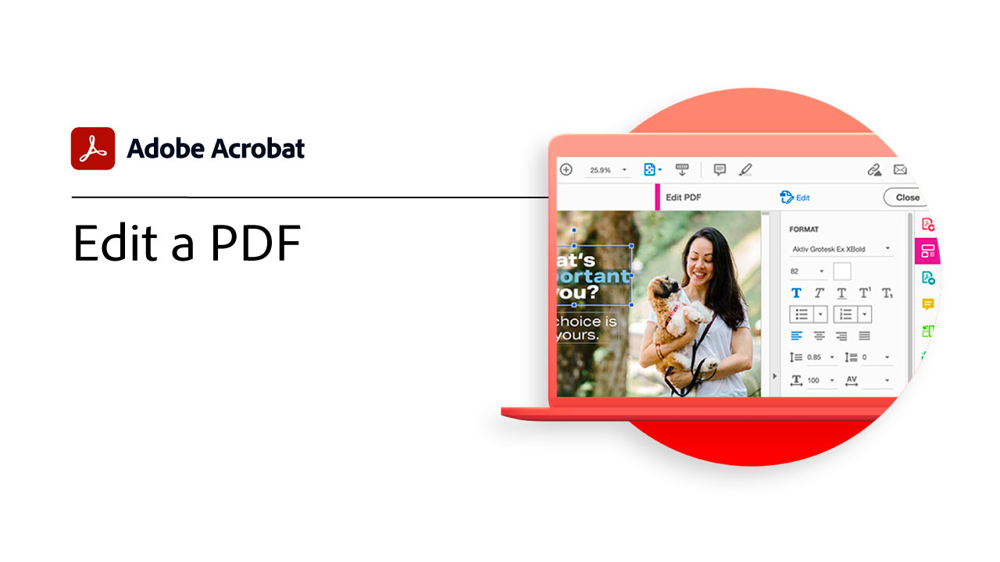
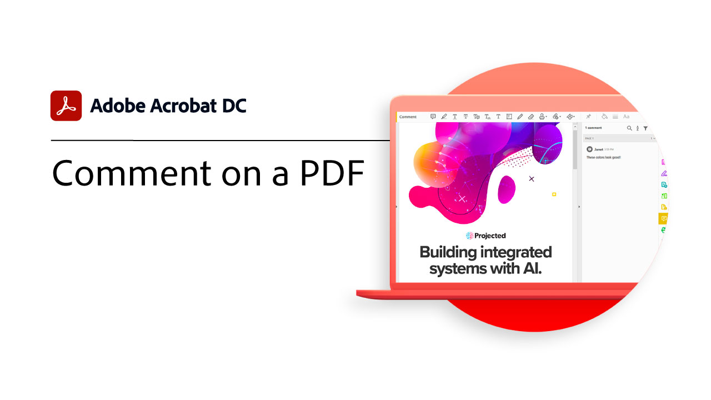

# Visão geral de introdução

Saiba como começar a usar o Adobe Acrobat por meio destes breves tutoriais passo a passo. Desde criar um documento até proteger ou [editar seus arquivos PDF](https://www.adobe.com/br/acrobat/online/pdf-editor.html){target="_blank"}, esse conteúdo foi projetado para facilitar seus fluxos de trabalho do PDF.

## Novidades

* [Trabalhe em qualquer lugar com o Acrobat Web](acrobatweb.md)
Saiba como lidar com solicitações de documentos comerciais de qualquer lugar usando as ferramentas da Web do Acrobat no navegador
* [Colaborar em tempo real](collaborate.md)
Avance seus projetos coletando comentários, colaborando em respostas e acompanhando o progresso em seus documentos, tudo em tempo real e de qualquer lugar

## Tutoriais de introdução

<table style="table-layout:fixed">
<tr>
  <td>
    
    

    <a href="get-to-know-the-acrobat-dc-interface.md"><strong>Noções básicas do Workspace</strong></a>
    

    <em>Veja como a área de trabalho do Acrobat facilita o acesso a arquivos e ferramentas no desktop, na Web e em dispositivos móveis</em>
     
  </td>
  <td>
    
    

    <a href="new-workspace.md"><strong>Nova experiência de espaço de trabalho</strong></a>
    

    <em>Saiba mais sobre a nova experiência de espaço de trabalho que você pode ativar no Acrobat</em>
     
  </td>
  <td>
    
    

    <a href="acrobatweb.md"><strong>Trabalhe em qualquer lugar com o Acrobat Web</strong></a>
    

    <em>Saiba como lidar com solicitações de documentos comerciais de qualquer lugar usando as ferramentas da Web do Acrobat no navegador</em>
     
  </td>
  <td>
    
    

     <a href="productivity.md"><strong>Produtividade em qualquer lugar</strong></a>
    

    <em>Faça mais com seu tablet ou celular usando o aplicativo Acrobat Reader para dispositivos móveis</em>
     
  </td>
</tr>
<tr>
    <td>
      
      

      <a href="../integrate/integrate-overview.md#microsoft"><strong>Trabalhar com o Microsoft 365</strong></a>
      

      <em>Aumente a produtividade e os fluxos de trabalho de documentos empresariais com o Acrobat e [!DNL Microsoft 365]</em>
       
    </td>
    <td>
      
      

      <a href="where-do-pdfs-come-from.md"><strong>De onde vêm os PDF?</strong></a>
      

      <em>Compreender de onde vêm os PDF e seus usos</em>
       
    </td>
    <td>
    
      

       
    </td>
    <td>
    
      

       
    </td>
  </tr>
  </table>

## Criar, combinar e organizar tutoriais

<table style="table-layout:fixed">
  <tr>
    <td>
      
      

      <a href="create-pdf.md"><strong>Criar um PDF</strong></a>
      

      <em>Criar PDF de todos os tipos diferentes de documentos</em>
       
    </td>
    <td>
      
      

      <a href="combine-to-pdf.md"><strong>Combinar arquivos em PDF</strong></a>
      

      <em>Combine vários tipos diferentes de arquivos em um único PDF</em>
       
    </td>
    <td>
      
      

      <a href="organize.md"><strong>Organizar páginas</strong></a>
      

      <em>Adicione, substitua, extraia, gire, exclua e reorganize as páginas em seu PDF</em>
       
    </td>
    <td>
      
      

      <a href="add-custom-page.md"><strong>Adicionar página personalizada</strong></a>
      

      <em>Saiba como adicionar páginas personalizadas ao seu PDF usando o aplicativo de Adobe Express integrado</em>
       
    </td>
  </tr>
  </table>

## Editar e exportar tutoriais

<table style="table-layout:fixed">
  <tr>
    <td>
      
      

      <a href="edit-pdf.md"><strong>Editar um PDF</strong></a>
      

      <em>Editar texto e imagens em arquivos PDF</em>
       
    </td>
    <td>
      
      

      <a href="auto-adjust-layout.md"><strong>Ajuste automático de layout</strong></a>
      

      <em>Saiba mais sobre o novo modo de edição que ajusta conteúdo automaticamente</em>
       
    </td>
    <td>
      
      

      <a href="export-pdf.md"><strong>Exportar um PDF para formatos editáveis</strong></a>
      

      <em>Saiba como exportar arquivos PDF para formatos editáveis</em>
       
    </td>
    <td>
    
      

       
    </td>
  </tr>
  </table>

## Tutoriais de colaboração

<table style="table-layout:fixed">
  <tr>
    <td>
      
      

      <a href="collaborate.md"><strong>Colaborar em tempo real</strong></a>
      

      <em>Avance seus projetos coletando comentários, colaborando em respostas e acompanhando o progresso em seus documentos, tudo em tempo real e de qualquer lugar</em>
       
    </td>
    <td>
      
      

      <a href="comment-on-pdf-files.md"><strong>Comentar em um PDF</strong></a>
      

      <em>Adicione comentários a um arquivo PDF e compartilhe-o com outras pessoas</em>
       
    </td>
    <td>
    
      

       
    </td>
    <td>
    
      

       
    </td>
</tr>
</table>

## Tutoriais adicionais

<table style="table-layout:fixed">
<tr>
  <td>
    
    

    <a href="create-fillable-forms.md"><strong>Criar formulários preenchíveis</strong></a>
    

    <em>Transformar um documento criado em outro aplicativo em um PDF preenchível</em>
     
  </td>
  <td>
    
    

    <a href="fill-and-sign.md"><strong>PDF forms Fill &amp; Sign</strong></a>
    

    <em>Preencha e assine rapidamente um formulário de PDF</em>
     
  </td>
  <td>
    
    

    <a href="scan-and-ocr.md"><strong>Digitalizar e OCR</strong></a>
    

    <em>Reduza arquivos grandes e otimize seus PDF sem comprometer a qualidade de compartilhamento, publicação ou arquivamento</em>
     
  </td>
  <td>
    
    

    <a href="password-protect.md"><strong>Protect um arquivo PDF com uma senha</strong></a>
    

    <em>Adicione uma senha ao seu PDF para proteger outras pessoas contra a abertura ou edição do arquivo</em>
     
  </td>
</tr>
<tr>
  <td>
    
    

    <a href="signatures.md"><strong>Obter assinaturas</strong></a>
    

    <em>Mantenha seus negócios em movimento coletando assinaturas eletrônicas com validade jurídica de terceiros, em qualquer lugar</em>
     
  </td>
  <td>
    
    

    <a href="track.md"><strong>Rastrear seus documentos</strong></a>
    

    <em>Sempre saiba quais arquivos estão aguardando assinaturas e quais foram assinados</em>
     
  </td>
  <td>
   
    

     
  </td>
  <td>
   
    

     
  </td>
</tr>
</table>
