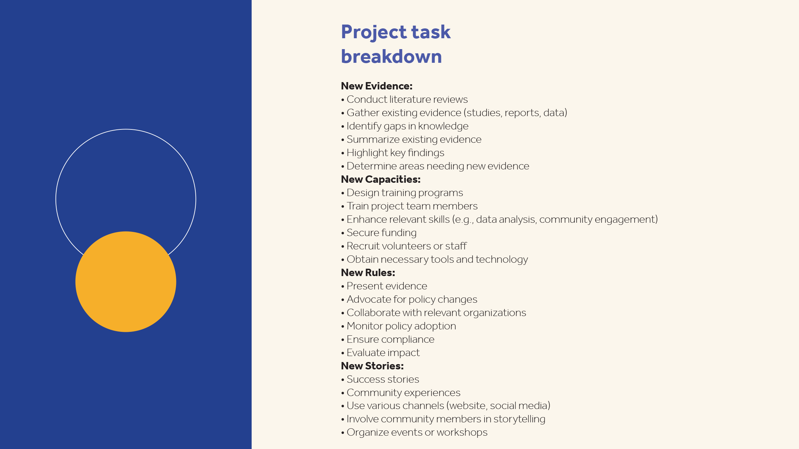

# Visão geral de introdução

Saiba como começar a usar o Adobe Acrobat por meio destes breves tutoriais passo a passo. Desde a criação de um documento até a proteção ou a [edição de seus arquivos de PDF](https://www.adobe.com/br/acrobat/online/pdf-editor.html){target="_blank"}, este conteúdo é projetado para facilitar os fluxos de trabalho de PDF.

## Novidades

* [Editar gráficos em um PDF](edit-graphics.md)
Saiba como criar, editar e aprimorar gráficos no seu PDF
* [Nova experiência de espaço de trabalho](new-workspace.md)
Saiba mais sobre a nova área de trabalho do Acrobat que ajuda a descobrir ferramentas rapidamente e a concluir suas tarefas de PDF com eficiência
* [Descubra insights de PDF com o Assistente de IA](ai-assistant.md)
Saiba como obter informações sobre seus arquivos de PDF usando o Assistente de IA

## Tutoriais de introdução

<table style="table-layout:fixed">
<tr>
  <td>
    
    

    <a href="new-workspace.md"><strong>Nova experiência de espaço de trabalho</strong></a>
    

    Saiba mais sobre o novo espaço de trabalho no Acrobat
     
  </td>
  <td>
    
    

    <a href="get-to-know-the-acrobat-dc-interface.md"><strong>Noções básicas do espaço de trabalho</strong></a>
    

    Saiba como acessar arquivos e ferramentas no desktop, na Web e em dispositivos móveis
     
  </td>
  <td>
    
    

    <a href="ai-assistant.md"><strong>Descubra insights de PDF com o Assistente de IA</strong></a>
    

    Saiba como obter informações sobre seus arquivos de PDF usando o Assistente de IA
     
  </td>
  <td>
    
    

    <a href="acrobatweb.md"><strong>Trabalhe em qualquer lugar com o Acrobat Web</strong></a>
    

    Saiba como lidar com solicitações de documentos comerciais de qualquer lugar
     
  </td>
</tr>
<tr>
  <td>
    
    

    <a href="productivity.md"><strong>Produtividade em qualquer lugar</strong></a>
    

    Saiba como fazer mais coisas do seu tablet ou celular
     
  </td>
    <td>
      
      

      <a href="../integrate/integrate-overview.md#microsoft"><strong>Trabalhar com o Microsoft 365</strong></a>
      

      Saiba como trabalhar perfeitamente com arquivos PDF diretamente no Microsoft 365
        
    </td>
    <td>
      
      

      <a href="where-do-pdfs-come-from.md"><strong>De onde vêm os PDF?</strong></a>
      

      Saiba de onde vêm os PDF e como usá-los em fluxos de trabalho digitais
       
    </td>
    <td>
    
      

       
    </td>
  </tr>
  </table>

## Criar, combinar e organizar tutoriais

<table style="table-layout:fixed">
  <tr>
    <td>
      
      

      <a href="create-pdf.md"><strong>Criar arquivos PDF</strong></a>
      

      Saiba como criar PDF a partir de todos os tipos diferentes de documentos
       
    </td>
    <td>
      
      

      <a href="combine-to-pdf.md"><strong>Combinar arquivos em um único PDF</strong></a>
      

      Saiba como combinar perfeitamente vários tipos diferentes de arquivos em um único PDF
       
    </td>
    <td>
      
      

      <a href="organize.md"><strong>Organizar páginas</strong></a>
      

      Saiba como reorganizar páginas da maneira que você quiser
       
    </td>
    <td>
      
      

      <a href="add-custom-page.md"><strong>Adicionar página personalizada</strong></a>
      

      Saiba como adicionar páginas personalizadas ao seu PDF
       
    </td>
  </tr>
  </table>

## Editar e exportar tutoriais

<table style="table-layout:fixed">
  <tr>
    <td>
      
      

      <a href="edit-pdf.md"><strong>Editar texto em um PDF</strong></a>
      

      Saiba como editar palavras, frases ou até mesmo páginas inteiras na sua PDF
       
    </td>
    <td>
      
      

      <a href="edit-graphics.md"><strong>Editar gráficos em um PDF</strong></a>
      

      Saiba como criar, editar e aprimorar gráficos no seu PDF
       
    </td>
    <td>
      
      

      <a href="stylize-this-PDF.md"><strong>Estilizar este PDF</strong></a>
      

      Saiba como criar PDF de aparência profissional
       
    </td>
   <td>
      
      

      <a href="auto-adjust-layout.md"><strong>Ajuste automático de layout</strong></a>
      

      Saiba mais sobre o novo modo de edição que reflui conteúdo
       
    </td>
  </tr>
    <td>
      
      

      <a href="export-pdf.md"><strong>Converter PDF em diferentes formatos de arquivo</strong></a>
      

      Saiba como converter seus arquivos PDF para diferentes formatos de arquivo
       
    </td>
    <td>
   
    

     
  </td>
  <td>
   
    

     
  </td>
   <td>
   
    

     
  </td>
</tr>
</table>

## Tutoriais de colaboração

<table style="table-layout:fixed">
  <tr>
    <td>
      
      

      <a href="collaborate.md"><strong>Colaborar em tempo real</strong></a>
      

      Avance seus projetos colaborando em tempo real
    </td>
    <td>
      
      

      <a href="comment-on-pdf-files.md"><strong>Comentar em um PDF</strong></a>
      

      Saiba como adicionar comentários a um arquivo PDF e compartilhá-lo com outras pessoas
       
    </td>
    <td>
    
      

       
    </td>
    <td>
    
      

       
    </td>
</tr>
</table>

## Tutoriais adicionais

<table style="table-layout:fixed">
<tr>
  <td>
    
    

      <a href="create-fillable-forms.md"><strong>Criar formulários preenchíveis</strong></a>
      

      Transformar um papel digitalizado em uma forma preenchível
       
  </td>
  <td>
    
    

    <a href="fill-and-sign.md"><strong>Formulário Fill &amp; Sign a PDF</strong></a>
    

    Saiba como preencher e assinar um formulário de PDF com rapidez e facilidade
     
  </td>
  <td>
    
    

    <a href="scan-and-ocr.md"><strong>Digitalização e OCR</strong></a>
    

    Converta digitalizações ou imagens de documentos em arquivos de PDF pesquisáveis e editáveis
     
  </td>
  <td>
    
    

    <a href="password-protect.md"><strong>Protect um arquivo PDF com uma senha</strong></a>
    

    Saiba como adicionar uma senha ao seu PDF
     
  </td>
</tr>
<tr>
  <td>
    
    

    <a href="signatures.md"><strong>Obter assinaturas</strong></a>
    

    Mantenha a continuidade dos negócios coletando assinaturas eletrônicas com validade jurídica
     
  </td>
  <td>
    
    

    <a href="track.md"><strong>Acompanhar seus documentos</strong></a>
    

    Saiba como rastrear e gerenciar seus documentos de assinatura eletrônica
     
  </td>
  <td>
   
    

     
  </td>
  <td>
   
    

     
  </td>
</tr>
</table>
