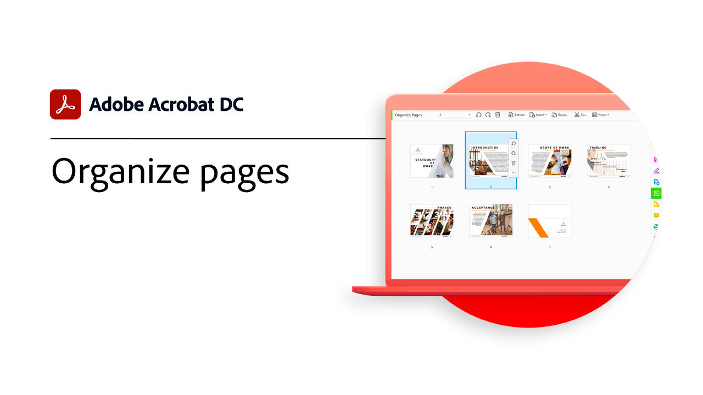

# Visão geral de introdução

Saiba como começar a usar o Adobe Acrobat através destes tutoriais passo a passo. Da criação de um documento à proteção de seus arquivos de PDF, esse conteúdo foi desenvolvido para facilitar os fluxos de trabalho de PDF.

## Tutoriais da Acrobat

<table style="table-layout:fixed">
<tr>
  <td>
    
    

    <a href="get-to-know-the-acrobat-dc-interface.md"><strong>Noções básicas sobre a área de trabalho</strong></a>
    

    <em>Veja como a interface do Adobe Acrobat DC facilita o acesso a arquivos e ferramentas no desktop, na Web e em dispositivos móveis</em>
     
  </td>
  <td>
    
    

    <a href="acrobatweb.md"><strong>Trabalhe em qualquer lugar com a Web da Acrobat</strong></a>
    

    <em>Saiba como lidar com solicitações de documentos de negócios em qualquer lugar usando as ferramentas da Web da Acrobat no seu navegador</em>
     
  </td>
  <td>
    
    

     <a href="productivity.md"><strong>Produtividade em qualquer lugar</strong></a>
    

    <em>Faça mais diretamente do seu tablet ou celular com o aplicativo Acrobat Reader para dispositivos móveis</em>
     
  </td>
</tr>
<tr>
   <td>
    
    

     <a href="../integrate/integrate-overview.md#microsoft"><strong>Trabalhar com o Microsoft 365</strong></a>
    

    <em>Aumente a produtividade e os fluxos de trabalho de documentos comerciais com a Acrobat e [!DNL Microsoft 365]</em>
     
  </td>
  <td>
    
    

     <a href="collaborate.md"><strong>Colaborar em tempo real</strong></a>
    

    <em>Avance seus projetos coletando comentários, colaborando em respostas e acompanhando o progresso em seus documentos em tempo real, em qualquer lugar</em>
     
  </td>
  <td>
    
    

     <a href="combine-to-pdf.md"><strong>Combinar arquivos em PDF</strong></a>
    

    <em>Combinar vários tipos diferentes de arquivos em um único PDF</em>
     
  </td>
</tr>
<tr>
  <td>
    
    

    <a href="create-pdf.md"><strong>Criar um PDF</strong></a>
    

    <em>Criar PDF de todos os diferentes tipos de documentos</em>
     
  </td>
 <td>
    
    

    <a href="comment-on-pdf-files.md"><strong>Comentar em um PDF</strong></a>
    

    <em>Adicione comentários a um arquivo de PDF e compartilhe-o com outras pessoas</em>
     
  </td>
  <td>
    
    

    <a href="edit-pdf.md"><strong>Editar um PDF</strong></a>
    

    <em>Editar texto e imagens em arquivos de PDF</em>
     
  </td>
</tr>
<tr>
  <td>
    
    

    <a href="export-pdf.md"><strong>Exportar uma PDF para formatos editáveis</strong></a>
    

    <em>Saiba como exportar seus arquivos de PDF para formatos editáveis</em>
     
  </td>
  <td>
    
    

    <a href="create-fillable-forms.md"><strong>Criar formulários preenchíveis</strong></a>
    

    <em>Transformar um documento criado em outro aplicativo em um formulário PDF preenchível</em>
     
  </td>
  <td>
    
    

    <a href="scan-and-ocr.md"><strong>Digitalizar e OCR</strong></a>
    

    <em>Reduza arquivos grandes e otimize suas PDF sem comprometer a qualidade para compartilhamento, publicação ou arquivamento</em>
     
  </td>
</tr>
<tr>
 <td>
    
    

    <a href="organize.md"><strong>Organizar páginas</strong></a>
    

    <em>Adicionar, substituir, extrair, girar, excluir e mover páginas no PDF</em>
     
  </td>
  <td>
    
    

    <a href="password-protect.md"><strong>Protect um arquivo PDF com senha</strong></a>
    

    <em>Adicione uma senha ao seu PDF para proteger outras pessoas de abrir ou editar o arquivo</em>
     
  </td>
  <td>
    
    

    <a href="fill-and-sign.md"><strong>PDF forms Fill &amp; Sign</strong></a>
    

    <em>Preencha e assine rapidamente um formulário de PDF</em>
     
  </td>
</tr>
<tr>
  <td>
    
    

    <a href="signatures.md"><strong>Obter assinaturas</strong></a>
    

    <em>Mantenha os negócios em movimento ao coletar assinaturas eletrônicas juridicamente vinculativas de outras pessoas. de qualquer lugar</em>
     
  </td>
  <td>
    
    

    <a href="where-do-pdfs-come-from.md"><strong>De onde vêm os PDF?</strong></a>
    

    <em>Entenda de onde vêm os PDF e seus usos</em>
     
  </td>
  <td>
   
    

     
  </td>
</tr>
</table>
