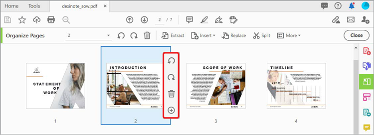

# Organizar páginas

Usar **[!UICONTROL Organizar páginas]** no Acrobat DC para adicionar, substituir, extrair, girar, excluir e mover páginas no PDF.

1. Selecionar **[!UICONTROL Organizar páginas]** do [!UICONTROL Ferramentas] painel central ou à direita.

   

1. Passe o mouse sobre uma página para girar a página no sentido horário ou anti-horário ou excluir a página.

   Para mover uma página, selecione e arraste a página para o novo local.

   

1. Selecionar **[!UICONTROL Extract]** na barra de ferramentas, para criar um PDF de uma ou mais páginas.

1. Selecione a página ou páginas e, em seguida, selecione **[!UICONTROL Extract]**.

   Você também pode **[!UICONTROL Inserir]** ou **[!UICONTROL Substituir]** e veja outras opções selecionando **[!UICONTROL Mais]**.

   

1. Selecionar **[!UICONTROL Dividir]** para separar uma ou mais PDF em várias PDF menores.

   Ao dividir um PDF, você pode separar pelo número de páginas, tamanho do arquivo ou marcadores de nível superior.

   

Clique para baixar uma PDF do *Organizar páginas* tutorial.

