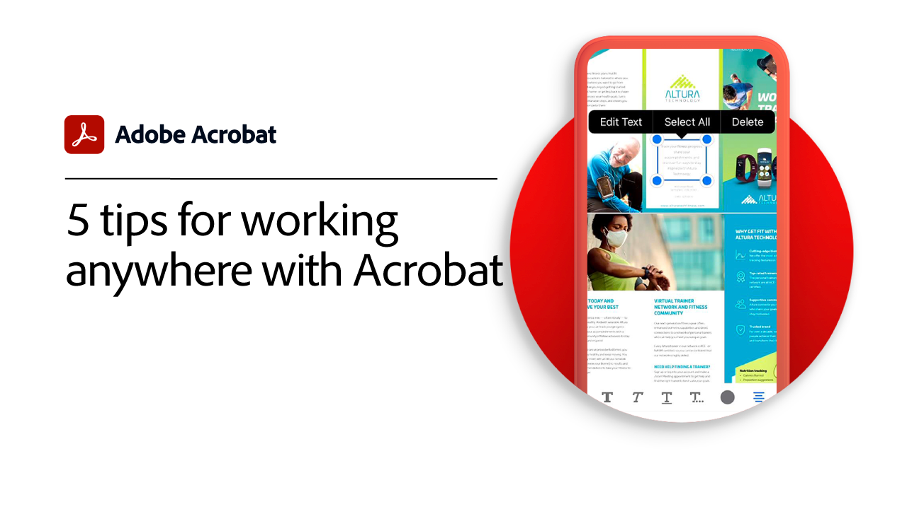
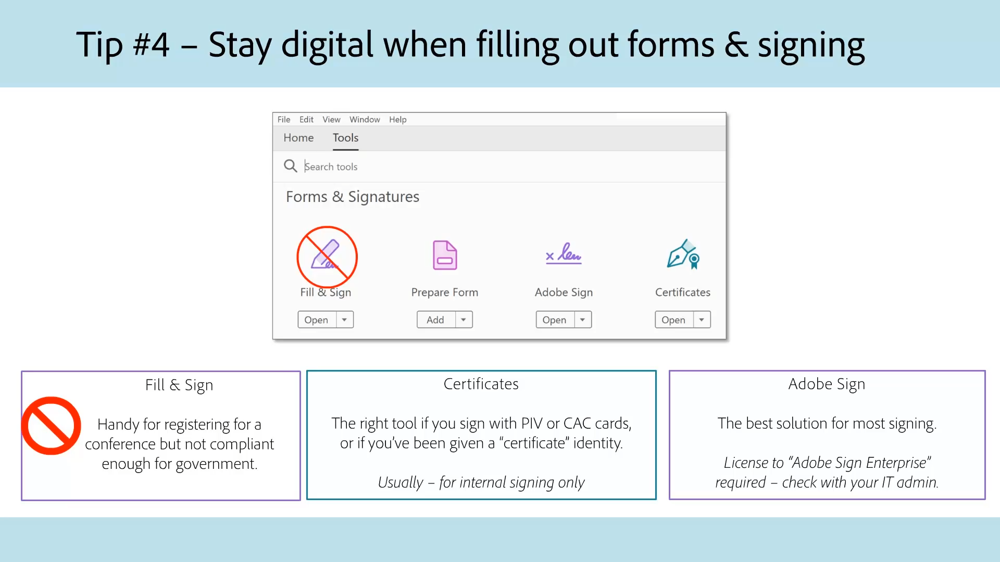
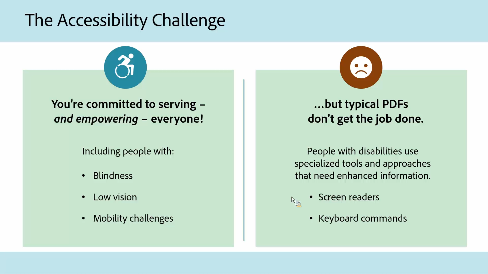

# Acrobat para órgãos governamentais

Explore nossos tutoriais do Acrobat desenvolvidos especificamente para governos federal, estadual e local.

## Cinco dicas para trabalhar em qualquer lugar com o Acrobat

<table style="table-layout:fixed">
<tr>
  <td>
    
    

    <a href="5-tips-for-working-anywhere-with-acrobat-dc-for-government.md"><strong>Cinco dicas para trabalhar em qualquer lugar com o Acrobat (concluído 15:12)</strong></a>
    

    <em>Saiba como usar e obter as ferramentas do Acrobat e seus aplicativos complementares para dispositivos móveis para trabalhar em qualquer lugar</em>
     
  </td>
  <td>
    
    

    <a href="get-your-tools.md"><strong>Dica 1: Tenha suas ferramentas</strong></a>
    

    <em>A primeira etapa para começar a trabalhar em qualquer lugar é obter suas ferramentas do Acrobat e aplicativos complementares para dispositivos móveis</em>
     
  </td>  
  <td>
    
    

    <a href="collaborate-on-documents.md"><strong>Dica 2: Colaborar em documentos</strong></a>
    

    <em>Crie fluxos de trabalho simples para colaborar em documentos</em>
     
  </td>
  <td>
    
    

    <a href="protect-digital-documents.md"><strong>Dica 3: Documentos digitais do Protect</strong></a>
    

    <em>Adicione uma senha ao PDF para evitar cópia, edição ou impressão</em>
     
  </td>
</tr>
  <td>
    
    

    <a href="work-with-forms-and-signatures.md"><strong>Dica 4: Trabalhar com formulários e assinaturas</strong></a>
    

    <em>Saiba como permanecer digital ao preencher formulários</em>
     
  </td>
  <td>
    
    

    <a href="scan-and-edit-on-mobile.md"><strong>Dica 5: Digitalize e edite em dispositivos móveis</strong></a>
    

    <em>Saiba como trabalhar com aplicativos para dispositivos móveis da Adobe Scan e da Acrobat Reader para trabalhar em qualquer lugar</em>
     
  </td>
  <td>
   
    

     
  </td>
  <td>
   
    

     
  </td>
</tr>
</table>

## Acessibilidade

<table>
<tr>
  <td>
    
    

    <a href="making-pdfs-accessible.md"><strong>Tornando PDF acessíveis (Complete 14:11)</strong></a>
    

    <em>Saiba mais sobre o fluxo de trabalho ideal para criar arquivos PDF acessíveis</em>
     
  </td>
  <td>
    
    

    <a href="understanding-accessibility.md"><strong>Tornando PDF acessíveis: Noções básicas sobre acessibilidade</strong></a>
    

    <em>Saiba o que significa tornar um PDF acessível para pessoas com deficiência</em>
     
  </td>  
  <td>
    
    

    <a href="collaborate-on-documents.md"><strong>Tornando PDF acessíveis: Criação no Word</strong></a>
    

    <em>Conheça as práticas recomendadas para criar arquivos PDF criados no [!DNL Microsoft Word]</em>
     
  </td>
   <td>
    
    

    <a href="finishing-in-acrobat.md"><strong>Tornando PDF acessíveis: Finalizando no Acrobat</strong></a>
    

    <em>Saiba como terminar de tornar seu arquivo PDF acessível usando as ferramentas no Acrobat Pro</em>
     
  </td>
</tr>
<tr>
  <td>
    
    

    <a href="making-pdf-ballots-accessible.md"><strong>Tornando as cédulas de PDF mais acessíveis</strong></a>
    

    <em>Este webinar abrange as principais áreas de acessibilidade do PDF necessárias para permitir que os usuários de tecnologias assistivas, como leitores de tela, leiam e concluam suas cédulas</em>
     
  </td>  
  <td>
   
    

     
  </td>
  <td>
   
    

     
  </td>
  <td>
   
    

     
  </td>
</tr>
</table>
