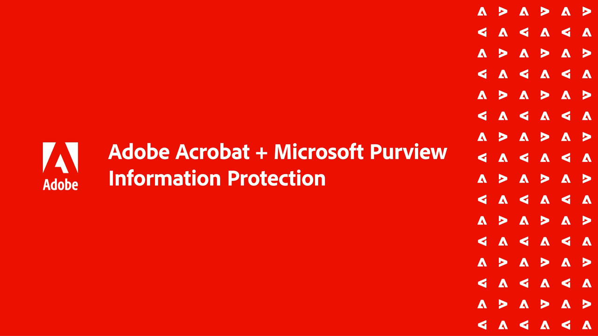

# Visão geral de integrações

Integrar o Acrobat ao [!DNL Box], [!DNL Dropbox], [!DNL Google Drive], [!DNL OneDrive]e [!DNL Microsoft] aplicativos.

## Microsoft

Saiba como todos da sua equipe podem trabalhar perfeitamente com arquivos de PDF, diretamente da sua equipe [Microsoft 365](https://www.adobe.com/documentcloud/integrations/microsoft-office-365.html).

<table style="table-layout:fixed">
<tr>
  <td>
    
    

    <a href="createfromword.md"><strong>Criar arquivos PDF de [!DNL Microsoft Word]</strong></a>
    

    <em>Crie arquivos de PDF avançados e avançados com sumário e referências cruzadas com hiperlinks, marcadores e até mesmo anexos diretamente do [!DNL Microsoft Word]</em>
     
  </td>
  <td>
    
    

    <a href="createofficeweb.md"><strong>Criar PDF em [!DNL Office] para a Web</strong></a>
    

    <em>Saiba como criar arquivos PDF sem nunca sair do seu [!DNL Microsoft Office] para aplicativos web</em>
     
  </td> 
  <td>
    
    

    <a href="acrobatandsp.md"><strong>Trabalhe com o seu [!DNL SharePoint] arquivos</strong></a>
    

    <em>Simplifique os fluxos de trabalho de documentos com [!DNL SharePoint] e ACROBAT</em>
     
  </td>
  <td>
    
    

    <a href="acrobatandteams.md"><strong>colaboração PDF em [!DNL Microsoft Teams]</strong></a>
    

    <em>Colabore e trabalhe com colegas visualizando, anotando e revisando PDF sem sair do [!DNL Microsoft Teams]</em>
     
  </td>
</tr>
<tr>
  <td>
    
    

    <a href="outlook.md"><strong>Converter mensagens de e-mail e anexos em PDF em [!DNL Outlook]</strong></a>
    

    <em>Saiba como fornecer informações de maneira mais profissional e segura dentro da [!DNL Outlook]</em>
     
  </td>
  <td>
    
    

    <a href="edge.md"><strong>Crie conteúdo de PDF ao navegar com [!DNL Microsoft Edge]</strong></a>
    

    <em>Saiba como arquivar páginas da Web em PDF com a extensão Adobe Acrobat para [!DNL Microsoft Edge]</em>
     
  </td>
  <td>
    
    

    <a href="microsoftsensitivitylabels.md"><strong>Protect PDF usando [!DNL Microsoft Purview Information] rótulos de sensibilidade</strong></a>
    

    <em>Saiba como proteger PDF adicionando, editando, personalizando e excluindo [!DNL Microsoft Purview] rótulos de confidencialidade diretamente no Acrobat</em>
     
  </td>
  <td>
   
    

     
  </td>
</tr>
</table>

## Google Drive

Saiba como fazer mais em menos tempo com as ferramentas essenciais de PDF e assinatura eletrônica [!DNL Google Drive].

<table style="table-layout:fixed">
<tr>
  <td>
    
    

    <a href="acrobatandgoogle.md"><strong>Adobe Acrobat para [!DNL Google Drive]</strong></a>
    

    <em>Tenha acesso a ferramentas de PDF para economizar tempo e fluxos de trabalho de assinatura eletrônica diretamente na [!DNL Google Drive] aplicativo</em>
     
  </td>
  <td>
   
    

     
  </td>
  <td>
   
    

     
  </td>
  <td>
   
    

     
  </td>
</tr>
</table>

## Dropbox

Saiba como é fácil acessar e trabalhar com arquivos armazenados em [!DNL Dropbox].

<table style="table-layout:fixed">
<tr>
  <td>
    
    

    <a href="acrobat-dropbox.md"><strong>Trabalhar com arquivos de [!DNL Dropbox]</strong></a>
    

    <em>Saiba como abrir, criar, editar, assinar e salvar alterações em seus [!DNL Dropbox] arquivos de dentro do Acrobat</em>
     
  </td>
  <td>
   
    

     
  </td>
  <td>
   
    

     
  </td>
  <td>
   
    

     
  </td>
</tr>
</table>

## Box

Saiba como a Acrobat e a [Caixa](https://www.adobe.com/documentcloud/integrations/box.html){target="_blank"} simplifique para que todos em sua organização mantenham seus negócios em movimento.
