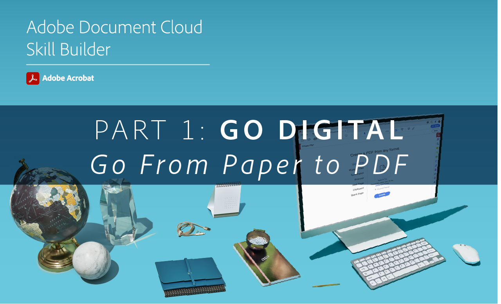
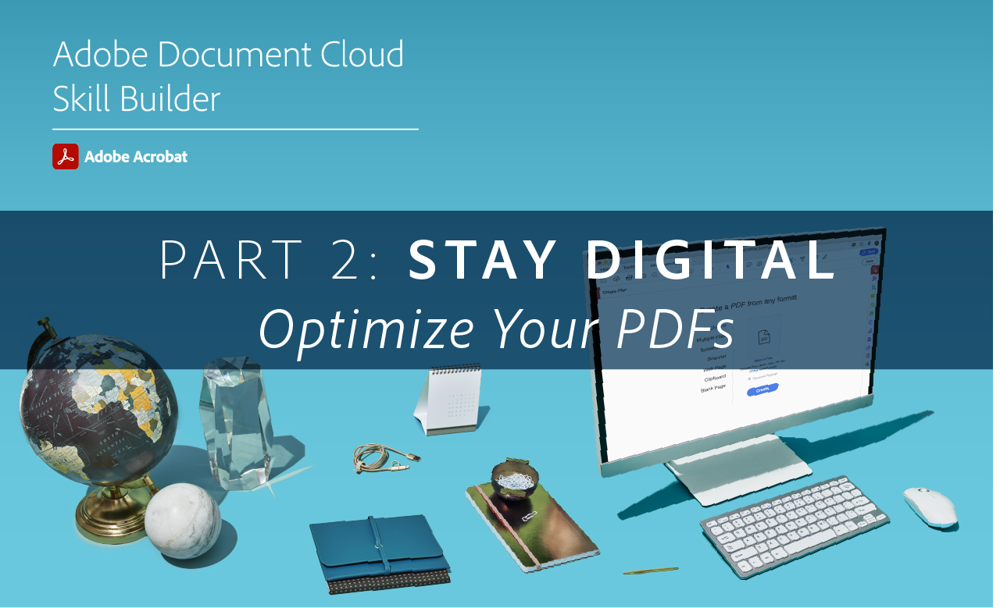

# Construtores de habilidades da Acrobat

Atualize-se com o Acrobat DC com esses desenvolvedores de habilidades interativos. Ou, participe de uma [sessão mensal ao vivo](skill-builder-webinars.md).

## Go Digital

<table style="table-layout:fixed">
<tr>
  <td>
    
    

    <a href="https://doccloud.adobeconnect.com/paperpdf/" target="_blank"><strong>Ir do papel para PDF</strong></a>
    

    <em>Transforme digitalmente qualquer documento impresso em PDF</em>
     
  </td>
  <td>
    
    

    <a href="https://doccloud.adobeconnect.com/skillbuilder-sigforms/" target="_blank"><strong>Preparar para assinatura</strong></a>
    

    <em>Criar PDFs com campos de assinatura eletrônica</em>
     
  </td>
  <td>
    
    

     
  </td>
</tr>
</table>

## Mantenha o digital

<table style="table-layout:fixed">
<tr>
 <td>
    
    

    <a href="https://doccloud.adobeconnect.com/createpdfs/" target="_blank"><strong>Criar e organizar PDFs</strong></a>
    

    <em>Criar e organizar PDFs a partir de qualquer tipo de arquivo</em>
     
  </td>
  <td>
    
    

    <a href="https://doccloud.adobeconnect.com/micro/" target="_blank"><strong>Acrobat e Microsoft 101</strong></a>
    

    <em>Criar e gerenciar PDFs diretamente no SharePoint</em>
     
  </td>
  <td>
    
    

    <a href="https://doccloud.adobeconnect.com/editpdf/" target="_blank"><strong>Editar seus PDFs</strong></a>
    

    <em>Adicione texto, imagens, links e marcas d'água ao PDF</em>
     
  </td>
</tr>
<tr>
  <td>
    
    

    <a href="https://doccloud.adobeconnect.com/sign/" target="_blank"><strong>Assine seu trabalho</strong></a>
    

    <em>Assinar documentos diretamente no Microsoft Outlook</em>
     
  </td>
  <td>
    
    

    <a href="https://doccloud.adobeconnect.com/convertpdfs/" target="_blank"><strong>Converta seus PDFs</strong></a>
    

    <em>Converter PDFs em Word, Excel e PowerPoint</em>
     
  </td>
  <td>
    
    

    <a href="https://doccloud.adobeconnect.com/fillsign/" target="_blank"><strong>Preencher e assinar em qualquer lugar</strong></a>
    

    <em>Preencha, assine e envie formulários eletronicamente em qualquer dispositivo</em>
     
  </td>
</tr>
<tr>
  <td>
    
    

    <a href="https://doccloud.adobeconnect.com/optimizepdfs/" target="_blank"><strong>Otimize seus PDFs</strong></a>
    

    <em>Preparar PDFs para distribuição</em>
     
  </td>
  <td>
   
    

     
  </td>
  <td>
   
    

     
  </td>
</tr>
</table>

## Obter trabalho concluído

<table style="table-layout:fixed">
<tr>
  <td>
    
    

    <a href="https://doccloud.adobeconnect.com/skillbuilder-share/" target="_blank"><strong>Compartilhar e coletar feedback</strong></a>
    

    <em>Reúna e receba feedback sobre seus PDFs</em>
     
  </td>
  <td>
    
    

    <a href="https://doccloud.adobeconnect.com/securepdfs/" target="_blank"><strong>Proteja seus PDFs</strong></a>
    

    <em>Redigir e proteger informações confidenciais em seus PDFs</em>
     
  </td>
  <td>
   
    

     
  </td>
</tr>
</table>
