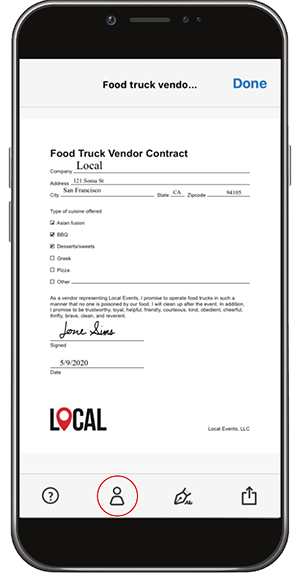

# Preencha e assine qualquer formulário no desktop ou em dispositivos móveis

Preencha, assine e envie formulários rapidamente pelo desktop, navegador ou aplicativo móvel. O Adobe AI reconhece e salva dados usados com frequência para uso em formato de PDF. Crie uma assinatura desenhando, importando uma digitalização ou digitando seu nome e, em seguida, aplique-o com segurança a um documento.

Neste exercício, você importará, preencherá, assinará e enviará um formulário usando seu dispositivo móvel.

Aqui estão os [arquivos de demonstração](assets/03_FillSignScan.zip) deste exercício.

**Etapa 1:** baixe o aplicativo [!DNL Adobe Fill & Sign] da loja [!DNL Apple App] ou [!DNL Google Play].

**Etapa 2:** abra o aplicativo, toque em **[!UICONTROL Selecione um formulário para preencher]**.

**Etapa 3:** escolha uma das opções de importação. Para este exercício, vamos “Tirar uma Foto”.

**Etapa 4:** use o botão branco para tirar uma foto e toque em **[!UICONTROL Usar foto]**. Toque em **[!UICONTROL Concluído]** no canto superior direito.

**Etapa 5:** na parte inferior do aplicativo, toque na ferramenta **[!UICONTROL Cortar]** e use as guias para [cortar a imagem](https://www.adobe.com/br/acrobat/online/crop-pdf.html). Toque em **[!UICONTROL Concluído]** quando terminar.

**Etapa 6:** use a ferramenta Varinha Mágica para limpar a imagem, se necessário. Toque em **[!UICONTROL Concluído]** quando terminar.

**Etapa 7:** toque em qualquer lugar da página para criar um campo e adicionar as informações necessárias ao documento. Selecione a elipse para exibir mais opções.

**Etapa 8:** toque no botão **[!UICONTROL Assinatura]** na parte inferior do aplicativo para adicionar sua assinatura.

**Etapa 9:** use uma caneta ou o dedo para assinar no campo de assinatura. Mova e posicione o campo de assinatura.

**Etapa 10:** toque no botão **[!UICONTROL Perfil]** na parte inferior do aplicativo para obter valores pré-preenchidos, como seu nome e data. Você só precisa preencher essas informações uma vez para poder usá-las em todos os formulários que preencher no aplicativo Fill &amp; Sign.

**Etapa 11:** quando o formulário estiver completo, toque no botão Compartilhar no canto inferior direito para enviar email.

## Recapitulação:

* Abra um arquivo a partir de um email ou tire uma foto de um formulário de papel com a câmera do seu dispositivo.

* Toque para inserir texto ou marcas de seleção nos campos de formulário. E para velocidade, use entradas personalizadas de preenchimento automático.

* Crie sua assinatura usando seu dedo ou caneta. Em seguida, aplique-o ao formulário ou adicione suas iniciais onde for necessário.
