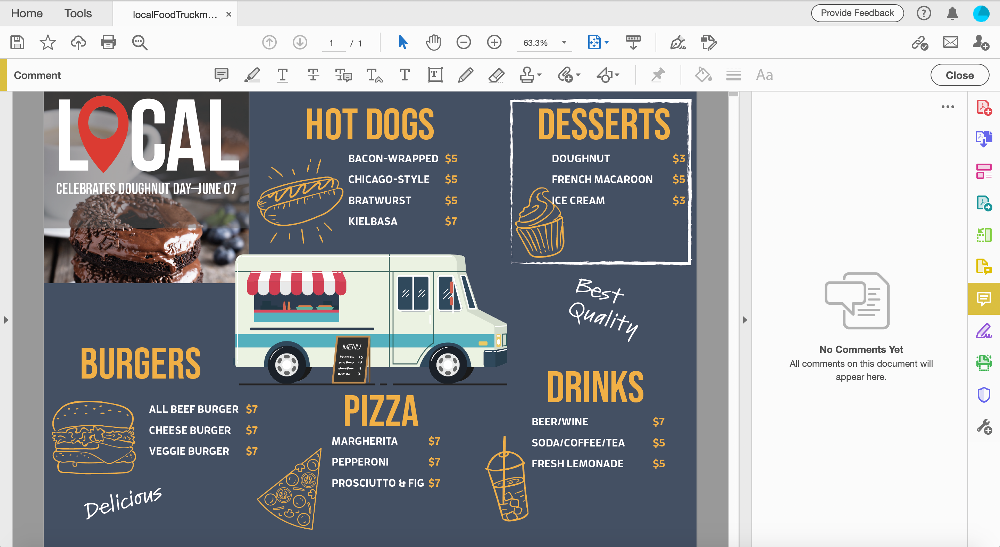

# Compartilhar arquivos PDF e revisar online

Use o serviço de revisão da Adobe Document Cloud para compartilhar com facilidade arquivos PDF para revisão no aplicativo de desktop da Acrobat, no Document Cloud Web ou no aplicativo móvel da Acrobat Reader. Quando os revisores clicam no URL do email de convite no seus computadores, eles podem fornecer feedback em um navegador com facilidade, sem ter que fazer logon ou instalar qualquer software adicional.

Neste exercício, analisamos como,

* Envie convites personalizados para comentar
* Enviar um link anônimo ou público por email

Aqui estão os [arquivos de demonstração](assets/01_Review.zip) para este exercício.

## Envie convites personalizados para comentar

**Etapa 1:** Abra o `localFoodTruckmenu_start.pdf` no Adobe Acrobat.

**Etapa 2:** Clique em **[!UICONTROL Send for Comments]** no painel direito ou no painel **[!UICONTROL Compartilhar este arquivo com outras pessoas]**   no canto superior direito.

**Etapa 3:** Insira os endereços de email dos destinatários. É possível inserir uma mensagem para os destinatários ou adicionar um prazo para revisão.

Você receberá um aviso por email assim que os destinatários exibirem seu arquivo.

## Experiência do revisor

Os revisores recebem um email de convite com um link para o PDF para revisão. Ao clicarem no link ou no botão **[!UICONTROL Revisar]** no convite, o PDF abre em um navegador da Web. Eles podem usar as ferramentas de comentário para adicionar comentários ao PDF. Eles também podem usar o Acrobat Reader DC ou o aplicativo para desktop Acrobat DC para adicionar comentários.

## Enviar um link anônimo ou público por email

**Etapa 1:** Abra o `localFoodTruckmenu_start.pdf` no Adobe Acrobat.

**Etapa 2:** Clique em **[!UICONTROL Compartilhar Um Link]** . O link compartilhado é gerado imediatamente; não será necessário aguardar até que o arquivo seja enviado para a nuvem. Por padrão, o [!UICONTROL Permitir comentários] está ligado.

**Etapa 3:** Clique em **[!UICONTROL Copiar link]** e compartilhar o link com os destinatários.

## Fazendo comentários

**Etapa 1:** Clique no botão **[!UICONTROL Comentário]** no painel direito.

**Etapa 2:** Use as ferramentas da faixa superior para marcar o documento e/ou digitar um comentário.

Seus comentários são salvos automaticamente e exibidos para outras pessoas.

## Importar comentários do PDF para o InDesign

O InDesign CC 2019 permite que você importe comentários diretamente de arquivos PDF. Você pode importar, aceitar e aplicar as alterações com apenas um clique. Selecionar um comentário no novo painel Comentários do PDF localizará e destacará o comentário no seu arquivo de InDesign.

**Etapa 1:** Baixe o arquivo PDF que contém os comentários.

**Etapa 2:** Abra o arquivo InDesign.

**Etapa 3:** Clique em **[!UICONTROL Arquivo]** no menu superior.

**Etapa 4:** Clique em **[!UICONTROL Importar comentários do PDF]** na lista suspensa.

**Etapa 5:** Abra o PDF que contém os comentários.

Os comentários são exibidos na interface do usuário.

## Recapitulação:

Revise e compartilhe versões de design com a Acrobat. O Acrobat permite que você:

* Envie um link para um PDF para outras pessoas revisarem.
* Revise em qualquer lugar: no desktop, no navegador e em dispositivos móveis.
* Colete em um único documento.
* Gerencie feedback em um só local organizado.
* Você só precisa de um navegador.

É fácil enviar e monitorar comentários em um só lugar. Os destinatários podem exibir mesmo que não tenham o Acrobat! Você pode convidar alguém para comentar em um navegador. Poupe tempo e esforço.
