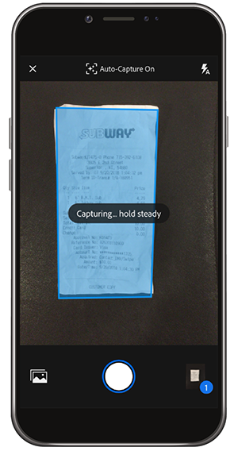

# Go Digital com Adobe Scan

Desaglomerar, organizar ou compartilhar! Não há necessidade de manter pilhas de papel em sua carteira ou recibos de material na carteira. O aplicativo Adobe Scan para dispositivos móveis digitaliza documentos em papel diretamente em PDFs e reconhece automaticamente o texto.

Neste exercício, você faz upload de conteúdo de um cartão de visita diretamente em seus contatos. Digitalize e armazene um recibo.

Colete um cartão de visita, um recibo ou qualquer outro item em papel com o qual você gostaria de trabalhar.

## Digitalizar um cartão de visita

**Etapa 1:** Baixe o aplicativo da Adobe Scan na Apple App Store ou no Google Play.

**Etapa 2:** Abra o aplicativo Adobe Scan.

**Etapa 3:** No aplicativo, tire uma foto do cartão de visita contendo as informações de contato que você gostaria de salvar no telefone.

**Passo 4:** Quando a digitalização estiver concluída, faça os ajustes para garantir que o cartão esteja dentro da caixa delimitadora.

**Etapa 5:** toque em  **[!UICONTROL Salvar]** PDF no canto superior direito. Em seguida, toque em **[!UICONTROL Salvar Contato]**.

**Etapa 6:** faça as edições ou adições desejadas às informações de contato antes de armazenar no telefone. Toque em &quot;Salvar&quot; mais uma vez para finalizar a gravação nos contatos.

## Digitalizar e armazenar um recibo

O aplicativo Adobe Scan também pode ser útil para digitalizar e armazenar um recibo de que você precisará mais tarde (por exemplo, um relatório de despesas ou outro reembolso).

**Etapa 1:** Com o aplicativo Adobe Scan aberto, tire uma foto do recibo que você gostaria de armazenar.

**Etapa 2:** Observe como o aplicativo detecta automaticamente seu recibo e captura seu conteúdo.

**Etapa 3:** toque em  **[!UICONTROL Salvar]** PDFs no canto superior direito para armazenar o recibo no telefone.

## Recapturar:

* Digitalize documentos e formulários impressos em PDF.
* Converta imagens JPG em PDF.
* Edite diretamente no seu dispositivo.
* Adicione as informações do cartão de visita diretamente aos Contatos.

Põe o papel fora!
