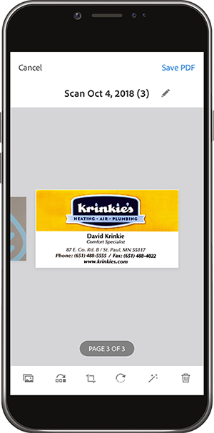
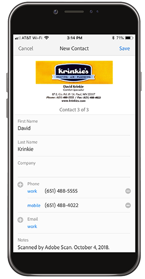

# Seja digital com o Adobe Scan

Elimine a desorganização, organize ou compartilhe! Não há necessidade de manter pilhas de papel na sua mesa ou recibos de coisas na sua carteira. O aplicativo móvel Adobe Scan digitaliza documentos impressos diretamente em PDF e reconhece automaticamente o texto.

Neste exercício, você faz upload do conteúdo de um cartão de visita diretamente para seus contatos. Digitalize e armazene um recibo.

Colete um cartão de visita, recibo ou qualquer outro item de papel com o qual você gostaria de trabalhar.

## Digitalizar um cartão de visita

**Etapa 1:** baixe o aplicativo da Adobe Scan na Apple App Store ou no Google Play.

**Etapa 2:** abra o aplicativo da Adobe Scan.

**Etapa 3:** do aplicativo, tire uma foto do cartão de visita contendo as informações de contato que você gostaria de salvar em seu telefone.

**Etapa 4:** quando a verificação estiver concluída, faça os ajustes para garantir que seu cartão esteja dentro da caixa delimitadora.

**Etapa 5:** toque em **[!UICONTROL Salvar PDF]** no canto superior direito. Em seguida, toque em **[!UICONTROL Salvar Contato]**.

**Etapa 6:** faça quaisquer edições ou adições desejadas às informações de contato antes de armazená-las no seu telefone. Toque em “Salvar” mais uma vez para finalizar o salvamento nos contatos.

## Digitalizar e armazenar um recibo

O aplicativo Adobe Scan também pode ser útil para digitalizar e armazenar um recibo de que você precisará posteriormente (por exemplo, um relatório de despesas ou outro reembolso).

**Etapa 1:** com o aplicativo Adobe Scan aberto, tire uma foto do recibo que você gostaria de armazenar.

**Etapa 2:** observe como o aplicativo detecta automaticamente seu recibo e captura seu conteúdo.

**Etapa 3:** toque em **[!UICONTROL Salvar PDF]** no canto superior direito para armazenar o recibo em seu telefone.

## Recapitulação:

* Digitalize documentos impressos e formulários para o PDF.
* Converta imagens de JPG em PDF.
* Edite diretamente no seu dispositivo.
* Adicione informações de cartão de visita diretamente aos Contatos.

Corte o papel!
