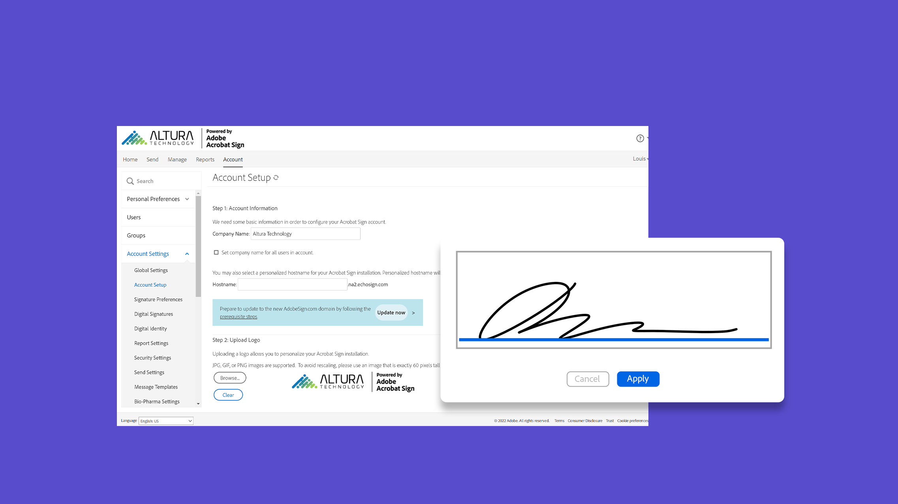
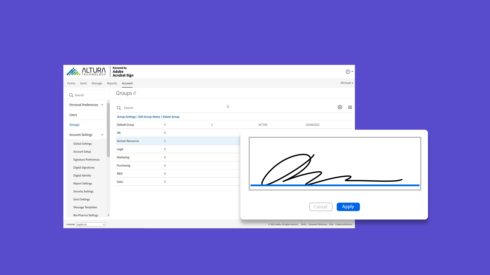
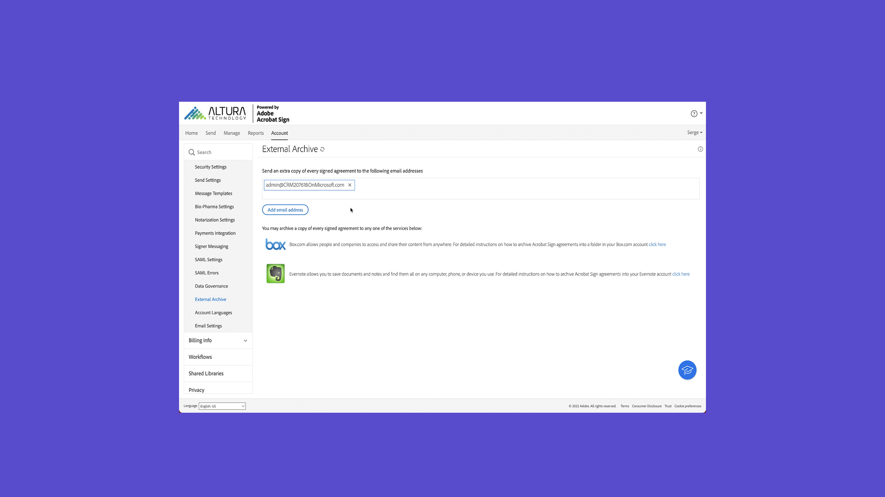
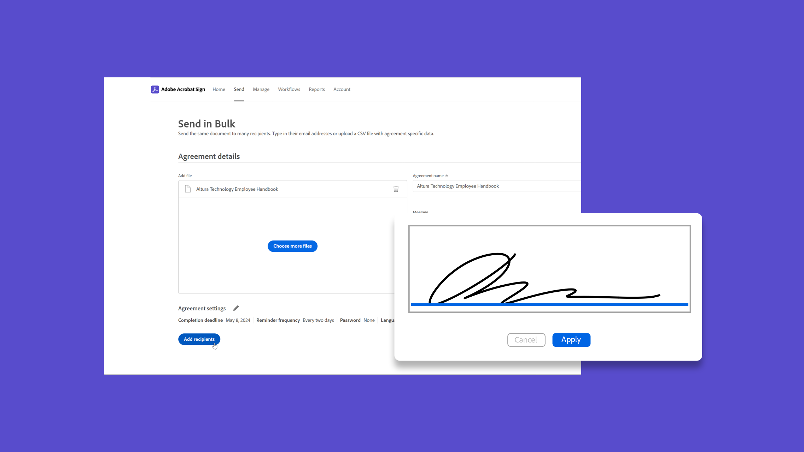
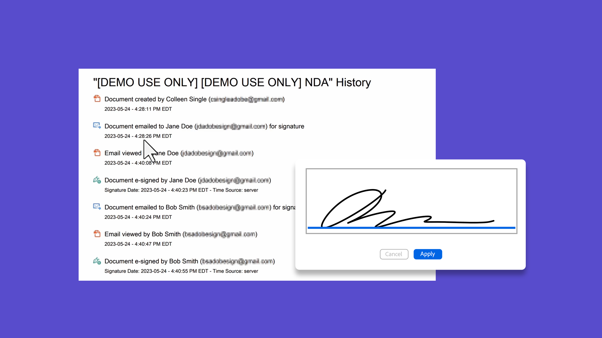
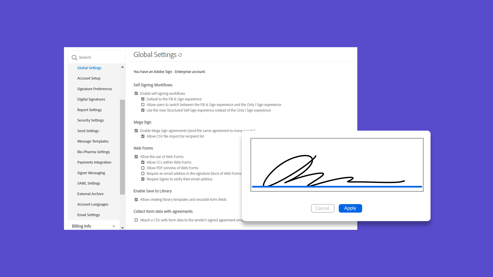
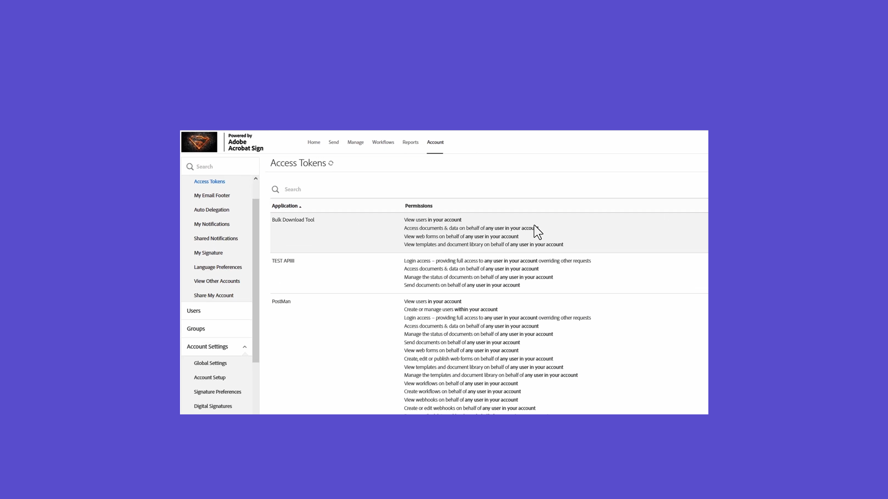
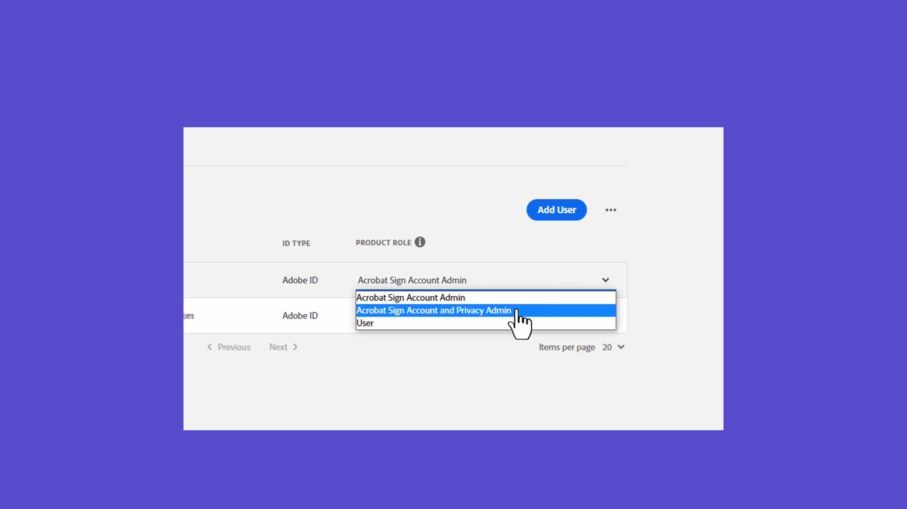

# Visão geral dos administradores

Saiba como adicionar usuários à sua conta, configurar grupos, compartilhar acesso e configurar um fluxo de trabalho, arquivamento externo e eventos e alertas compartilhados. Estes tutoriais foram desenvolvidos para administradores que passaram da fase de instalação e estão prontos para começar a administrar o Acrobat Sign. As Tarefas avançadas abrangem tópicos que se expandem além da configuração do administrador e passam a definir configurações globais, acesso e compartilhamento de conta e marcação de texto.

## Novidades

>[!BEGINTABS]

>[!TAB Configurar e controlar a opção Modificar Contrato]

Saiba como configurar e controlar o [Contrato de modificação](configure-modify-agreement.md) no Acrobat Sign.

>[!TAB Criar um fluxo de trabalho personalizado]

Saiba como criar e usar [fluxos de trabalho personalizados](building-a-custom-workflow.md) para acelerar o processo de criação e envio de um contrato.

>[!TAB Criar um modelo reutilizável]

Saiba como criar um [modelo de documento reutilizável](../sign-advanced-users/create-a-template.md).

>[!TAB Habilitar regras de atribuição automática de usuários]

Saiba como configurar [regras de atribuição automática](automatic-assignment-rules.md) que concedem aos usuários acesso ao Acrobat Sign no Admin Console.

>[!ENDTABS]

## Introdução

<table style="table-layout:fixed">
<tr>
  <td>
    
    

    <a href="get-started-admin.md"><strong>Introdução para novos administradores</strong></a>
    

    <em>Neste guia em vídeo abrangente, saiba mais sobre todas as ferramentas necessárias para colocar sua organização em funcionamento com o Acrobat Sign</em>
    
  </td>
  <td>
    
    

    <a href="up-and-running-admin.md"><strong>Em funcionamento para Administradores</strong></a>
    

    <em>Visão geral das 7 áreas principais para que os administradores comecem a trabalhar rapidamente no Acrobat Sign</em>
    
  </td>
  <td>
    
    

    <a href="docusign-templates.md"><strong>Migrar modelos do Docusign</strong></a>
    

    <em>Saiba como migrar modelos e fluxos de trabalho do Docusign com facilidade</em>
    
  </td>
  <td>
    
    

    <a href="add-users-to-your-account.md"><strong>Adicionar um novo usuário</strong></a>
    

    <em>Saiba como adicionar novos usuários ao Acrobat Sign</em>
    
  </td>
</tr>
<tr>
  <td>
    
    

    <a href="automatic-assignment-rules.md"><strong>Habilitar regras de atribuição automática de usuários</strong></a>
    

    <em>Saiba como configurar regras de atribuição automática que concedem aos usuários acesso ao Acrobat Sign no Admin Console</em>
    
  </td>
  <td>
    
    

    <a href="add-admin.md"><strong>Adicionar um novo administrador de conta</strong></a>
    

    <em>Saiba como criar um novo usuário ou promover um usuário existente à função de administrador do Acrobat Sign</em>
    
  </td>
    <td>
      
      

      <a href="promote-admin.md"><strong>Atribuir funções de administrador de produto e suporte</strong></a>
      

      <em>Saiba como atribuir uma função de administrador de produto e de suporte de usuário do Acrobat Sign no Admin Console</em>
      
    </td>
    <td>
      
      

      <a href="create-and-manage-groups.md"><strong>Criando e gerenciando grupos</strong></a>
      

      <em>Criar grupos, adicionar usuários a grupos e editar configurações de grupos</em>
      
    </td>
</tr>
<tr>
 <td>
      
      

      <a href="set-up-your-external-archive.md"><strong>Configurando um arquivo externo</strong></a>
      

      <em>Criar um arquivo externo para cópias de backup de contratos que foram assinados</em>
      
    </td>
  <td>
    
    

    <a href="../sign-advanced-users/create-a-template.md"><strong>Criar um modelo reutilizável</strong></a>
    

    <em>Criar um modelo de documento reutilizável para velocidade e consistência</em>
    
  </td>
  <td>
    
    

    <a href="../sign-advanced-users/creating-a-report.md"><strong>Uso de relatórios e transações</strong></a>
    

    <em>Saiba como gerar relatórios e acompanhar o uso de transações</em>
    
  </td>
  <td>
    
    

    <a href="report-options.md"><strong>Opções de relatório para usuários</strong></a>
    

    <em>Saiba como configurar opções de relatório para usuários</em>
    
  </td>
</tr>  
<tr>
   <td>
    
    

    <a href="../sign-advanced-users/webform.md"><strong>Criando um formulário da Web</strong></a>
    

    <em>Crie um documento que possa ser assinado eletronicamente diretamente no seu site</em>
    
  </td>
  <td>
    
    

    <a href="../sign-advanced-users/modify-webform.md"><strong>Modificar um formulário web existente</strong></a>
    

    <em>Saiba como desabilitar, editar e reabilitar um formulário web existente</em>
    
  </td>
  <td>
    
    

    <a href="../sign-advanced-users/megasign.md"><strong>Envio em massa</strong></a>
    

    <em>Colete milhares de assinaturas de uma só vez para qualquer documento</em>
    
  </td>
  <td>
    
    

    <a href="building-a-custom-workflow.md"><strong>Criar um fluxo de trabalho personalizado</strong></a>
    

    <em>Saiba como criar e usar fluxos de trabalho personalizados para acelerar o processo de criação e envio de um contrato</em>
    
  </td>
</tr>
<tr>
     <td>
    
    

    <a href="audit-reports.md"><strong>Relatórios de auditoria</strong></a>
    

    <em>Saiba como acessar, utilizar e configurar relatórios de auditoria</em>
    
    </td>
    <td>
      
      

      <a href="set-up-shared-events-and-alert.md"><strong>Configurar notificações para eventos e alertas</strong></a>
      

      <em>Configurar notificações para eventos e alertas para sua conta</em>
      
    </td>
    <td>
      
      

      <a href="configure-modify-agreement.md"><strong>Configurar e controlar a opção Modificar Contrato</strong></a>
      

      <em>Saiba como configurar e controlar a opção Modificar Contrato</em>
      
    </td>
    <td>
      
      

       
    </td>
</tr>    
</table>

## Tarefas avançadas

<table style="table-layout:fixed">
<tr>
  <td>
    
    

    <a href="learn-about-global-settings.md"><strong>Configurações globais</strong></a>
    

    <em>Editar configurações de produto globalmente para toda a organização ou para grupos específicos</em>
    
  </td>
  <td>
      
    

    <a href="share-account-access.md"><strong>Acesso à conta de compartilhamento</strong></a>
    

    <em>Configurar o acesso somente exibição para transações na conta de outro usuário</em>
    
  </td>
  <td>
    
    

    <a href="advanced-account-sharing.md"><strong>Compartilhamento avançado de conta</strong></a>
    

    <em>Configure o compartilhamento de conta para permitir que administradores e usuários deleguem suas permissões de envio, modificação e exibição</em>
    
  </td>
  <td>
    
    

    <a href="bulk-download-tool.md"><strong>Ferramenta de download em massa</strong></a>
    

    <em>Saiba como usar a ferramenta de Download em Massa para baixar rapidamente todos os seus contratos assinados</em>
    
  </td> 
</tr>
<tr>
   <td>
     
    

    <a href="../sign-advanced-users/adobe-sign-text-tagging.md"><strong>Marcação de texto do Acrobat Sign</strong></a>
    

    <em>Criar campos de formulário do Acrobat Sign por marcação de texto usando o Adobe Acrobat</em>
    
  </td>
  <td>
    
    

    <a href="use-bio-pharma-settings.md"><strong>Usando configurações do BioPharma</strong></a>
    

    <em>Configurar o BioPharma para atender aos requisitos da FDA 21 CFR Parte 11</em>
    
  </td>
  <td>
    
    

    <a href="privacy.md"><strong>Como configurar administradores de privacidade</strong></a>
    

    <em>Saiba como configurar e usar administradores de privacidade</em>
    
  </td>
  <td>
    
    

     
  </td>
</tr>
</table>
