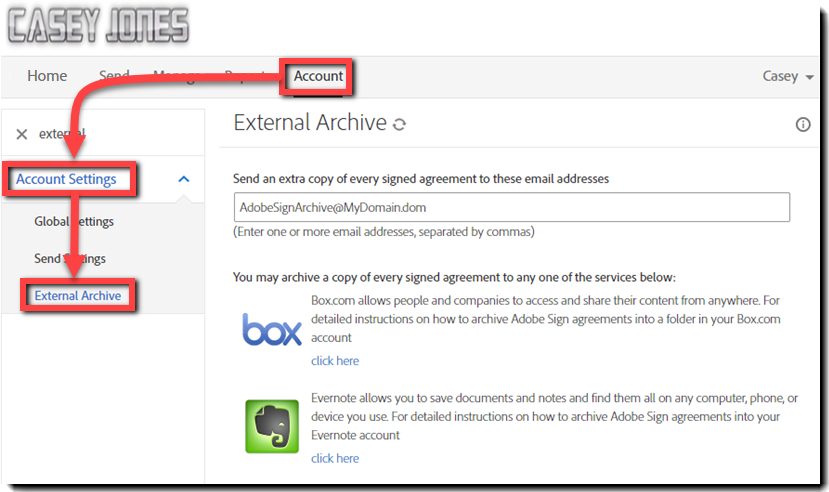

# Configuração de um arquivo externo

Saiba como criar um arquivo externo para cópias de backup de contratos que foram enviados. Você pode arquivar cópias de contratos assinados em qualquer endereço de email ou no Box e no Evernote. Uma cópia do email Assinado e Arquivado é enviada para o endereço de email ou para o serviço que você configurou.

## Arquivo externo: endereço de email

1. Faça logon como administrador da conta.

1. Clique em **[!UICONTROL Configurações da conta]** > **[!UICONTROL Arquivo externo]** na guia [!UICONTROL Conta].

   

1. Insira o endereço de email de arquivamento e clique em **[!UICONTROL Salvar alterações]**.

   

## Arquivo externo: Box.com

1. Faça logon como administrador da conta.

1. Clique em **[!UICONTROL Configurações da conta]** > **[!UICONTROL Arquivo externo]** na guia [!UICONTROL Conta].

1. Selecione o link [!UICONTROL clique aqui] à direita do logotipo do Box.

   

1. Siga as instruções específicas do Box na janela pop-up.

   

## Arquivo externo: Evernote

1. Faça logon como administrador da conta.

1. Clique em **[!UICONTROL Configurações da conta]** > **[!UICONTROL Arquivo externo]** na guia [!UICONTROL Conta].

1. Selecione o link **[!UICONTROL clique aqui]** à direita do logotipo do Evernote.

   

1. Siga as instruções específicas do Evernote na janela pop-up.

   
