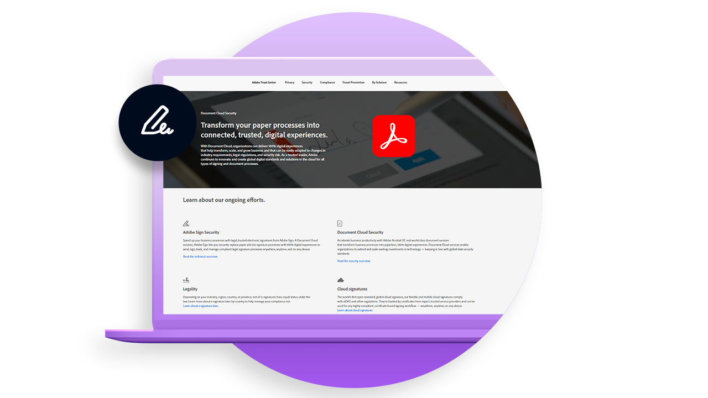

# Visão geral da implantação

Artigos de práticas recomendadas com insights valiosos sobre a implantação do Adobe Sign em sua organização.

<table style="table-layout:fixed">
<tr>
  <td>
    
    

    <a href="https://helpx.adobe.com/enterprise/using/adobe-sign-for-enterprise.html" target="_blank"><strong>Gerenciamento do Adobe Sign no Admin Console</strong></a>
    

    <em>Saiba como gerenciar usuários e licenças da Adobe Sign na plataforma corporativa da Adobe no Adobe Admin Console</em>
     
  </td>
  <td>
    
    

    <a href="https://helpx.adobe.com/sign/using/adobe-sign-training-best-practice.html" target="_blank"><strong>Práticas recomendadas</strong></a>
    

    <em>Analise insights valiosos e o conhecimento adquirido pelo trabalho de nosso Gerente de sucesso do cliente com nossos clientes na implantação do Adobe Sign</em>
     
  </td>  
  <td>
    
    

    <a href="https://www.adobe.com/trust/document-cloud-security.html" target="_blank"><strong>Central de confiança do Adobe</strong></a>
    

    <em>Saiba mais sobre nossos esforços contínuos em segurança, legalidade e padrões para o Adobe Sign</em>
     
  </td>
</tr>
<tr>
  <td>
    
    

    <a href="assets/SignStudyGuide.pdf"><strong>Guia de estudo do Adobe Sign Essentials</strong></a>
    

    <em>Guia de estudo da Adobe Sign para a avaliação do Adobe Sign Essentials (AD3-D104)</em>
     
  </td>
  <td>
    
    

     
  </td>
  <td>
    
    

     
  </td>
</tr>
</table>
