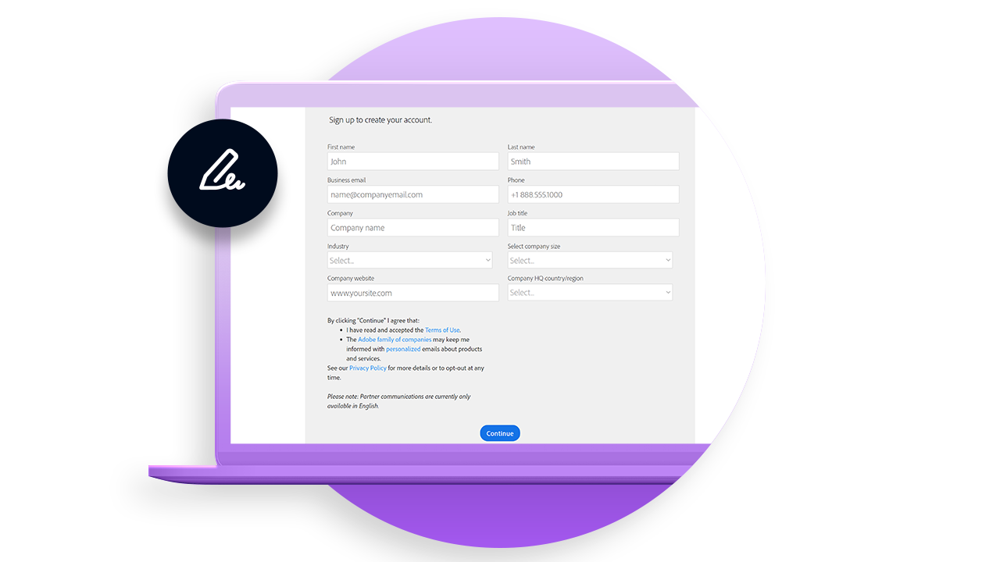
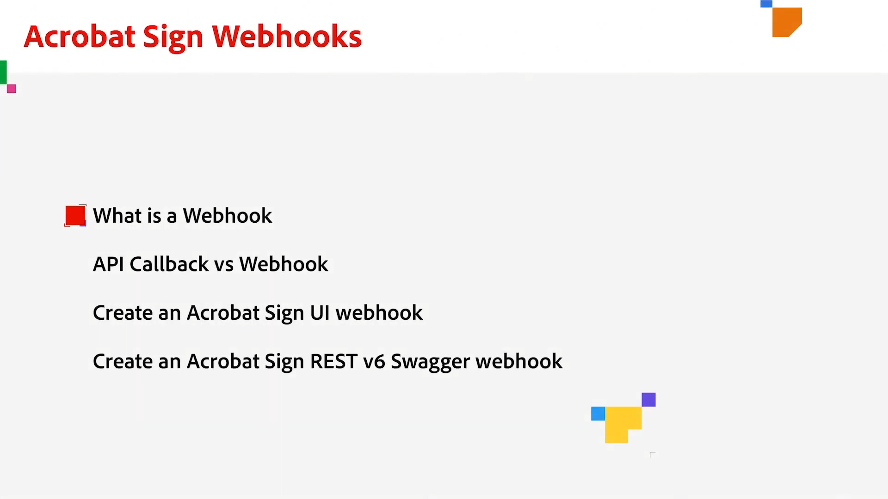

# Desenvolver visão geral

40% dos contratos no Acrobat Sign são criados usando APIs. Use APIs para criar aplicativos personalizados para suas equipes, parceiros e clientes.

## Novidades

>[!BEGINTABS]

>[!TAB Como configurar webhooks]

Saiba como criar um [webhook](webhooks.md) para automatizar processos que normalmente exigiriam intervenção manual.

>[!ENDTABS]

<table style="table-layout:fixed">
<tr>
  <td>
    
    

    <a href="https://www.adobe.io/apis/documentcloud/sign.html" target="_blank"><strong>Criar uma conta de desenvolvedor</strong></a>
    

    <em>Saiba como começar a usar uma conta de desenvolvedor</em>
     
  </td>
  <td>
    
    

    <a href="https://www.adobe.io/apis/documentcloud/sign/docs.html" target="_blank"><strong>Saiba o que você pode fazer</strong></a>
    

    <em>Saiba como incorporar a funcionalidade do Acrobat Sign em qualquer aplicativo externo</em>
     
  </td>  
  <td>
    
    

    <a href="gigasign.md"><strong>Coletar documentos em alto volume usando o GigaSign</strong></a>
    

    <em>Envie, colete e acompanhe documentos para assinatura a milhares de pessoas ao mesmo tempo</em>
     
  </td>
   <td>
    
    

    <a href="embeddedesignature.md"><strong>Criar assinatura eletrônica incorporada e experiências de documento</strong></a>
    

    <em>Saiba como usar as APIs do Acrobat Sign para incorporar a assinatura eletrônica e as experiências de documento em suas plataformas Web e sistemas de gerenciamento de conteúdo e documentos</em>
     
  </td>
</tr>
<tr>
  <td>
    
    

    <a href="webhooks.md"><strong>Como configurar webhooks</strong></a>
    

    <em>Saiba como criar um webhook para automatizar processos que normalmente exigem intervenção manual</em>
     
  </td>
  <td>
    
    

     
  </td>
  <td>
    
    

     
  </td>
  <td>
    
    

     
  </td>
</tr>
</table>
