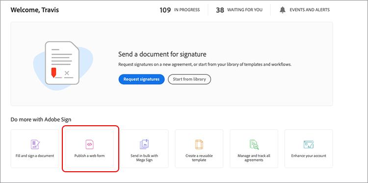
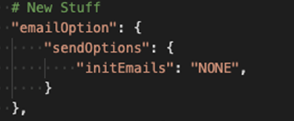

# Crie assinaturas eletrônicas incorporadas e experiências em documentos

Saiba como usar APIs do Acrobat Sign para incorporar assinaturas eletrônicas e experiências de documentos às suas plataformas da Web e sistemas de gerenciamento de documentos e conteúdo. Há quatro partes neste tutorial prático.

## Parte 1: O que você precisa

Na parte 1, saiba como começar com tudo o que você precisa para as partes 2 a 4. Vamos começar obtendo credenciais de API.

+++Exibir detalhes sobre como obter credenciais de API

* [Conta de desenvolvedor do Acrobat Sign](https://acrobat.adobe.com/br/pt/sign/developer-form.html)
* [Código Inicial](https://github.com/benvanderberg/adobe-sign-api-tutorial)
* [Código VS (ou editor de sua escolha)](https://code.visualstudio.com)
* Python 3.x
   * Mac — Homebrew
   * Linux — Instalador integrado
   * Windows — Chocolatey
   * Todos — https://www.python.org/downloads/

+++

## Parte 2: Baixo/sem código — o poder dos formulários web

Na parte 2, explore a opção de baixo/sem código do uso de formulários web. É sempre uma boa ideia ver se você pode evitar escrever código no início.

+++Exibir detalhes sobre como criar um formulário da Web

1. Acesse o Acrobat Sign com sua conta de desenvolvedor.

1. Selecionar **Publicar um formulário da Web** na página inicial.

   

1. Crie seu contrato.

   

1. Incorpore seu contrato em uma página HTML simples.

1. Experimente adicionar parâmetros de consulta dinamicamente.

   

+++

## Parte 3: Enviar contrato com um formulário e mesclar dados

Na parte 3, crie contratos de maneira dinâmica.

+++Exibir detalhes sobre como criar contratos dinamicamente

Primeiro, você precisa estabelecer o acesso. Com o Acrobat Sign, há duas maneiras de se conectar por meio da API. Tokens OAuth e chaves de integração. A menos que você tenha um motivo muito específico para usar o OAuth com seu aplicativo, você deve explorar as Chaves de integração primeiro.

1. Selecionar **Chave de integração** no **Informações da API** menu abaixo do **Conta** no Acrobat Sign.

   

Agora que você tem acesso e pode interagir com a API, veja o que pode fazer com a API.

1. Navegue até o [Métodos da Acrobat Sign REST API Versão 6](http://adobesign.com/public/docs/restapi/v6).

   

1. Use o token como um valor de &quot;portador&quot;.

   

Para enviar seu primeiro contrato, é melhor entender como usar a API.

1. Crie um Documento temporário e envie-o.

>[!NOTE]
>
>As chamadas de solicitação baseadas em JSON têm uma opção &quot;Modelo&quot; e &quot;Esquema de modelo mínimo&quot;. Isso fornece especificações e um conjunto de carga útil mínima.

Depois de enviar um contrato pela primeira vez, você estará pronto para adicionar a lógica. É sempre uma boa ideia estabelecer alguns auxiliares para minimizar a repetição. Estes são alguns exemplos:

**Validação**

**Cabeçalhos/Autenticação**

**URI Base**

Lembre-se de onde os documentos transitórios estão no grande esquema do ecossistema do Sign.
Temporário -> Contrato transitório -> Modelo -> Contrato transitório -> Widget -> Contrato

Este exemplo usa um modelo como nossa fonte de documento. Geralmente, essa é a melhor rota, a menos que você tenha um motivo sólido para gerar dinamicamente documentos para assinatura (por exemplo, código herdado ou geração de documento).

O código é bastante simples; ele usa um documento da biblioteca (modelo) para a origem do documento. O primeiro e o segundo signatários são atribuídos dinamicamente. O `IN_PROCESS` estado significa que o documento está sendo enviado imediatamente. Além disso, `mergeFieldInfo` é aproveitado para preencher campos dinamicamente.

+++

## Parte 4: Incorpore experiência de assinatura, redirecionamentos e muito mais

Em muitos casos, você pode permitir que o participante acionador assine imediatamente um contrato. Isso é útil para aplicativos e quiosques voltados para o cliente.

+++Veja detalhes sobre como incorporar a experiência de assinatura

Se você não deseja que o primeiro email de envio seja acionado, uma maneira fácil é gerenciar o comportamento é com uma modificação na chamada de API.

Veja como controlar o redirecionamento pós-assinatura:

Depois de atualizar o processo de criação do contrato, a etapa final é gerar o URL de assinatura. Essa chamada também é bastante direta e gera um URL que um signatário pode usar para acessar sua parte do processo de assinatura.

>[!NOTE]
>
>Observe que a chamada de criação do contrato é tecnicamente assíncrona. Isso significa que uma chamada de contrato &#39;POST&#39; pode ser feita, mas o contrato ainda não está pronto. A prática recomendada é estabelecer um loop de repetição. Use uma repetição ou qualquer outra prática recomendada para seu ambiente.

Quando tudo é montado, a solução é bastante simples. Você está criando um contrato e gerando um URL de assinatura para o signatário clicar e começar o ritual de assinatura.

+++

## Tópicos adicionais

* [Eventos JS](https://www.adobe.io/apis/documentcloud/sign/docs.html#!adobedocs/adobe-sign/master/events.md)
* Eventos do Webhook
   * [API REST](https://sign-acs.na1.echosign.com/public/docs/restapi/v6#!/webhooks/createWebhook)
   * [Webhooks no Acrobat Sign v6](https://www.adobe.io/apis/documentcloud/sign/docs.html#!adobedocs/adobe-sign/master/webhooks.md)
* [Reativar e-mails de solicitação (com eventos)](https://sign-acs.na1.echosign.com/public/docs/restapi/v6#!/agreements/updateAgreement)
* [Substituir Tempo Limite por uma Repetição](https://stackoverflow.com/questions/23267409/how-to-implement-retry-mechanism-into-python-requests-library)

     
* Lembretes personalizados
   * Com a criação inicial

      

   * Ou adicione um [em voo](https://sign-acs.na1.echosign.com/public/docs/restapi/v6#!/agreements/createReminderOnParticipant)
