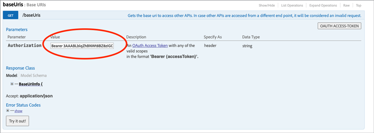
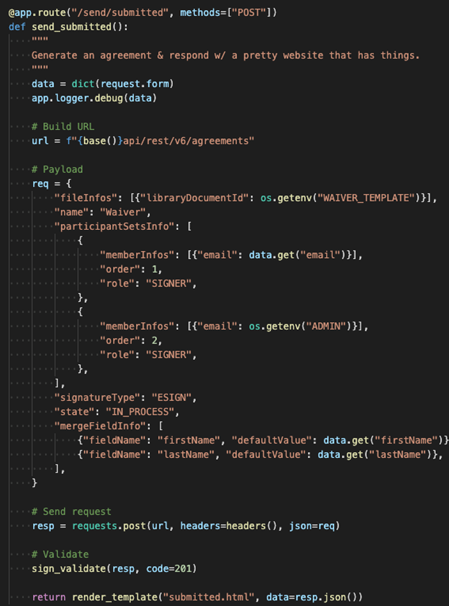
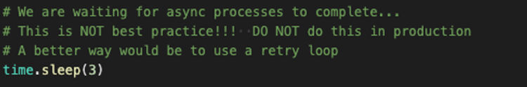

# Criar assinatura eletrônica incorporada e experiências de documento

Saiba como usar as APIs do Acrobat Sign para incorporar experiências de assinatura eletrônica e de documento em plataformas Web e sistemas de gerenciamento de conteúdo e documentos. Há quatro partes neste tutorial prático.

## Parte 1: Do que você precisa

Na parte 1, saiba como começar a usar tudo o que você precisa para as partes 2 a 4. Vamos começar obtendo credenciais de API.

+++Exibir detalhes sobre como obter credenciais de API

* [Conta de desenvolvedor do Acrobat Sign](https://www.adobe.com/acrobat/business/developer-form.html)
* [Código Inicial](https://github.com/benvanderberg/adobe-sign-api-tutorial)
* [Código VS (ou editor de sua escolha)](https://code.visualstudio.com)
* Python 3.x
   * Mac — Homebrew
   * Linux — Instalador integrado
   * Windows — Chocolatey
   * All — https://www.python.org/downloads/

+++

## Parte 2: Código baixo/nulo — o poder dos formulários web

Na parte 2, explore a opção de baixo valor/sem código do uso de formulários web. É sempre uma boa ideia ver se você pode evitar escrever código no início.

+++Exibir detalhes sobre como criar um formulário da Web

1. Acesse o Acrobat Sign com sua conta de desenvolvedor.

1. Selecione **Publish um formulário web** na página inicial.

   

1. Crie seu contrato.

   

1. Insira seu contrato em uma página de HTML simples.

1. Experimente adicionar parâmetros de consulta dinamicamente.

   

+++

## Parte 3: Enviar contrato com um formulário e mesclar dados

Na parte 3, crie contratos dinamicamente.

+++Exibir detalhes sobre como criar contratos dinamicamente

Primeiro, você precisa estabelecer o acesso. Com o Acrobat Sign, há duas maneiras de se conectar por meio da API. Tokens OAuth e Chaves de Integração. A menos que você tenha um motivo muito específico para usar o OAuth com o aplicativo, você deve explorar as Chaves de integração primeiro.

1. Selecione **Chave de integração** no menu **Informações de API** na guia **Conta** do Acrobat Sign.

   

Agora que você tem acesso e pode interagir com a API, veja o que você pode fazer com a API.

1. Navegue até os [Métodos da ](http://adobesign.com/public/docs/restapi/v6) da API REST Versão 6.

   

1. Use o token como um valor de “portador”.

   

Para enviar seu primeiro contrato, é melhor entender como usar a API.

1. Crie um Documento temporário e envie-o.

>[!NOTE]
>
>As chamadas de solicitação baseadas em JSON têm uma opção “Modelo” e “Esquema de modelo mínimo”. Isso fornece especificações e um conjunto mínimo de carga útil.

Depois de enviar um contrato pela primeira vez, você estará pronto para adicionar a lógica. É sempre uma boa ideia estabelecer alguns auxiliares para minimizar a repetição. Veja alguns exemplos:

**Validação**

**Cabeçalhos/Autenticação**

**URI Base**

Lembre-se de onde os Documentos transitórios pousam no esquema geral do ecossistema do Sign.
Temporário -> Contrato
Temporário -> Modelo -> Contrato
Temporário -> Widget -> Contrato

Este exemplo usa um modelo como nossa origem de documento. Geralmente, esse é o melhor caminho, a menos que você tenha um motivo sólido para gerar dinamicamente documentos para assinatura (por exemplo, código legado ou geração de documento).

O código é bastante simples; ele usa um documento da biblioteca (modelo) para a origem do documento. O primeiro e o segundo signatários são atribuídos dinamicamente. O estado `IN_PROCESS` significa que o documento está sendo enviado imediatamente. Além disso, o `mergeFieldInfo` é aproveitado para preencher campos dinamicamente.

+++

## Parte 4: incorpore experiência de assinatura, redirecionamentos e muito mais

Em muitas situações, você pode permitir que o participante de acionamento assine imediatamente um contrato. Isso é útil para aplicativos e quiosques voltados para o cliente.

+++Exibir detalhes sobre como incorporar a experiência de assinatura

Se você não quiser que o primeiro email de envio seja acionado, uma maneira fácil é gerenciar o comportamento é com uma modificação na chamada de API.

Veja como controlar o redirecionamento pós-assinatura:

Depois de atualizar o processo de criação do contrato, a etapa final é gerar o URL de assinatura. Essa chamada também é bastante direta e gera um URL que um signatário pode usar para acessar sua parte do processo de assinatura.

>[!NOTE]
>
>Observe que a chamada de criação do contrato é tecnicamente assíncrona. Isso significa que uma chamada de contrato &#39;POST&#39; pode ser feita, mas o contrato ainda não está pronto. A prática recomendada é estabelecer um loop de repetição. Use uma nova tentativa ou qualquer outra prática recomendada para seu ambiente.

Quando tudo está pronto, a solução é bastante simples. Você está criando um contrato e gerando um URL de assinatura para que o signatário clique e comece o ritual de assinatura.

+++

## Tópicos adicionais

* [JS Events](https://www.adobe.io/apis/documentcloud/sign/docs.html#!adobedocs/adobe-sign/master/events.md)
* Eventos do Webhook
   * [API REST](https://sign-acs.na1.echosign.com/public/docs/restapi/v6#!/webhooks/createWebhook)
   * [Webhooks no Acrobat Sign v6](https://www.adobe.io/apis/documentcloud/sign/docs.html#!adobedocs/adobe-sign/master/webhooks.md)
* [Reativar e-mails de solicitação (com eventos)](https://sign-acs.na1.echosign.com/public/docs/restapi/v6#!/agreements/updateAgreement)
* [Substituir o tempo limite por uma nova tentativa](https://stackoverflow.com/questions/23267409/how-to-implement-retry-mechanism-into-python-requests-library)
* Lembretes personalizados
   * Com a criação inicial

     

   * Ou adicione um [em andamento](https://sign-acs.na1.echosign.com/public/docs/restapi/v6#!/agreements/createReminderOnParticipant)
