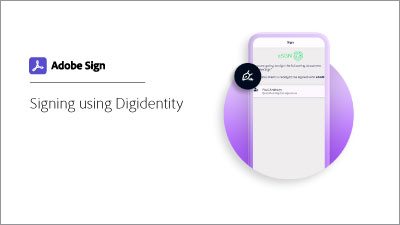

# Obter uma ID digital de [!DNL Digidentity]

Saiba como obter um certificado de assinatura digital de [!DNL Digidentity]. Depois de registrada e sua identidade ser verificada, [!DNL Digidentity] emite uma ID digital usada para aplicar uma assinatura na nuvem da Adobe Sign.

>[!VIDEO](https://video.tv.adobe.com/v/337067?hidetitle=true)

  

**Selecione a imagem abaixo para saber como usar sua ID  [!DNL Digidentity] digital no Adobe Sign.**

