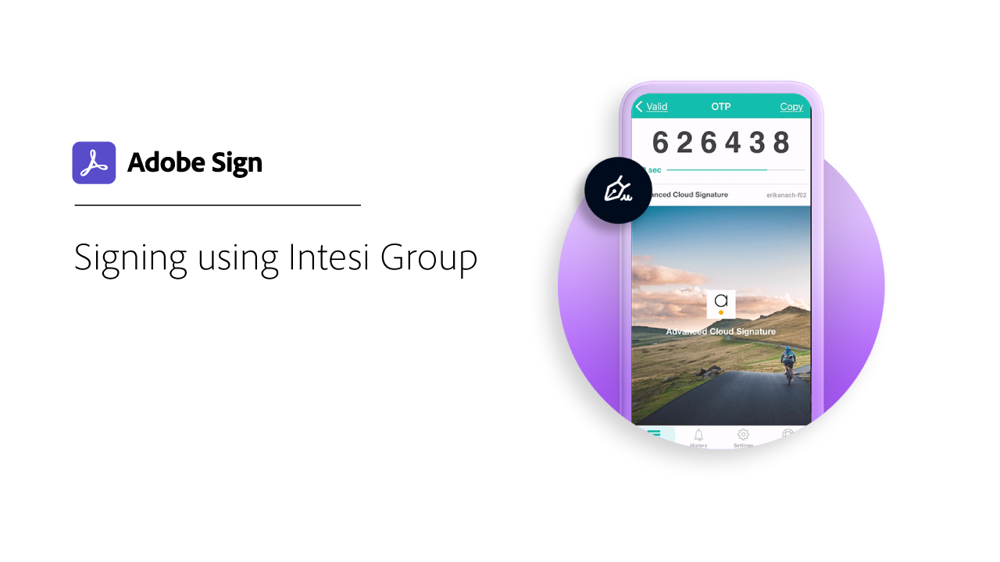

# Visão geral da ID digital

Semelhante a um passaporte em formato eletrônico, uma identidade digital (ID digital) permite que você prove com segurança que é quem diz ser. Além disso, ao assinar eletronicamente no Acrobat Sign, usar uma ID digital oferece uma garantia maior de que você autorizou sua assinatura eletrônica nesse documento específico. Os tutoriais a seguir mostram como usar IDs digitais do mundo todo com o Acrobat Sign.

>[!NOTE]
>
>Antes de usar uma ID digital com uma assinatura em nuvem, consulte o administrador da sua organização para confirmar se a solução do provedor está habilitada no Acrobat Sign.

## [!DNL Aadhaar]

<table style="table-layout:fixed">
<tr>
 <td>
    
    

    <a href="aadhaar-sign.md"><strong>Assinar usando [!DNL Aadhaar]</strong></a>
    

    <em>Saiba como usar sua [!DNL Aadhaar] ID digital com o Acrobat Sign</em>
     
  </td>
  <td>
    
    

     
  </td>
  <td>
    
    

     
  </td>
</tr>
</table>

## [!DNL Digidentity]

<table style="table-layout:fixed">
<tr>
 <td>
    
    

    <a href="digidentity-reg.md"><strong>Obter uma ID digital de [!DNL Digidentity]</strong></a>
    

    <em>Saiba como obter um certificado de assinatura digital do [!DNL Digidentity]</em>
     
  </td>
  <td>
    
    

    <a href="digidentity-sign.md"><strong>Assinar usando [!DNL Digidentity]</strong></a>
    

    <em>Saiba como usar sua [!DNL Digidentity] ID digital com o Acrobat Sign</em>
     
  </td>
  <td>
    
    

     
  </td>
</tr>
</table>

## [!DNL Intesi Group]

<table style="table-layout:fixed">
<tr>
  <td>
    
    

    <a href="intesi-advanced.md"><strong>Obter uma ID digital de [!DNL Intesi Group] (Avançado)</strong></a>
    

    <em>Saiba como obter um certificado de assinatura digital avançada da [!DNL Intesi Group]</em>
     
  </td>
  <td>
    
    

    <a href="intesi-qualified.md"><strong>Obter uma ID digital de [!DNL Intesi Group] (Qualificado)</strong></a>
    

    <em>Saiba como obter um certificado de assinatura digital qualificado da [!DNL Intesi Group]</em>
     
  </td>
  <td>
    
    

    <a href="intesi-sign.md"><strong>Assinar usando [!DNL Intesi Group]</strong></a>
    

    <em>Saiba como usar sua [!DNL Intesi Group] ID digital com o Acrobat Sign</em>
     
  </td>
</tr>
</table>
