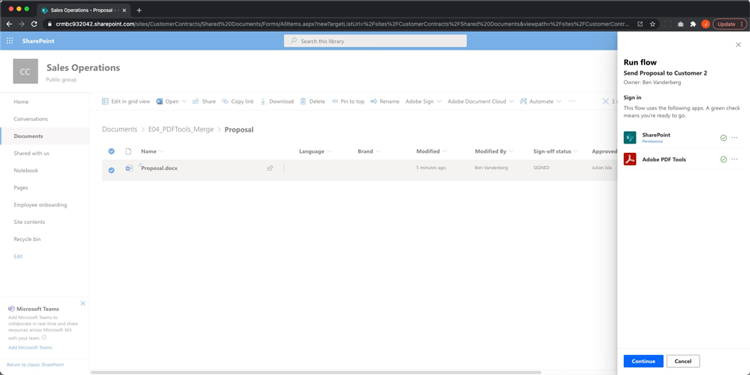

# Automação de documentos com o Acrobat Sign para Microsoft Power Platform

Saiba como ativar e usar os conectores do Acrobat Sign e do Adobe PDF Tools para Microsoft Power Apps. Crie fluxos de trabalho que automatizem os processos de aprovação e assinatura de negócios com rapidez e segurança, sem nenhum código. Há quatro partes neste tutorial prático destacadas nos links abaixo:

<table style="table-layout:fixed">
<tr>
  <td>
    
    

    <a href="documentautomation.md#part1"><strong>Parte 1: Armazenar o contrato assinado no SharePoint com o Acrobat Sign</strong></a>
    

  </td>
  <td>
    
    

    <a href="documentautomation.md#part2"><strong>Parte 2: Processo de aprovação automatizado para obter assinatura eletrônica com o Acrobat Sign</strong></a>
    

  </td>
  <td>
   
    

    <a href="documentautomation.md#part3"><strong>Parte 3: OCR de documento automatizado com ferramentas do Adobe PDF</strong></a>
    

  </td>
  <td>
   
    

    <a href="documentautomation.md#part4"><strong>Parte 4: Montagem automatizada de documentos com as ferramentas do Adobe PDF</strong></a>
    

  </td>
</tr>
</table>

## Pré-requisitos

* Familiaridade do Microsoft 365 e do Power Automate
* Conhecimento da Acrobat Sign
* Conta do Microsoft 365 com acesso ao SharePoint e ao Power Automate (Básico para Acrobat Sign, Premium para ferramentas do Adobe PDF)
* Conta de desenvolvedor da Acrobat Sign para corporações ou da Acrobat Sign

**Exercícios 1 e 2**

* Conta do Acrobat Sign com acesso à API. Uma conta de desenvolvedor ou uma conta corporativa.
* Site do SharePoint acessível pelo Power Automate ao qual você tem permissões de edição. Recomenda-se acesso total de administrador.
* Exemplo de documento para a solicitação de aprovação de assinatura e assinatura.

**Exercícios 3 e 4**

Baixar materiais [aqui](https://github.com/benvanderberg/adobe-sign-pdftools-powerautomate-tutorial)

## Parte 1: Armazenar o contrato assinado no SharePoint com o Acrobat Sign {#part1}

Na primeira parte, você usará um modelo de fluxo do Power Automate para configurar um fluxo de trabalho automatizado que salvará todos os contratos assinados no site do SharePoint.

1. Navegue até o Power Automate.
1. Procure por Acrobat Sign.

   

1. Escolher **Salvar um contrato concluído do Acrobat Sign na biblioteca do SharePoint**.

   

1. Revise a tela e configure as conexões necessárias. Ative a conexão do Acrobat Sign.
1. Clique no azul `+` símbolo.

   

1. Insira o email da sua conta da Acrobat Sign e clique no campo de senha na nova janela.

   

   Aguarde um momento para que o Adobe verifique sua conta.

   >[!NOTE]
   >
   >Essa verificação encaminhará você ao logon apropriado se estiver usando uma Adobe ID ou nosso SSO corporativo.

1. Logon completo.
1. Clique em **Continuar** para ir para a tela Edição de fluxo.
1. Nomeie o acionador.

   

1. Defina as configurações do SharePoint.

   

   **Endereço do site:** Seu site da SharePoint
   **Caminho da Pasta:** Caminho para os Documentos Compartilhados que você deseja usar
   **Nome do arquivo:** Aceitar o padrão
   **Conteúdo do arquivo:** Aceitar o padrão

1. Salve o fluxo.

   

1. Navegue até a tela de visão geral do fluxo com a seta azul para trás. Você testará esse fluxo na parte 2.

   

Você testará esse fluxo na próxima parte.

## Parte 2: Processo de aprovação automatizado para obter assinatura eletrônica com o Acrobat Sign {#part2}

Na segunda parte, desenvolvemos a primeira parte com um fluxo mais robusto e testamos ambos os fluxos para vê-los em ação.

1. Selecionar **Modelos** no lado esquerdo da interface do Power Automate.

   

1. Procure por “aprovação do gerente”.
1. Selecionar **Solicitar aprovação do gerente para um arquivo selecionado**.

   

   Revise as conexões e adicione as que estiverem ausentes.

   >[!NOTE]
   >
   >Se este for o primeiro fluxo que você está fazendo com as aprovações, elas serão totalmente configuradas quando o fluxo for executado.

1. Clique em **Continuar** para ir para a tela de edição de fluxo.

   Esse fluxo tem muitas etapas pré-configuradas, incluindo verificação de erros e etapas condicionais aninhadas.

1. Configurar **Para um arquivo selecionado** do seguinte modo:
   **Endereço do site:** Seu site do SharePoint
   **Nome da biblioteca:** Seu repositório de documentos
1. Adicione uma entrada da seguinte maneira:
   **Tipo**: E-mail
   **Nome**: Email do signatário

   

1. Configurar **Obter Propriedades do Arquivo:** do seguinte modo:
   **Endereço do site:** Seu site do SharePoint
   **Nome da biblioteca:** Seu repositório de documentos

1. Desça e procure **Em caso afirmativo**.

   

1. Clique em **Adicionar uma ação** na caixa **Em caso afirmativo** (não a mais abaixo) para adicionar as etapas a serem enviadas para assinatura.

   

1. Procurar por **Obter conteúdo do arquivo do SharePoint** e escolha **Obter conteúdo do arquivo**.

   

1. Configurar o **Obter conteúdo do arquivo** do seguinte modo:

   

   **Endereço do site:** Seu site da SharePoint.
   **Identificador de arquivo:** Pesquise “identifier” e escolha Identifier na **Obter propriedades do arquivo** etapa.
1. Pesquise por &quot;Adobe&quot; e escolha **Acrobat Sign** para adicionar outra ação.

   

1. Digite “upload” na caixa de pesquisa do Acrobat Sign e selecione **Fazer upload de um documento e obter uma ID de documento**.
1. Procurar a variável dinâmica **Nome** para obter o nome do item/documento selecionado no acionador em **Nome do arquivo**.
1. Clique em **Expressão** na variável assistant sob **Conteúdo do arquivo**.

   

1. Adicione um único apóstrofo e clique novamente para **Conteúdo dinâmico**, exclua seu apóstrofo, selecione **Conteúdo do arquivo** e clique em **OK**.

   Certifique-se de que não haja apóstrofos adicionais e que se pareça com a amostra abaixo.

   

1. Pesquise “criar” na área de pesquisa do Acrobat Sign para adicionar outra ação do Acrobat Sign.
1. Selecionar **Criar um contrato a partir de um documento carregado e enviar para assinatura**.

   

1. Configure as informações necessárias: escolha **Nome** no assistente de variável dinâmica no **Nome do contrato**.
Escolher **ID do documento** no assistente de variável dinâmica no **ID do documento**.
Escolher **Email do signatário** no assistente de variável dinâmica no **Email do participante**.
Digite “1” em **Ordem do participante**.
Escolher **Signatário** na lista suspensa em **Função do participante**.

   

1. **Salvar** o fluxo.

### Teste o fluxo

Vá para o repositório de documentos do site do SharePoint para testá-lo.

1. Selecione o documento e escolha **Automatizar** e a **Fluxo** você acabou de criar.

   

1. Inicie o fluxo para validar as conexões (somente a primeira execução do fluxo).
1. Insira uma mensagem agradável para o aprovador em **Mensagem**.
1. Insira o email do signatário do documento em **Email do signatário**.
1. Clique em **Executar fluxo**.

O aprovador configurado para o usuário que inicia o fluxo receberá uma solicitação de aprovação. Você pode aprovar por email ou pelo menu Itens de ação do Power Automate.
Depois de aprovado, assine o documento. Dependendo do usuário e se ele estiver conectado ao Sign, talvez seja necessário abrir as janelas de assinatura em uma janela privada do navegador.

Conclua a assinatura e examine novamente sua pasta da SharePoint.

## Parte 3: OCR de documento automatizado com ferramentas do Adobe PDF {#part3}

Na terceira parte, você aprenderá como automatizar o OCR em PDF quando eles forem importados no Microsoft SharePoint. Isso resolve um problema que ocorre com documentos PDF digitalizados que não são pesquisáveis no SharePoint.

### Configurar uma pasta no SharePoint

Acesse o Microsoft SharePoint onde você gostaria de armazenar documentos.

1. Clique em **+ Novo** para criar uma nova pasta chamada “Contratos Processados”.
1. Clique em **+ Novo** para criar uma nova pasta chamada “Contratos Antigos”.

   

Essas pastas agora são referenciadas como parte do fluxo do Power Automate.

### Criar um fluxo a partir de um modelo

1. Faça logon em https://flow.microsoft.com.
1. Clique em **Modelos** na barra lateral.

   

1. Selecionar **Converter arquivos recém-adicionados em PDF de texto pesquisável no SharePoint**.
1. Clique no botão **+** símbolo ao lado de Ferramentas do Adobe PDF.

   

1. Navegue até https://www.adobe.com/go/powerautomate_getstarted em uma nova guia.
1. Clique em **Começar**.

   

1. Efetue login com seu Adobe ID.

   

1. Insira o nome e a descrição das credenciais e clique em **Criar credenciais**.

   

   Mantenha a janela com as credenciais abertas. Você precisará inseri-los no Microsoft Power Automate.

   

1. Insira as credenciais e clique em **Crie no Microsoft Power Automate**.

   

1. Clique em **Continuar**.

   

   Agora você tem uma visão do fluxo de trabalho e precisará configurá-lo para seu ambiente.

1. Selecione o campo Endereço do site e escolha o site da SharePoint que você está usando sob o acionador chamado **Quando um arquivo é criado em uma pasta**.

   

1. Clique no ícone de pasta para navegar até a pasta Contratos antigos, localizada em ID da pasta.

   

1. Edite o **Criar arquivo** ação na parte inferior do fluxo:

   Alterar **Endereço do site** para o endereço do site.
Especifique o local da pasta Contratos Processados no Caminho da Pasta.

1. Clique em **Salvar** no canto superior direito.
1. Clique em **Teste**.
1. Selecionar **Manualmente**.
1. Clique em **Teste**.

   

### Experimente o novo fluxo

1. Navegue até a pasta Contratos antigos no SharePoint.
1. Navegue até E03/Old Contracts nos arquivos de exercício que você baixou.
1. Copie os arquivos ReleaseFormXX.pdf para a antiga pasta Contracts no SharePoint.

   

Agora, se você navegar até a pasta Contratos processados, poderá ver seus PDF disponíveis depois que o fluxo tiver alguns minutos para ser executado. Se você abrir os PDF, verá que o texto é selecionável.
Além disso, o SharePoint indexa o documento, permitindo que você pesquise o conteúdo dos documentos na barra de pesquisa do SharePoint.

## Parte 4: Montagem automatizada de documentos com as ferramentas do Adobe PDF {#part4}

Na parte quatro, você aprenderá como mesclar muitos documentos com base nas informações fornecidas ao selecionar e iniciar um fluxo no Microsoft SharePoint. Nesse cenário, o fluxo irá:

* Peça informações para escolher o que incluir em um pacote para um cliente.
* Com base nas informações fornecidas, ele mescla muitos documentos. Esses documentos incluem uma capa e white papers opcionais.
* O documento mesclado será salvo na SharePoint.

### Importar arquivos de exercício para o SharePoint

1. Abra a pasta E04 nos arquivos do exercício.
1. Importe as pastas Proposta, Modelos e Documentos gerados no SharePoint.

   

Essas pastas serão usadas para referência. Em particular, você usará o arquivo Proposal.docx para sua proposta.

Na pasta Modelos, há uma pasta Capas que inclui designs de páginas de capa para diferentes cidades. Há também uma pasta de white papers que contém white papers adicionais opcionais que serão anexados ao final, se selecionados.

### Importe o fluxo para o Microsoft Power Automate

1. Faça logon no Microsoft Power Automate (https://flow.microsoft.com).
1. Clique em **Meus fluxos**.

   

1. Clique em **Importar**.

   

1. Clique em **Carregar** e escolha a pasta GenerateProposal_20210311231623.zip em E04/Flows/.

   

1. Clique em **Importar**.

1. Clique no ícone de Chave inglesa em Ação, ao lado de **Enviar proposta ao cliente**.

   

1. Selecionar **Criar como novo** em Configuração.
1. Defina o nome do fluxo em Nome do Recurso.
1. Clique em **Salvar**.

   Repita isso para os outros recursos relacionados e selecione sua conexão.

   

1. Clique em **Importar** depois de ter feito todas as conexões.

### Definir para um arquivo selecionado

Agora que o fluxo foi criado, faça o seguinte:

1. Clique em **Editar**.

   

1. Selecionar o acionador **Para um arquivo selecionado**.

   Adicione seu site do SharePoint ao Endereço do site.
Adicione sua biblioteca à biblioteca.

   

### Definir templateFolderPath

1. Clique na variável templateFolderPath.
1. Defina o caminho para onde a pasta Modelos está localizada dentro do site do SharePoint importado.

### Definir conteúdo do arquivo de obtenção de capa

1. Clique em **Capa** ação, que expande o Escopo.
1. Expandir **Capa: Obter conteúdo do arquivo**.

   Defina o Endereço do site para o site da SharePoint.

   

### Definir arquivo selecionado

1. Expanda a **Arquivo selecionado** ação de escopo.

   Altere o Endereço do site e o Nome da biblioteca para o site da SharePoint e a Biblioteca respectivamente em **Obter propriedades do arquivo**.
Altere o Endereço do site para o site da SharePoint em **Obter conteúdo do arquivo**.

   

### Definir white papers

1. Clique em **White papers** ação.
1. Expandir **Condição: Adicionar Whitepaper**.

   

1. Expandir **Informe oficial 1: obtenha o conteúdo do arquivo usando o caminho**.
Edite o Endereço do site para o site da SharePoint especificado.

Repita as mesmas etapas para **Condição: Adicionar Whitepaper 2**.

### Definir Criar Arquivo

1. Expandir **Criar arquivo**.

   Edite o Endereço do site e o Caminho da pasta para o site da SharePoint e o caminho onde a pasta Documentos gerados está localizada.

1. Clique em **Salvar**.

### Teste o fluxo

1. Navegue até a pasta Proposta no SharePoint.
1. Selecione a pasta Proposal.docx.

   

1. Selecione seu fluxo na guia **Automatizar** menu.

   

1. Clique em **Continuar** para iniciar o fluxo.

   

1. Escolha sua capa e os documentos que deseja acrescentar.
1. Clique em **Executar fluxo**.

   

Navegue até a pasta Gerar Documentos. Agora você deve ver o arquivo PDF gerado.

### Adicionar o Protect e outras ações ao fluxo

Agora que você criou um fluxo com êxito, editará o fluxo para criptografar o documento PDF com uma senha. Isso também explica como você pode utilizar outras ações.

1. Navegue de volta para o final do fluxo.
1. Clique no botão **+** símbolo entre **Mesclar PDF** e **Criar arquivo**.

   

1. Selecionar **Adicionar uma ação**.
1. Pesquise por &quot;Adobe PDF Tools”.

   

1. Selecionar **Protect PDF da visualização**.
1. Use Dynamic Content para definir o campo Nome do arquivo como **Nome do Arquivo PDF do PDF de Mesclagem**.

   

   No acionador, há um campo Senha que faz parte do formulário de iniciação. Podemos usar isso aqui.

1. Procurar por **Campo Senha** usando conteúdo dinâmico e coloque-o no campo Senha.

   

1. Use conteúdo dinâmico para defini-lo como **Conteúdo de Arquivo PDF de Mesclar PDF** no campo Conteúdo do Arquivo.
1. Alterar o **Criar arquivo** para obter o conteúdo do arquivo do Protect PDF em vez de Mesclar PDF.
1. Expandir **Criar arquivo**.
1. Limpe o campo Conteúdo do arquivo.
1. Use o conteúdo dinâmico para inserir **Conteúdo do Arquivo PDF** de **Protect PDF da visualização**.

### Teste o fluxo

1. Navegue até a pasta Proposta no SharePoint.
1. Selecione Proposal.docx.

   

1. Selecionar **Automatizar** para escolher o fluxo.

   

1. Clique em **Continuar** para iniciar o fluxo.

   

1. Escolha a capa e os documentos que deseja acrescentar.
1. Defina o campo Senha para a Senha que deseja definir.
1. Clique em **Executar fluxo**.

   

1. Navegue até a pasta Gerar Documentos.
Você deve ver o arquivo de PDF gerado. Abra o arquivo PDF e solicite que você insira sua senha de PDF.

   
