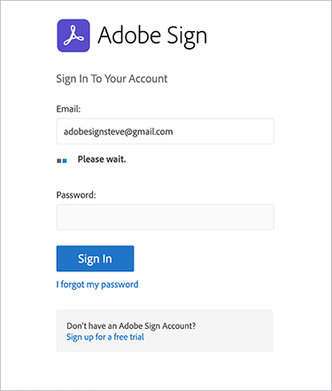
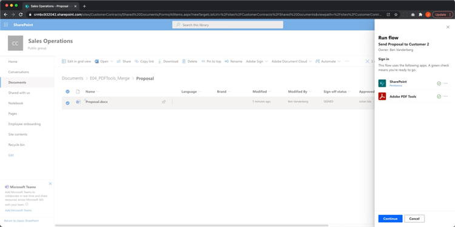
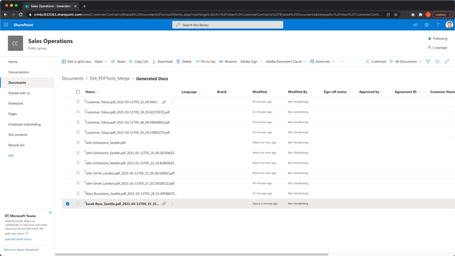

# Automação de documentos com Adobe Sign para Microsoft Power Platform

Saiba como ativar e usar os conectores Adobe Sign e Adobe PDF Tools para Microsoft Power Apps. Crie fluxos de trabalho que automatizem os processos de aprovação e assinatura de negócios de forma rápida e segura, sem nenhum código. Há quatro partes neste tutorial prático descrito nos links abaixo:

<table style="table-layout:fixed">
<tr>
  <td>
    
    

    <a href="documentautomation.md#part1"><strong>Parte 1: Armazenar o contrato assinado no SharePoint com o Adobe Sign</strong></a>
    

  </td>
  <td>
    
    

    <a href="documentautomation.md#part2"><strong>Parte 2: Processo de aprovação automatizado para obter assinatura eletrônica com a Adobe Sign</strong></a>
    

  </td>
  <td>
   
    

    <a href="documentautomation.md#part3"><strong>Parte 3: OCR de documentos automatizado com Adobe PDF Tools</strong></a>
    

  </td>
  <td>
   
    

    <a href="documentautomation.md#part4"><strong>Parte 4: Montagem automatizada de documentos com as ferramentas Adobe PDF</strong></a>
    

  </td>
</tr>
</table>

## Pré-requisitos

* Familiaridade entre o Microsoft 365 e o Power Automate
* Conhecimento Adobe Sign
* Conta Microsoft 365 com acesso ao SharePoint e Power Automate (Básico para Adobe Sign, Premium para Adobe PDF Tools)
* Conta de desenvolvedor Adobe Sign para empresas ou Adobe Sign

**Exercícios 1 e 2**

* Conta da Adobe Sign com acesso à API. Uma conta de desenvolvedor ou uma conta corporativa.
* Site do SharePoint acessível pelo Power Automate ao qual você tem permissões de edição. Recomenda-se o acesso completo do administrador.
* Exemplo de documento para a solicitação de aprovação de assinatura e assinatura.

**Exercícios 3 e 4**

Baixar materiais [aqui](https://github.com/benvanderberg/adobe-sign-pdftools-powerautomate-tutorial)

## Parte 1: Armazenar o contrato assinado no SharePoint com o Adobe Sign {#part1}

Na primeira parte, você usará um modelo de Fluxo do Power Automate para configurar um fluxo de trabalho automatizado que salvará todos os contratos assinados no site do SharePoint.

1. Navegue até Automação de energia.
1. Procure por Adobe Sign.

   

1. Escolha **Salvar um contrato concluído da Adobe Sign na biblioteca do SharePoint**.

   

1. Revise a tela e configure as conexões necessárias. Ative a conexão Adobe Sign.
1. Clique no símbolo azul `+`.

   

1. Insira o email da sua conta da Adobe Sign e clique no campo de senha na nova janela.

   

   Aguarde um momento para a Adobe verificar sua conta.

   >[!NOTE]
   >
   >Essa verificação o direcionará para o logon apropriado se você estiver usando um SSO Adobe ID ou nossa SSO corporativa.

1. Logon completo.
1. Clique em **Continuar** para ir para a tela Edição de fluxo.
1. Nomeie o acionador.

   

1. Defina as configurações do SharePoint.

   

   **Endereço do site:** Seu site do SharePoint
   **Caminho da pasta:** Caminho para os documentos compartilhados que você deseja usar
   **Nome do arquivo:** aceite o padrão
   **Conteúdo do arquivo:** aceite o padrão

1. Salve o fluxo.

   

1. Navegue até a tela de visão geral do fluxo com a seta azul para trás. Você testará esse fluxo na parte 2.

   

Você testará esse fluxo na próxima parte.

## Parte 2: Processo de aprovação automatizado para obter assinatura eletrônica com a Adobe Sign {#part2}

Na segunda parte, construímos a primeira parte com um Fluxo mais robusto e testamos ambos os Fluxos para vê-los em ação.

1. Selecione **Modelos** no lado esquerdo da interface do Power Automate.

   

1. Procure &quot;aprovação do gerente&quot;.
1. Selecione **Aprovação do gestor de pedidos para um ficheiro selecionado**.

   

   Revise as conexões e adicione as que estiverem ausentes.

   >[!NOTE]
   >
   >Se este for o primeiro fluxo que você está fazendo com aprovações, elas serão totalmente configuradas quando o fluxo for executado.

1. Clique em **Continuar** para ir para a tela de edição de fluxo.

   Esse fluxo tem várias etapas pré-configuradas, incluindo verificação de erros e etapas condicionais aninhadas.

1. Configurar **Para um ficheiro selecionado** da seguinte forma:
   **Endereço do site:** seu site do SharePoint
   **Nome da biblioteca:** seu repositório de documentos
1. Adicione uma entrada da seguinte forma:
   **Tipo**: Email
   **Nome**: Email do signatário

   

1. Configure **Obter Propriedades do Ficheiro:** da seguinte forma:
   **Endereço do site:** seu site do SharePoint
   **Nome da biblioteca:** seu repositório de documentos

1. Role para baixo e procure **Se sim**.

   

1. Clique em **Adicionar uma ação** na caixa **Se sim** (não a mais inferior) para adicionar as etapas para enviar para assinatura.

   

1. Procure **SharePoint para obter conteúdo de arquivo** e escolha **Obter conteúdo de arquivo**.

   

1. Configure o **Obter conteúdo do arquivo** da seguinte forma:

   

   **Endereço do site:** seu site do SharePoint.
   **Identificador de arquivo:** procure &quot;identificador&quot; e escolha Identificador na etapa  **Obter** propriedades do arquivo.
1. Procure &quot;Adobe&quot; e escolha **Adobe Sign** para adicionar outra ação.

   

1. Insira &quot;upload&quot; na caixa de pesquisa do Adobe Sign e selecione **Carregar um documento e obter uma ID de documento**.
1. Procure a variável dinâmica **Nome** para obter o nome do item/documento selecionado no acionador em **Nome do Arquivo**.
1. Clique em **Expression** no assistente de variáveis em **Conteúdo de Arquivo**.

   

1. Adicione um único apóstrofo, clique em Voltar para **Conteúdo Dinâmico**, elimine o apóstrofo, selecione **Conteúdo de Ficheiro** e, em seguida, clique em **OK**.

   Verifique se não há apóstrofos adicionais e se ele se parece com a amostra abaixo.

   

1. Procure &quot;criar&quot; na área de pesquisa do Adobe Sign para adicionar outra ação do Adobe Sign.
1. Selecione **Criar e assinar de um documento carregado e enviar para assinatura**.

   

1. Configure as informações necessárias:
Escolha **Nome** no assistente de variáveis dinâmicas em **Nome do contrato**.
Escolha **ID do documento** no assistente da variável dinâmica em **ID do documento**.
Escolha **Email do signatário** no assistente de variáveis dinâmicas em **Email do participante**.
Digite &quot;1&quot; em **Ordem do participante**.
Escolha **Signatário** no menu suspenso em **Função do Participante**.

   

1. **Salve** o fluxo.

### Teste o fluxo

Vá para o repositório de documentos do site do SharePoint para testá-lo.

1. Selecione o documento e escolha **Automatizar** e o **Fluxo** que acabou de criar.

   

1. Inicie o fluxo para validar as conexões (somente a primeira execução do fluxo).
1. Insira uma boa mensagem para o aprovador em **Message**.
1. Insira o email do signatário do documento em **Email do signatário**.
1. Clique em **Executar fluxo**.

O aprovador configurado para o usuário que inicia o fluxo receberá uma solicitação de aprovação. Você pode aprovar por email ou por meio do menu Itens de ação do Power Automate.
Depois de aprovado, assine o documento. Dependendo do usuário e se eles estiverem conectados ao Sign, talvez seja necessário abrir as janelas de assinatura em uma janela privada do navegador.

Conclua a assinatura e, em seguida, procure novamente na pasta do SharePoint.

## Parte 3: OCR de documentos automatizado com Adobe PDF Tools {#part3}

Na terceira parte, você aprenderá como automatizar o OCR em PDFs quando forem importados para o Microsoft SharePoint. Isso resolve um problema que ocorre com documentos PDF digitalizados que não são pesquisáveis no SharePoint.

### Configurar uma pasta no SharePoint

Vá para o Microsoft SharePoint onde gostaria de armazenar documentos.

1. Clique em **+ Novo** para criar uma nova pasta chamada &quot;Contratos Processados&quot;.
1. Clique em **+ Novo** para criar uma nova pasta chamada &quot;Contratos antigos&quot;.

   

Essas pastas agora são mencionadas como parte do fluxo do Power Automate.

### Criar um fluxo a partir de um modelo

1. Faça logon em https://flow.microsoft.com.
1. Clique em **Modelos** na barra lateral.

   

1. Selecione **Converter arquivos recentemente adicionados em PDFs pesquisáveis de texto no SharePoint**.
1. Clique no símbolo **+** ao lado de Ferramentas Adobe PDF.

   

1. Navegue até https://www.adobe.com/go/powerautomate_getstarted em uma nova guia.
1. Clique em **Introdução**.

   

1. Faça logon com seu Adobe ID.

   

1. Insira o nome das credenciais e a descrição das credenciais e clique em **Criar credenciais**.

   

   Mantenha a janela com as credenciais abertas. Você precisará inseri-los no Microsoft Power Automate.

   

1. Insira as credenciais e clique em **Criar no Microsoft Power Automate**.

   

1. Clique em **Continuar**.

   

   Agora você pode ver uma visualização do fluxo de trabalho e precisará configurá-lo para seu ambiente.

1. Selecione o campo Endereço do site e escolha qual site do SharePoint você está usando no acionador chamado **Quando um arquivo é criado em uma pasta**.

   

1. Clique no ícone de pasta para navegar até a pasta Contratos antigos localizada na ID da pasta.

   

1. Edite a ação **Criar arquivo** na parte inferior do fluxo:

   Altere **Endereço do site** para o endereço do site.
Especifique o local da pasta Contratos Processados no Caminho da Pasta.

1. Clique em **Salvar** no canto superior direito.
1. Clique em **Testar**.
1. Selecione **Manualmente**.
1. Clique em **Testar**.

   

### Experimente seu novo fluxo

1. Navegue até a pasta Contratos antigos no SharePoint.
1. Navegue até Contratos antigos/E03 nos arquivos de exercício baixados.
1. Copie os arquivos ReleaseFormXX.pdf na pasta Contratos antigos no SharePoint.

   

Agora, se você navegar até a pasta Contratos processados, poderá ver seus PDFs disponíveis após o fluxo ser executado em alguns momentos. Se você abrir os PDFs, verá que o texto é selecionável.
Além disso, o SharePoint indexa o documento, permitindo pesquisar o conteúdo dos documentos na barra de pesquisa do SharePoint.

## Parte 4: Montagem automatizada de documentos com as ferramentas Adobe PDF {#part4}

Na parte quatro, você aprenderá como mesclar vários documentos com base nas informações fornecidas ao selecionar e iniciar um fluxo do Microsoft SharePoint. Nesse cenário, o fluxo:

* Peça informações para escolher o que incluir em um pacote para um cliente.
* Com base nas informações fornecidas, ele mescla muitos documentos. Esses documentos incluem uma folha de rosto e white papers opcionais.
* O documento mesclado é salvo no SharePoint.

### Importar arquivos de exercício no SharePoint

1. Abra a pasta E04 nos arquivos Exercise.
1. Importe as pastas Proposta, Modelos e Documentos gerados para o SharePoint.

   

Essas pastas serão usadas como referência. Em particular, você usará o arquivo Proposta.docx para sua proposta.

Na pasta Modelos, há uma pasta Capas que inclui designs de folha de rosto para diferentes cidades. Há também uma pasta de Documentos técnicos que contém documentos brancos adicionais opcionais que serão anexados ao final, se selecionados.

### Importar o fluxo para o Microsoft Power Automate

1. Faça logon no Microsoft Power Automate (https://flow.microsoft.com).
1. Clique em **Meus fluxos**.

   

1. Clique em **Importar**.

   

1. Clique em **Carregar** e escolha a pasta GenerateProposta_20210311231623.zip em E04/Flows/.

   

1. Clique em **Importar**.

1. Clique no ícone de chave inglesa em Ação ao lado de **Enviar proposta ao cliente**.

   

1. Selecione **Criar como novo** em Configuração.
1. Defina o nome do fluxo em Nome do recurso.
1. Clique em **Salvar**.

   Repita isso para os outros recursos relacionados e selecione sua conexão.

   

1. Clique em **Importar** depois de ter feito todas as suas conexões.

### Definir para um arquivo selecionado

Agora que o fluxo é criado, faça o seguinte:

1. Clique em **Editar**.

   

1. Selecione o acionador **Para um ficheiro selecionado**.

   Adicione seu site do SharePoint no endereço do site.
Adicione sua biblioteca à biblioteca.

   

### Definir templateFolderPath

1. Clique na variável templateFolderPath.
1. Defina o caminho para onde a pasta Modelos está localizada dentro do site do SharePoint que você importou.

### Definir conteúdo do arquivo de capa

1. Clique na ação **Capa**, que expande o Escopo.
1. Expanda **Tampa: Obter conteúdo do arquivo**.

   Defina o endereço do site para o site do SharePoint.

   

### Definir arquivo selecionado

1. Expanda a ação do escopo **Arquivo selecionado**.

   Altere o Endereço do site e o Nome da biblioteca para o site do SharePoint e a Biblioteca, respectivamente, em **Obter propriedades do arquivo**.
Altere o endereço do site para o site do SharePoint em **Obter conteúdo do arquivo**.

   

### Definir publicações técnicas

1. Clique na ação **Documentos técnicos**.
1. Expanda **Condição: Adicione o Whitepaper**.

   

1. Expanda **Publicação Técnica 1: Obtenha conteúdo de arquivo usando o caminho**.
Edite o endereço do site para o site do SharePoint especificado.

Repita as mesmas etapas para **Condição: Adicione o Whitepaper 2**.

### Definir arquivo

1. Expanda **Criar Arquivo**.

   Edite o endereço do site e o caminho da pasta para o site do SharePoint e o caminho onde a pasta Documentos gerados está localizada.

1. Clique em **Salvar**.

### Teste seu fluxo

1. Navegue até a pasta Proposta no SharePoint.
1. Selecione a pasta Proposta.docx.

   

1. Selecione seu fluxo no menu **Automatizar**.

   

1. Clique em **Continuar** para iniciar o fluxo.

   

1. Escolha sua capa e os artigos que deseja anexar.
1. Clique em **Executar fluxo**.

   

Navegue até a pasta Gerar documentos. Agora você deve ver o arquivo PDF gerado.

### Adicionar Protect e outras ações ao fluxo

Agora que você criou um fluxo com êxito, você vai editar seu fluxo para criptografar o documento PDF com uma senha. Isso também explica como você pode utilizar outras ações.

1. Navegue até o final do fluxo.
1. Clique no símbolo **+** entre **Mesclar PDFs** e **Criar arquivo**.

   

1. Selecione **Adicionar uma ação**.
1. Procure &quot;Adobe PDF Tools&quot;.

   

1. Selecione **Protect PDF em Visualização**.
1. Use Conteúdo dinâmico para definir o campo Nome do arquivo como **Nome do arquivo PDF de Mesclar PDF**.

   

   No acionador, há um campo Senha que faz parte do formulário inicial. Podemos usar isso aqui.

1. Procure **campo Senha** usando conteúdo dinâmico e coloque-o no campo Senha.

   

1. Use conteúdo dinâmico para defini-lo como **Conteúdo de arquivo PDF de Mesclar PDFs** no campo Conteúdo do arquivo.
1. Altere **Criar arquivo** para obter o conteúdo do arquivo de Protect PDF em vez de Mesclar PDFs.
1. Expanda **Criar arquivo**.
1. Limpe o campo Conteúdo do arquivo.
1. Use Conteúdo Dinâmico para inserir **Conteúdo de Arquivo PDF** de **Protect PDF de Visualização**.

### Teste seu fluxo

1. Navegue até a pasta Proposta no SharePoint.
1. Selecione Proposta.docx.

   

1. Selecione **Automatizar** para escolher o fluxo.

   

1. Clique em **Continuar** para iniciar o fluxo.

   

1. Escolha a capa e os artigos que deseja anexar.
1. Defina o campo Senha como a Senha que deseja definir.
1. Clique em **Executar fluxo**.

   

1. Navegue até a pasta Gerar documentos.
Você deve ver o arquivo PDF gerado. Abra o arquivo PDF e ele solicitará que você insira sua senha do PDF.

   
