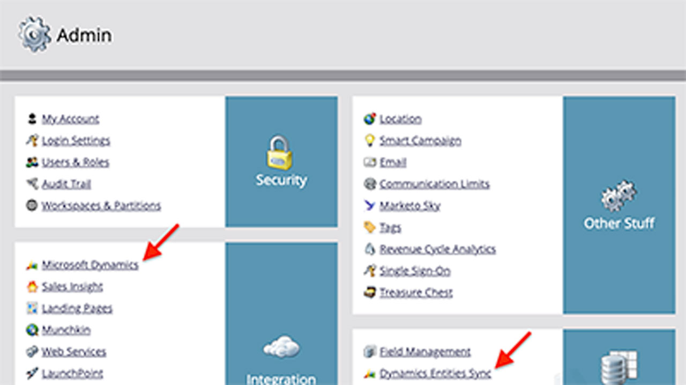

# Visão geral das integrações

Você pode usar o Adobe Sign em outros aplicativos que sua organização já usa, como Microsoft, Salesforce, Workday e Marketo para nomear alguns. Saiba como simplificar seus fluxos de trabalho de assinatura eletrônica nesses guias e tutoriais de integração.

>[!NOTE]
> Se você estiver tendo problemas para acessar qualquer um desses recursos, consulte o administrador da sua organização para garantir que a integração esteja ativada.

## Tutoriais de integrações da Microsoft

<table style="table-layout:fixed">
<tr>
  <td>
    
    

    <a href="fill-and-sign-doc-microsoft-outlook.md"><strong>Preencher e assinar no Microsoft Outlook</strong></a>
    

    <em>Preencher e assinar um formulário diretamente no Microsoft Outlook</em>
     
  </td>
  <td>
    
    

    <a href="send-for-signature-with-outlook.md"><strong>Enviar para assinatura no Outlook</strong></a>
    

    <em>Enviar um documento para assinatura diretamente no Microsoft Outlook</em>
     
  </td>
  <td>
    
    

    <a href="send-for-signature-with-sharepoint-online.md"><strong>Enviar para assinatura no SharePoint Online</strong></a>
    

    <em>Enviar um documento para assinatura diretamente no Sharepoint Online</em>
     
  </td>
</tr>
<tr>
  <td>
    
    

    <a href="track-an-agreement-with-sharepoint-online.md"><strong>Rastreamento no SharePoint Online</strong></a>
    

    <em>Monitore o progresso de um contrato diretamente no Microsoft Sharepoint</em>
     
  </td>
  <td>
    
    

    <a href="adobe-sign-teams-mortgage.md"><strong>Enviar documentos para assinatura em [!DNL Microsoft Teams]</strong></a>
    

    <em>Enviar documentos para assinatura diretamente [!DNL Microsoft Teams]</em>
     
  </td>
  <td>
    
    

    <a href="documentautomation.md"><strong>Automação de documentos com o Adobe Sign para plataforma de energia Microsoft</strong></a>
    

    <em>Saiba como ativar e usar os conectores Adobe Sign e Adobe PDF Tools para Microsoft Power Apps</em>
     
  </td>
</tr>
</table>

## Tutoriais de integrações do Salesforce

<table style="table-layout:fixed">
<tr>
  <td>
    
    

    <a href="create-an-agreement-template.md"><strong>Criação de um modelo de documento no Adobe Sign para Salesforce</strong></a>
    

    <em>Criar um modelo de documento reutilizável para fornecer velocidade e consistência</em>
     
  </td>
  <td>
    
    

    <a href="set-up-data-mapping.md"><strong>Configurar mapeamento de dados</strong></a>
    

    <em>Reinsira os dados no Salesforce após a assinatura de um contrato</em>
     
  </td>
  <td>
    
    

    <a href="set-up-merging-map.md"><strong>Configurar mapeamento de mesclagem</strong></a>
    

    <em>Mesclar dados do Salesforce diretamente em um contrato</em>
     
  </td>
</tr>
<tr>
  <td>
    
    

    <a href="create-a-custom-button.md"><strong>Criação de um botão personalizado</strong></a>
    

    <em>Criar um botão personalizado que inicia o processo de envio e preenche automaticamente um contrato no Salesforce</em>
     
  </td>
  <td>
    
    

     
  </td>
  <td>
    
    

     
  </td>
</tr>
</table>

## Tutoriais de integração da Workday

<table style="table-layout:fixed">
<tr>
  <td>
    
    

    <a href="workday.md"><strong>Configuração do Adobe Sign com Workday</strong></a>
    

    <em>Saiba como configurar a Adobe Sign para trabalhar diretamente no Workday para gerenciar com facilidade toda a sua documentação de RH</em>
     
  </td>
  <td>
    
    

     
  </td>
  <td>
    
    

     
  </td>
</tr>
</table>

## Tutoriais de integração e guias de configuração da Marketo

<table style="table-layout:fixed">
<tr>
  <td>
    
    

    <a href="marketo-salesforce-sms.md"><strong>Enviar notificações usando o Adobe Sign para Salesforce e Marketo</strong></a>
    

    <em>Saiba como enviar uma mensagem de texto, um email ou uma notificação por push para que o signatário saiba que um contrato está a caminho</em>
     
  </td>
  <td>
    
    

    <a href="marketo-salesforce-reminder.md"><strong>Tutorial Enviar lembretes usando o Adobe Sign para Salesforce e Marketovideo</strong></a>
    

    <em>Saiba como enviar um lembrete por email da Marketo quando um contrato não for assinado após um período de tempo</em>
     
  </td>
  <td>
    
    

    <a href="marketo-salesforce-reminder.md"><strong>Enviar lembretes usando o guia de configuração Adobe Sign para Salesforce e Marketo</strong></a>
    

    <em>Leia como enviar um lembrete por email da Marketo quando um contrato não for assinado após um período de tempo</em>
     
  </td>
</tr>
<tr>
  <td>
    
    

    <a href="marketo-dynamics-reminder.md"><strong>Enviar lembretes usando o Adobe Sign para Microsoft Dynamics e Marketo</strong></a>
    

    <em>Saiba como enviar um lembrete por email quando um contrato permanece sem assinatura após um período de tempo</em>
     
  </td>
  <td>
    
    

    <a href="marketo-dynamics-sms.md"><strong>Enviar notificações usando o Adobe Sign para Microsoft Dynamics e Marketo</strong></a>
    

    <em>Saiba como enviar uma mensagem de texto, um email ou uma notificação por push para que o signatário saiba que um contrato está a caminho</em>
     
  </td>
  <td>
    
    

     
  </td>
</tr>
</table>
