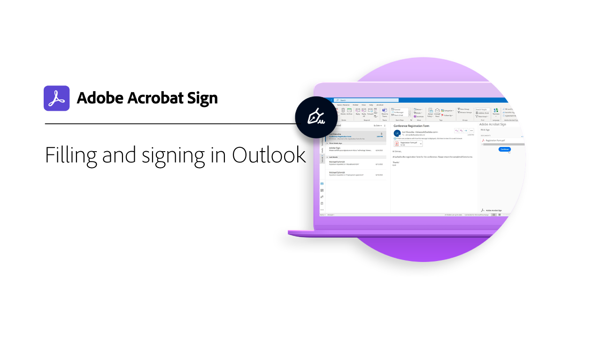

# Visão geral de integrações

Você pode usar o Acrobat Sign em outros aplicativos que sua organização já usa, como o Microsoft, o Salesforce, o Workday e o Marketo, para citar alguns. Saiba como simplificar seus fluxos de trabalho de assinatura eletrônica nestes guias de integração e tutoriais.

>[!NOTE]
> Se você tiver problemas para acessar qualquer um desses recursos, consulte o administrador da sua organização para garantir que a integração esteja ativada.

## Novidades

* [Configurar arquivos grandes e mapeamentos por push](salesforce-large-files.md)
Saiba como configurar documentos grandes e enviar serviços de contrato por push no Salesforce
* [Configurar atualizações automáticas](salesforce-automatic-updates.md)
Saiba como vincular facilmente sua conta ao Salesforce para obter atualizações automáticas
* [Integração da guia Documentos para [!DNL Microsoft Teams]](acrobat-sign-teams-documents-tab.md)
Saiba como enviar documentos para assinatura diretamente da guia Documentos no [!DNL Microsoft Teams]

## Tutoriais de integrações do Microsoft

<table style="table-layout:fixed">
<tr>
  <td>
    
    

    <a href="fill-and-sign-doc-microsoft-outlook.md"><strong>Preencher e assinar no Microsoft Outlook</strong></a>
    

    <em>Preencha e assine um formulário diretamente no Microsoft Outlook</em>
     
  </td>
  <td>
    
    

    <a href="send-for-signature-with-outlook.md"><strong>Enviar para assinatura no Outlook</strong></a>
    

    <em>Enviar um documento para assinatura diretamente no Microsoft Outlook</em>
     
  </td>
  <td>
    
    

    <a href="send-for-signature-with-sharepoint-online.md"><strong>Enviar para assinatura no SharePoint Online</strong></a>
    

    <em>Enviar um documento para assinatura diretamente no Sharepoint Online</em>
     
  </td>
   <td>
    
    

    <a href="track-an-agreement-with-sharepoint-online.md"><strong>Rastreamento no SharePoint Online</strong></a>
    

    <em>Acompanhar o progresso de um contrato diretamente no Microsoft Sharepoint</em>
     
  </td>
</tr>
<tr>
  <td>
    
    

    <a href="integrate-web-form-sharepoint-online.md"><strong>Integrar um formulário da Web com [!DNL SharePoint Online]</strong></a>
    

    <em>Saiba como mapear dados coletados de um formulário da Web para uma lista [!DNL SharePoint]</em>
     
  </td>
  <td>
    
    

    <a href="auto-archive-sharepoint-power-automate.md"><strong>Arquivar automaticamente arquivos em [!DNL SharePoint] com [!DNL Power Automate]</strong></a>
    

    <em>Saiba como arquivar automaticamente documentos assinados em uma biblioteca do [!DNL SharePoint] usando [!DNL Power Automate]</em>
     
  </td>
  <td>
    
    

    <a href="documentautomation.md"><strong>Automação de documentos com [!DNL Acrobat Sign for Microsoft Power Platform]</strong></a>
    

    <em>Saiba como ativar e usar os conectores do [!DNL Acrobat Sign] e do [!DNL Adobe PDF Tools] para aplicativos do [!DNL Microsoft Power]</em>
     
  </td>
   <td>
    
    

    <a href="adobe-sign-teams-mortgage.md"><strong>Enviar para assinatura em [!DNL Microsoft Teams]</strong></a>
    

    <em>Envie documentos para assinatura diretamente em [!DNL Microsoft Teams]</em>
     
  </td>
</tr>
<tr>
  <td>
    
    

    <a href="live-sign-microsoft-teams.md"><strong>Live Sign no Adobe Acrobat Sign para [!DNL Microsoft Teams]</strong></a>
    

    <em>Saiba como criar uma experiência de assinatura online que se assemelhe à assinatura presencial durante uma reunião do [!DNL Microsoft Teams]</em>
     
  </td>
   <td>
    
    

    <a href="acrobat-sign-teams-documents-tab.md"><strong>Integração da guia Documentos para [!DNL Microsoft Teams]</strong></a>
    

    <em>Saiba como enviar documentos para assinatura diretamente da guia Documentos em [!DNL Microsoft Teams]</em>
     
  </td>
 <td>
    
    

    <a href="simple-workflow-power-automate.md"><strong>Criar um fluxo de trabalho simples com [!DNL Power Automate]</strong></a>
    

    <em>Saiba como criar um fluxo de trabalho simples usando [!DNL Power Automate] conectores</em>
     
  </td>
  <td>
    
    

    <a href="advanced-workflow-power-automate.md"><strong>Criar um fluxo de trabalho avançado com o Power Automate</strong></a>
    

    <em>Saiba como criar um fluxo de trabalho avançado usando [!DNL Power Automate] conectores</em>
     
  </td>
<tr>
  <td>
    
    

    <a href="dynamics-customer-service.md"><strong>Microsoft Dynamics 365 para Atendimento ao Cliente</strong></a>
    

    <em>Saiba como a Acrobat Sign e o [!DNL Microsoft Dynamics 365] for Customer Service são usados para melhorar a satisfação do cliente em um portal da Web de autoatendimento do cliente</em>
     
  </td>
  <td>
    
    

    <a href="dynamics-field-service.md"><strong>Microsoft Dynamics 365 para Field Service</strong></a>
    

    <em>Saiba como a Acrobat Sign, o [!DNL Power Automate] e o [!DNL Microsoft Dynamics 365] for Field Service são usados para otimizar os contratos no local do cliente</em>
     
  </td>
  <td>
    
    

    <a href="dynamics-sales.md"><strong>Microsoft Dynamics 365 para Vendas</strong></a>
    

    <em>Saiba como o Acrobat Sign e o [!DNL Microsoft Dynamics 365] for Sales são usados para automatizar o processo de assinatura de cotação de venda</em>
     
  </td>
  <td>
    
    

     
  </td>
</tr>
</table>

## Tutoriais de integração do [!DNL Notarize]

<table style="table-layout:fixed">
<tr>
  <td>
    
    

    <a href="send-document-notarize.md"><strong>Enviar documentos para autenticação</strong></a>
    

    <em>Saiba como enviar um documento para autenticação</em>
     
  </td>
  <td>
    
    

     
  </td>
  <td>
    
    

     
  </td>
  <td>
    
    

     
  </td>
</tr>
</table>

## Tutoriais de integrações do Salesforce

<table style="table-layout:fixed">
<tr>
  <td>
    
    

    <a href="create-an-agreement-template.md"><strong>Document Builder para [!DNL Salesforce]</strong></a>
    

    <em>Saiba como criar um modelo de documento reutilizável usando o Document Builder para [!DNL Salesforce]</em>
     
  </td>
  <td>
    
    

    <a href="set-up-data-mapping.md"><strong>Configurando mapeamento de dados</strong></a>
    

    <em>Retirar dados de volta para o Salesforce após a assinatura de um contrato</em>
     
  </td>
  <td>
    
    

    <a href="set-up-merging-map.md"><strong>Configurando o mapeamento de mesclagem no Salesforce</strong></a>
    

    <em>Saiba como mesclar dados do Salesforce diretamente em um documento do Acrobat Sign</em>
     
  </td>
  <td>
    
    

    <a href="create-a-custom-button.md"><strong>Criando um botão personalizado</strong></a>
    

    <em>Criar um botão personalizado que inicia o processo de envio e preenche automaticamente um contrato dentro do Salesforce</em>
     
  </td>
</tr>
<tr>
  <td>
    
    

    <a href="salesforce-automatic-updates.md"><strong>Configurar atualizações automáticas</strong></a>
    

    <em>Saiba como vincular facilmente sua conta ao Salesforce para receber atualizações automáticas</em>
     
  </td>
 <td>
    
    

    <a href="salesforce-large-files.md"><strong>Configurar arquivos grandes e mapeamentos por push</strong></a>
    

    <em>Saiba como configurar documentos grandes e enviar serviços de contrato por push no Salesforce</em>
     
  </td>
  <td>
      
      

       
  </td>
  <td>
      
      

       
  </td>
</tr>
</table>

## Tutoriais de integração do Workday

<table style="table-layout:fixed">
<tr>
 <td>
    
    

    <a href="acrobat-sign-workday-onboarding.md"><strong>Integração da nova contratação do Acrobat Sign + Workday</strong></a>
    

    <em>Saiba como otimizar os fluxos de trabalho de integração com o Acrobat Sign + Workday</em>
     
  </td>
 <td>
    
    

     
  </td>
  <td>
    
    

     
  </td>
  <td>
    
    

     
  </td>
</tr>
</table>

## Tutoriais de integração e guias de configuração do Marketo

<table style="table-layout:fixed">
<tr>
  <td>
    
    

    <a href="marketo-salesforce-sms.md"><strong>Enviar notificações usando o Acrobat Sign para Salesforce e Marketo</strong></a>
    

    <em>Saiba como enviar uma mensagem de texto, um email ou uma notificação por push para permitir que o signatário saiba que um contrato está a caminho</em>
     
  </td>
  <td>
    
    

    <a href="marketo-salesforce-reminder.md"><strong>Envie lembretes usando o Adobe Sign para Salesforce e o tutorial em vídeo do Marketo</strong></a>
    

    <em>Saiba como enviar um lembrete de email da Marketo quando um contrato permanece não assinado após um período</em>
     
  </td>
  <td>
    
    

    <a href="marketo-salesforce-reminder.md"><strong>Enviar lembretes usando o Acrobat Sign para Salesforce e o guia de configuração do Marketo</strong></a>
    

    <em>Leia como enviar um lembrete de email da Marketo quando um contrato permanecer não assinado após um período de tempo</em>
     
  </td>
   <td>
    
    

    <a href="marketo-dynamics-reminder.md"><strong>Enviar lembretes usando o Acrobat Sign para Microsoft Dynamics e Marketo</strong></a>
    

    <em>Saiba como enviar um lembrete de email quando um contrato permanece não assinado após um período</em>
     
  </td>
</tr>
<tr>
  <td>
    
    

    <a href="marketo-dynamics-sms.md"><strong>Enviar notificações usando o Acrobat Sign para Microsoft Dynamics e Marketo</strong></a>
    

    <em>Saiba como enviar uma mensagem de texto, um email ou uma notificação por push para permitir que o signatário saiba que um contrato está a caminho</em>
     
  </td>
  <td>
    
    

     
  </td>
  <td>
    
    

     
  </td>
  <td>
    
    

     
  </td>
</tr>
</table>
