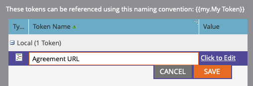

# Enviar lembretes usando o Adobe Sign para Microsoft Dynamics 365 e Marketo

Saiba como enviar um lembrete por email quando um contrato permanece sem assinatura após um período de tempo. Essa integração usa Adobe Sign, Adobe Sign para Microsoft Dynamics, Marketo e Marketo Microsoft Dynamics Sync.

## Pré-requisitos

1. Instale o Marketo Microsoft Dynamics Sync.

   Informações e o plug-in mais recente para o Microsoft Dynamics Sync estão disponíveis [aqui.](https://experienceleague.adobe.com/docs/marketo/using/product-docs/crm-sync/microsoft-dynamics/marketo-plugin-releases-for-microsoft-dynamics.html)

1. Instale [Adobe Sign para Microsoft Dynamics](https://appsource.microsoft.com/pt-br/product/dynamics-365/adobesign.f3b856fc-a427-4d47-ad4b-d5d1baba6f86).

   Informações sobre este plug-in estão disponíveis [aqui.](https://helpx.adobe.com/ca/sign/using/microsoft-dynamics-integration-installation-guide.html)

## Localizar o objeto personalizado

Quando as configurações do Marketo Microsoft Dynamics Sync e do Adobe Sign for Dynamics estiverem concluídas, duas novas opções serão exibidas no Marketo Admin Terminal.


1. Clique em **[!UICONTROL Sincronização de Entidades do Dynamics]**.

   A sincronização deve ser desativada antes de sincronizar entidades personalizadas. Clique em **Sincronizar esquema** se esta for a primeira vez. Caso contrário, clique em **Atualizar Esquema**.

   

## Sincronizar o objeto personalizado

1. No lado direito, localize os objetos personalizados [!UICONTROL Lead], [!UICONTROL Contact] e [!UICONTROL Account].

   * **Ative** Syncfor the objects em  **** Leadif (Entrelinha) se quiser enviar um lembrete quando uma   Leadis não tiver assinado um contrato no Dynamics.

   * **Ative** Sincronizar para os objetos em  **** Contato se quiser enviar um lembrete quando um   contato não tiver assinado um contrato no Dynamics.

   * **Ative** Sincronizar para os objetos em  **** Conta se você deseja enviar um lembrete quando uma   Conta não assinou um contrato no Dynamics.

   * **Ative** Syncfor the agreement object (Sincronizar) no  **[!UICONTROL Pai]**  desejado ([!UICONTROL Lead],  [!UICONTROL Contato] ou  [!UICONTROL Conta]).

   

1. Na nova janela, selecione as propriedades desejadas no Contrato e ative as caixas em **Restrição** e **Acionador** para expô-las às Atividades de marketing.

   

   

1. Reative a sincronização após ativar a sincronização nos objetos personalizados.

   Volte ao Admin Terminal, clique em **Microsoft Dynamics** e, em seguida, clique em **Ativar sincronização**.

   

   

## Criar o programa e o token

1. Na seção Atividades de marketing da Marketo, clique com o botão direito do mouse em **Atividades de marketing** na barra esquerda.

   Selecione **Nova pasta da campanha** e dê um nome a ela.

   

1. Clique com o botão direito do mouse na pasta criada, selecione **Novo programa** e dê um nome a ela.

   Deixe tudo o resto como padrão e clique em **Criar**.

   

   

1. Clique em **Meus Tokens** e arraste **Script de e-mail** sobre a tela.

   

1. Dê um nome a ele e clique em **Clique para Editar**.

   

1. Expanda **[!UICONTROL Objetos Personalizados]** no lado direito e, em seguida, expanda o objeto **[!UICONTROL Contrato]**.

   Localize e arraste [!UICONTROL Nome], Status do contrato, Enviado em e Url do signatário atual para a tela.

1. Escreva um script Velocity usando esses tokens para exibir o URL do contrato de um contrato que não está assinado por uma semana. Este é um exemplo que compara a data atual com Enviado em:

   ```
   #foreach($agreement in $adobe_agreementList)
       #if($agreement.adobe_esagreementstatus == "Out for Signature")
           #set($todayCalObj = $date.toCalendar($date.toDate("yyyy-MM-dd",$date.get('yyyy-MM-dd'))) )
           #set($dateSentCalObj = $date.toCalendar($date.toDate("yyyy-MM-dd",$agreement.adobe_datesent)) )
           #set($dateDiff = ($todayCalObj.getTimeInMillis() - $dateSentCalObj.getTimeInMillis()) / 86400000 )
   
           #if($dateDiff >= 7)
               #set($agreementName = $agreement.adobe_name)
               #set($agreementURL = $agreement.adobe_currentsignerurl.substring(8))
               #break
           #else
           #end
       #else
       #end
   #end
   
   #if(${agreementName})
       <a href="https://${agreementURL}">${agreementName}</a>
   #else
       Please contact us. 
   #end
   ```

1. Clique em **[!UICONTROL Salvar]**.

## Crie o lembrete e adicione personalização

Exemplos de personalização incluem: o nome do signatário, o nome do contrato, um link para o contrato etc.

1. Clique com o botão direito do mouse no programa que você criou e clique em **[!UICONTROL Novo ativo local]** e selecione **[!UICONTROL Email]**.

   

1. Na nova guia, digite um **[!UICONTROL Nome]** e **[!UICONTROL Descrição]** para o email e selecione um modelo no seletor de modelo.

   

1. Clique em **[!UICONTROL Criar]**.

1. Defina **[!UICONTROL Do nome]** e **[!UICONTROL Do endereço]**.

   

1. Clique no corpo da mensagem para ativar o Editor.

   Clique no botão **[!UICONTROL Inserir Token]**, localize o token personalizado do URL do contrato criado e clique em **[!UICONTROL Inserir]**. Conclua a personalização do email e clique em **[!UICONTROL Salvar]**.

   

1. Visualizar usando um perfil que tenha um contrato atribuído a ele.

   Você deve ver um link para o URL com o Nome do contrato como o rótulo.

   

## Configurar o Filtro da Campanha Inteligente

1. Clique com o botão direito do mouse no programa que você criou e clique em **[!UICONTROL Nova Campanha Inteligente]**.

   

1. Dê um nome de sua escolha e clique em **[!UICONTROL Criar]**.

   

1. Procure e, em seguida, clique e arraste **[!UICONTROL Tem contrato]** para a Lista inteligente.

   

   Os campos expostos ao acionador devem estar disponíveis em **[!UICONTROL Adicionar restrição]**.

1. Selecione **[!UICONTROL Status do contrato]** e quaisquer outros campos pelos quais você deseja filtrar.

   Para cada campo adicionado, defina os valores para filtrar. Nesse caso, ele só é acionado quando o **[!UICONTROL Status do contrato]** é *Enviado para assinatura* e **[!UICONTROL Enviado em]** é *passado antes de 1 semana*.

   

   >[!NOTE]
   >
   > Adicione um identificador exclusivo às restrições, como **Name**, se quiser que esta campanha seja executada apenas para determinados contratos.

1. Confirme o público-alvo da campanha e veja quem se qualificará na guia Programação.

   

## Configurar o Fluxo de Campanha Inteligente

Como o filtro de campanha **Dias até expirar** foi usado, você pode usar uma repetição programada para a campanha.

1. Clique na guia **[!UICONTROL Fluxo]** na [!UICONTROL Campanha inteligente].

   Procure e arraste o fluxo **Enviar email** para a tela e selecione o email de lembrete criado na seção anterior.

   

1. Clique na guia **[!UICONTROL Programação]** na Campanha inteligente. Certifique-se de que o fluxo da campanha esteja limitado a ser executado apenas uma vez por pessoa nas **Configurações da campanha inteligente**. Em seguida, clique na guia **Agendar recorrência**.

   

1. Defina **Schedule** como _Daily_. Escolha um dia e hora de início e data de término da campanha, se necessário.

   

>[!TIP]
>
>Este tutorial é parte do curso [Acelere os ciclos de vendas com o Adobe Sign for Microsoft Dynamics e o Marketo](https://experienceleague.adobe.com/?recommended=Sign-U-1-2021.1) que está disponível gratuitamente no Experience League!