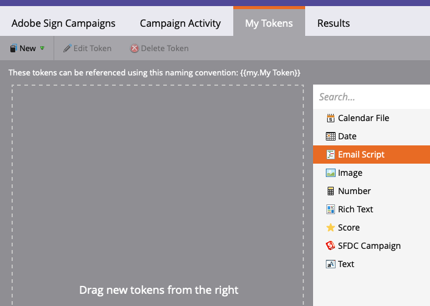

# Enviar lembretes usando o Acrobat Sign para Microsoft Dynamics 365 e Marketo

Saiba como enviar um lembrete por email quando um contrato permanece não assinado após um período de tempo. Essa integração usa o Acrobat Sign, o Acrobat Sign para Microsoft Dynamics, o Marketo e o Marketo Microsoft Dynamics Sync.

## Pré-requisitos

1. Instale o Marketo Microsoft Dynamics Sync.

   Informações e o plug-in mais recente do Microsoft Dynamics Sync estão disponíveis [aqui.](https://experienceleague.adobe.com/docs/marketo/using/product-docs/crm-sync/microsoft-dynamics/marketo-plugin-releases-for-microsoft-dynamics.html)

1. Instalar [Acrobat Sign para Microsoft Dynamics](https://appsource.microsoft.com/pt-br/product/dynamics-365/adobesign.f3b856fc-a427-4d47-ad4b-d5d1baba6f86).

   Informações sobre este plug-in estão disponíveis [aqui.](https://helpx.adobe.com/ca/sign/using/microsoft-dynamics-integration-installation-guide.html)

## Localizar o objeto personalizado

Quando as configurações do Marketo Microsoft Dynamics Sync e do Acrobat Sign para Dynamics estiverem concluídas, duas novas opções serão exibidas no Marketo Admin Terminal.


1. Clique em **[!UICONTROL Sincronização de Entidades do Dynamics]**.

   A sincronização deve ser desabilitada antes da sincronização de entidades personalizadas. Clique em **Esquema de sincronização** se esta é a sua primeira vez. Caso contrário, clique em **Atualizar Esquema**.

   

## Sincronizar o objeto personalizado

1. No lado direito, localize [!UICONTROL Lead], [!UICONTROL Contato]e [!UICONTROL Conta]objetos personalizados baseados em código.

   * **Ativar sincronização** para os objetos sob **[!UICONTROL Lead]** se quiser enviar um lembrete quando um [!UICONTROL Lead] não assinou um contrato no Dynamics.

   * **Ativar sincronização** para os objetos sob **[!UICONTROL Contato]** se quiser enviar um lembrete quando um [!UICONTROL Contato] não assinou um contrato no Dynamics.

   * **Ativar sincronização** para os objetos sob **[!UICONTROL Conta]** se quiser enviar um lembrete quando um [!UICONTROL Conta] não assinou um contrato no Dynamics.

   * **Ativar sincronização** para o objeto de contrato sob o **[!UICONTROL Pai]** ([!UICONTROL Lead], [!UICONTROL Contato]ou [!UICONTROL Conta]).

   

1. Na nova janela, selecione as propriedades desejadas em Contrato e ative as caixas em **Restrição** e **Acionador** para exibi-las às suas atividades de marketing.

   

   

1. Reative a sincronização depois de habilitar a sincronização nos objetos personalizados.

   Volte para o Admin Terminal e clique em **Microsoft Dynamics** e clique em **Ativar sincronização**.

   

   

## Criar o programa e o token

1. Na seção Atividades de marketing do Marketo, clique com o botão direito do mouse em **Atividades de marketing** na barra esquerda.

   Selecionar **Nova Pasta de Campanha** e dê um nome.

   

1. Clique com o botão direito do mouse na pasta criada e selecione **Novo programa** e dê um nome.

   Deixe todo o resto como padrão e clique em **Criar**.

   

   

1. Clique em **Meus Tokens** e, em seguida, arraste **Script de Email** na tela.

   

1. Dê um nome e clique em **Clique para editar**.

   

1. Expandir **[!UICONTROL Objetos Personalizados]** no lado direito, expanda a **[!UICONTROL Contrato]** objeto.

   Localizar e arrastar [!UICONTROL Nome], Status do contrato, Enviado em e URL do signatário atual na tela.

1. Escreva um script Velocity usando esses tokens para exibir o URL do contrato que fica sem assinatura por uma semana. Aqui está um exemplo que compara a data atual com Enviado em:

   ```
   #foreach($agreement in $adobe_agreementList)
       #if($agreement.adobe_esagreementstatus == "Out for Signature")
           #set($todayCalObj = $date.toCalendar($date.toDate("yyyy-MM-dd",$date.get('yyyy-MM-dd'))) )
           #set($dateSentCalObj = $date.toCalendar($date.toDate("yyyy-MM-dd",$agreement.adobe_datesent)) )
           #set($dateDiff = ($todayCalObj.getTimeInMillis() - $dateSentCalObj.getTimeInMillis()) / 86400000 )
   
           #if($dateDiff >= 7)
               #set($agreementName = $agreement.adobe_name)
               #set($agreementURL = $agreement.adobe_currentsignerurl.substring(8))
               #break
           #else
           #end
       #else
       #end
   #end
   
   #if(${agreementName})
       <a href="https://${agreementURL}">${agreementName}</a>
   #else
       Please contact us. 
   #end
   ```

1. Clique em **[!UICONTROL Salvar]**.

## Crie o lembrete e adicione personalização

Exemplos de personalização: o nome do signatário, o nome do contrato, um link para o contrato etc.

1. Clique com o botão direito do mouse no programa criado e clique em **[!UICONTROL Novo ativo local]** e selecione **[!UICONTROL Email]**.

   

1. Na nova guia, insira um **[!UICONTROL Nome]** e **[!UICONTROL Descrição]** para o email e selecione um modelo no seletor de modelos.

   

1. Clique em **[!UICONTROL Criar]**.

1. Defina o **[!UICONTROL Do nome]** e **[!UICONTROL Endereço De]**.

   

1. Clique no corpo da mensagem para ativar o Editor.

   Clique no botão **[!UICONTROL Inserir Token]** , localize o token personalizado de URL do contrato que você criou e clique em **[!UICONTROL Inserir]**. Conclua a personalização do email e clique em **[!UICONTROL Salvar]**.

   

1. Visualize usando um perfil que tenha um contrato atribuído a ele.

   Você deve ver um link para o URL com o Nome do contrato como rótulo.

   

## Configurar o Filtro da Campanha Inteligente

1. Clique com o botão direito do mouse no programa criado e, em seguida, clique em **[!UICONTROL Nova Campanha Inteligente]**.

   

1. Dê um nome de sua preferência e clique em **[!UICONTROL Criar]**.

   

1. Pesquise, clique e arraste **[!UICONTROL Tem Contrato]** à Smart List.

   

   Os campos expostos ao acionador devem estar disponíveis em **[!UICONTROL Adicionar Restrição]**.

1. Selecionar **[!UICONTROL Status do contrato]** e quaisquer outros campos pelos quais você deseja filtrar.

   Para cada campo adicionado, defina os valores pelos quais filtrar. Nesse caso, ele só é acionado quando a **[!UICONTROL Status do contrato]** é *Enviado para assinatura* e **[!UICONTROL Enviado em]** é *no passado antes de 1 semana*.

   

   >[!NOTE]
   >
   > Adicionar um identificador exclusivo às restrições, como **Nome**, se você quiser que essa campanha seja executada apenas para determinados contratos.

1. Confirme o público da campanha e veja quem se qualificará na guia Programação.

   

## Configurar o fluxo de campanha inteligente

Como o filtro de campanha **Dias até o vencimento** foi usado, você pode usar uma recorrência agendada para a campanha.

1. Clique no botão **[!UICONTROL Fluxo]** na guia [!UICONTROL Campanha inteligente].

   Pesquise e arraste o **Enviar Email** vá para a tela e selecione o email de lembrete criado na seção anterior.

   

1. Clique no botão **[!UICONTROL Programação]** no Smart Campaign. Verifique se o fluxo de campanha está limitado a ser executado apenas uma vez por pessoa no **Configurações de Campanha Inteligente**. Em seguida, clique no botão **Agendar Recorrência** guia.

   

1. Defina o **Programação** para _Diariamente_. Escolha um dia e hora de início e uma data de término para a campanha, se necessário.

   

>[!TIP]
>
>Este tutorial faz parte do curso [Agilizar os ciclos de vendas com o Acrobat Sign para Microsoft Dynamics e Marketo](https://experienceleague.adobe.com/?recommended=Sign-U-1-2021.1) que está disponível gratuitamente no Experience League!