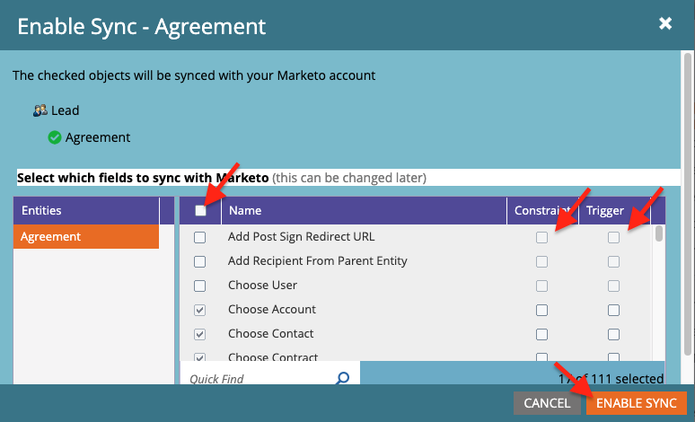

# Enviar lembretes usando o Acrobat Sign para Microsoft Dynamics 365 e Marketo

Saiba como enviar um lembrete de email quando um contrato permanece não assinado após um período de tempo. Essa integração usa o Acrobat Sign, o Acrobat Sign para Microsoft Dynamics, o Marketo e o Marketo Microsoft Dynamics Sync.

## Pré-requisitos

1. Instale o Marketo Microsoft Dynamics Sync.

   Informações e o plug-in mais recente do Microsoft Dynamics Sync estão disponíveis [aqui.](https://experienceleague.adobe.com/docs/marketo/using/product-docs/crm-sync/microsoft-dynamics/marketo-plugin-releases-for-microsoft-dynamics.html)

1. Instale o [Acrobat Sign para Microsoft Dynamics](https://appsource.microsoft.com/pt-br/product/dynamics-365/adobesign.f3b856fc-a427-4d47-ad4b-d5d1baba6f86).

   Informações sobre este plug-in estão disponíveis [aqui.](https://helpx.adobe.com/ca/sign/using/microsoft-dynamics-integration-installation-guide.html)

## Localizar o objeto personalizado

Quando as configurações do Marketo Microsoft Dynamics Sync e do Acrobat Sign for Dynamics estiverem concluídas, duas novas opções serão exibidas no Marketo Admin Terminal.


1. Clique em **[!UICONTROL Sincronização de Entidades do Dynamics]**.

   A sincronização deve ser desabilitada antes de sincronizar entidades personalizadas. Clique em **Sincronizar Esquema** se esta for a primeira vez. Caso contrário, clique em **Atualizar Esquema**.

   

## Sincronizar o objeto personalizado

1. No lado direito, localize objetos personalizados baseados em [!UICONTROL Lead], [!UICONTROL Contato] e [!UICONTROL Conta].

   * **Habilite a sincronização** para os objetos em **[!UICONTROL Lead]** se desejar enviar um lembrete quando um [!UICONTROL Lead] não tiver assinado um contrato no Dynamics.

   * **Habilite a sincronização** dos objetos em **[!UICONTROL Contato]** se desejar enviar um lembrete quando um [!UICONTROL Contato] não tiver assinado um contrato no Dynamics.

   * **Habilite a Sincronização** para os objetos em **[!UICONTROL Conta]** se desejar enviar um lembrete quando uma [!UICONTROL Conta] não tiver assinado um contrato no Dynamics.

   * **Habilite a Sincronização** para o objeto do contrato no **[!UICONTROL Pai]** desejado ([!UICONTROL Cliente potencial], [!UICONTROL Contato] ou [!UICONTROL Conta]).

   

1. Na nova janela, selecione as propriedades que deseja no Contrato e habilite as caixas em **Restrição** e **Acionador** para exibi-las às suas Atividades de Marketing.

   

   

1. Reative a sincronização depois de habilitar a sincronização nos objetos personalizados.

   Volte para o Admin Terminal, clique em **Microsoft Dynamics** e em **Habilitar Sincronização**.

   

   

## Criar o programa e o token

1. Na seção Atividades de Marketing do Marketo, clique com o botão direito do mouse em **Atividades de Marketing** na barra esquerda.

   Selecione **Nova Pasta de Campanha** e dê um nome a ela.

   

1. Clique com o botão direito na pasta criada, selecione **Novo Programa** e dê um nome a ela.

   Deixe tudo como padrão e clique em **Criar**.

   

   

1. Clique em **Meus Tokens** e arraste o **Script de Email** sobre a tela.

   

1. Dê um nome a ele e clique em **Clique para editar**.

   

1. Expanda os **[!UICONTROL Objetos personalizados]** no lado direito e expanda o objeto de **[!UICONTROL Contrato]**.

   Localize e arraste o [!UICONTROL Nome], o Status do contrato, o Enviado e a Url do signatário atual para a tela.

1. Escreva um script Velocity usando esses tokens para exibir o URL de um contrato que fica sem assinatura por uma semana. Veja um exemplo que compara a data atual com a data de Enviado em:

   ```
   #foreach($agreement in $adobe_agreementList)
       #if($agreement.adobe_esagreementstatus == "Out for Signature")
           #set($todayCalObj = $date.toCalendar($date.toDate("yyyy-MM-dd",$date.get('yyyy-MM-dd'))) )
           #set($dateSentCalObj = $date.toCalendar($date.toDate("yyyy-MM-dd",$agreement.adobe_datesent)) )
           #set($dateDiff = ($todayCalObj.getTimeInMillis() - $dateSentCalObj.getTimeInMillis()) / 86400000 )
   
           #if($dateDiff >= 7)
               #set($agreementName = $agreement.adobe_name)
               #set($agreementURL = $agreement.adobe_currentsignerurl.substring(8))
               #break
           #else
           #end
       #else
       #end
   #end
   
   #if(${agreementName})
       <a href="https://${agreementURL}">${agreementName}</a>
   #else
       Please contact us. 
   #end
   ```

1. Clique em **[!UICONTROL Salvar]**.

## Criar o lembrete e adicionar personalização

Os exemplos de personalização incluem: o nome do signatário, o nome do contrato, um link para o contrato etc.

1. Clique com o botão direito no programa que você criou e clique em **[!UICONTROL Novo Ativo Local]** e selecione **[!UICONTROL Email]**.

   

1. Na nova guia, insira um **[!UICONTROL Nome]** e uma **[!UICONTROL Descrição]** para o email e selecione um modelo no seletor de modelos.

   

1. Clique em **[!UICONTROL Criar]**.

1. Defina o **[!UICONTROL De Nome]** e o **[!UICONTROL De Endereço]**.

   

1. Clique no corpo da mensagem para ativar o Editor.

   Clique no botão **[!UICONTROL Inserir token]**, encontre o token de URL de contrato personalizado que você criou e clique em **[!UICONTROL Inserir]**. Conclua a personalização de seu email e clique em **[!UICONTROL Salvar]**.

   

1. Visualize usando um perfil que tenha um contrato atribuído a ele.

   Você verá um link para o URL com o Nome do contrato como rótulo.

   

## Configurar o filtro da Campanha inteligente

1. Clique com o botão direito no programa que você criou e clique em **[!UICONTROL Nova Campanha Inteligente]**.

   

1. Dê um nome de sua escolha e clique em **[!UICONTROL Criar]**.

   

1. Pesquise por e, em seguida, clique e arraste **[!UICONTROL Tem contrato]** para a Smart List.

   

   Os campos que você expôs ao gatilho devem estar disponíveis em **[!UICONTROL Adicionar Restrição]**.

1. Selecione o **[!UICONTROL Status do contrato]** e qualquer outro campo pelo qual você deseja filtrar.

   Para cada campo adicionado, defina os valores pelos quais filtrar. Nesse caso, ele só é acionado quando o **[!UICONTROL Status do contrato]** é *Enviado para assinatura* e o **[!UICONTROL Enviado em]** está *no passado antes de 1 semana*.

   

   >[!NOTE]
   >
   > Adicione um identificador exclusivo às restrições, como **Nome**, se desejar que esta campanha seja executada apenas para determinados contratos.

1. Confirme o público da campanha e veja quem se qualificará na guia Programação.

   

## Configurar o fluxo de campanha inteligente

Como o filtro de campanha **Dias até a Expiração** foi usado, você pode usar uma recorrência agendada para a campanha.

1. Clique na guia **[!UICONTROL Fluxo]** na [!UICONTROL Campanha Inteligente].

   Pesquise e arraste o fluxo **Enviar Email** para a tela e selecione o email de lembrete que você criou na seção anterior.

   

1. Clique na guia **[!UICONTROL Agendar]** na Campanha Inteligente. Verifique se o fluxo de campanha é limitado a ser executado somente uma vez por pessoa nas **Configurações de Campanha Inteligente**. Depois, clique na guia **Agendar Recorrência**.

   

1. Defina o **Agendamento** para _Diário_. Escolha um dia e hora de início e uma data de término para a campanha, se necessário.

   
