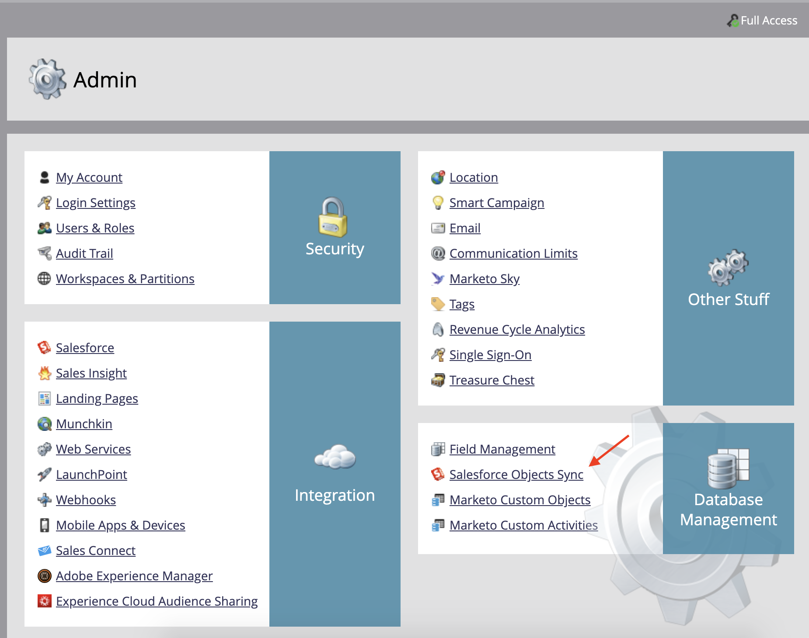

# Enviar lembretes usando o Acrobat Sign para Salesforce e o Guia de configuração do Marketo

Saiba como enviar um lembrete por email do Marketo quando um contrato permanece não assinado após um período de tempo. Essa integração usa o Acrobat Sign, o Acrobat Sign para Salesforce, o Marketo e o Marketo e Salesforce Sync.

## Pré-requisitos

1. Instale o Marketo Salesforce Sync.

   Informações e o plug-in mais recente para o Salesforce Sync estão disponíveis [aqui.](https://experienceleague.adobe.com/docs/marketo/using/product-docs/crm-sync/salesforce-sync/understanding-the-salesforce-sync.html)

1. Instale o Acrobat Sign para Salesforce.

   Informações sobre este plug-in estão disponíveis [aqui.](https://helpx.adobe.com/ca/sign/using/salesforce-integration-installation-guide.html)

## Localizar o objeto personalizado

Quando as configurações do Marketo Salesforce Sync e do Acrobat Sign para Salesforce estiverem concluídas, várias novas opções serão exibidas no Marketo Admin Terminal.




1. Clique em **Esquema de sincronização** se esta é a sua primeira vez. Caso contrário, clique em **Atualizar Esquema**.

   

1. Se a sincronização global estiver em execução, desative clicando em **Desabilitar Sincronização Global**.

   

1. Clique em **Atualizar Esquema**.

   

## Sincronizar o objeto personalizado

No lado direito, consulte objetos personalizados baseados em lead, contato e conta.

**Ativar sincronização** para os objetos em Lead se você quiser enviar um lembrete quando um Lead não tiver assinado um contrato no Salesforce.

**Ativar sincronização** para os objetos em Contato, se desejar enviar um lembrete quando um Contato não tiver assinado um contrato no Salesforce.

**Ativar sincronização** para os objetos em Conta, se desejar enviar um lembrete quando uma Conta não tiver assinado um contrato no Salesforce.

1. **Ativar sincronização** para **Contrato** objeto mostrado sob o Pai desejado (Lead, Contato ou Conta). Faça isso para qualquer outro objeto personalizado que você gostaria de sincronizar.

   

1. Os seguintes ativos mostram como **Ativar sincronização**.

   

   

## Expor os campos de objeto personalizados a acionadores

1. Enquanto a sincronização global está desativada, selecione o objeto personalizado do contrato para o qual você ativou a sincronização e **Editar Campos Visíveis**.

1. Marque o campo &quot;Nome do contrato&quot; na coluna do acionador para exibi-lo aos acionadores de ação de campanha. Marque todos os outros campos pelos quais deseja filtrar e **Salvar**.

   

   

1. Ao terminar de ativar a sincronização nos objetos personalizados e de expor os valores de acionamento, lembre-se de reativar a sincronização:

   

## Criar o programa e o token

1. Na seção Atividades de marketing do Marketo, clique com o botão direito do mouse em **Atividades de marketing** na barra esquerda, selecione **Nova Pasta de Campanha** e dê um nome.

   

1. Clique com o botão direito do mouse na pasta criada e selecione **Novo programa** e dê um nome. Deixe todo o resto como padrão e clique em **Criar**.

   

   

1. Clique em **Meus Tokens** e, em seguida, arraste  **Script de Email** na tela.

   

1. Dê um nome e clique em **Clique para editar**.

   

1. Expandir **Objetos Personalizados** no lado direito, expanda a **Contrato** objeto. Localize e arraste o Nome do contrato, Status do contrato, Data de assinatura e URL de assinatura para a tela.

1. Escreva um script Velocity usando esses tokens para exibir o URL do contrato que fica sem assinatura por uma semana. Aqui está um exemplo que compara a data atual com a Data de envio:

   ```
   #foreach($agreement in $echosign_dev1__SIGN_Agreement__cList)
       #if($agreement.echosign_dev1__Status__c == "Out for Signature")
           #set($todayCalObj = $date.toCalendar($date.toDate("yyyy-MM-dd",$date.get('yyyy-MM-dd'))) )
           #set($dateSentCalObj = $date.toCalendar($date.toDate("yyyy-MM-dd",$agreement.echosign_dev1__DateSent__c)) )
           #set($dateDiff = ($todayCalObj.getTimeInMillis() - $dateSentCalObj.getTimeInMillis()) / 86400000 )
   
           #if($dateDiff >= 7)
               #set($agreementName = $agreement.Name)
               #set($agreementURL = $agreement.echosign_dev1__Signing_URL__c.substring(8))
               #break
           #else
           #end
       #else
       #end
   #end
   
   #if(${agreementName})
       <a href="https://${agreementURL}">${agreementName}</a>
   #else
       Please contact us. 
   #end
   ```

1. Clique em **Salvar**.

## Crie o lembrete e adicione personalização

Exemplos de personalização: o nome do signatário, o nome do contrato, um link para o contrato etc.

1. Clique com o botão direito do mouse no programa criado e clique em **Novo ativo local** e selecione **Email**.

   

1. Na nova guia, insira um **Nome** e **Descrição** para o email e selecione um modelo no seletor de modelos. Clique em **Criar**.

   

1. Defina o **Do nome** e **Endereço De**.

   

1. Clique no corpo da mensagem para ativar o Editor. Clique no botão **Inserir Token** , localize o token personalizado de URL do contrato que você criou e clique em **Inserir**. Conclua a personalização do email e clique em **Salvar**.

   

1. Visualize usando um perfil que tenha um contrato atribuído a ele. Você deve ver um link para o URL com o Nome do contrato como rótulo.

   

## Configurar o Filtro da Campanha Inteligente

1. Clique com o botão direito do mouse no programa criado e, em seguida, clique em **Nova Campanha Inteligente**.

   

1. Dê um nome de sua preferência e clique em **Criar**.

   

1. Pesquise, clique e arraste **Tem Contrato** à Smart List.

   

1. Os campos expostos ao acionador agora devem estar disponíveis no **Adicionar Restrição**. Selecionar **Status do contrato** e quaisquer outros campos pelos quais você deseja filtrar. Para cada campo adicionado, defina os valores pelos quais filtrar. Nesse caso, ele só será acionado quando a **Status do contrato** está Enviado para assinatura e **Data de envio** estiver no passado antes de 7 dias.

   

   >[!NOTE]
   >
   > d um identificador exclusivo para as restrições, como **Nome do contrato**, se você quiser que essa campanha seja executada apenas para determinados contratos.

1. Confirme o público da campanha e veja quem se qualificará na guia Programação.

   

## Configurar o fluxo de campanha inteligente

Como o filtro de campanha **Dias sem assinatura** foi usado, você pode usar uma recorrência agendada para a campanha.

1. Clique no botão **Fluxo** no Smart Campaign. Pesquise e arraste o **Enviar Email** vá para a tela e selecione o email de lembrete criado na seção anterior.

   

1. Clique no botão **Programação** no Smart Campaign. Verifique se o fluxo de campanha está limitado a ser executado apenas uma vez por pessoa no **Configurações de Campanha Inteligente**. Em seguida, clique no botão **Agendar Recorrência** guia.

   

1. Defina o **Programação** para Diariamente, escolha um dia e hora de início e uma data de término para a campanha, se necessário.

   

>[!TIP]
>
>Este tutorial faz parte do curso [Agilize os ciclos de vendas com o Acrobat Sign para Salesforce e Marketo](https://experienceleague.adobe.com/?recommended=Sign-U-1-2021.1) que está disponível gratuitamente no Experience League!
