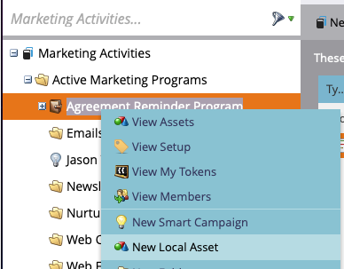
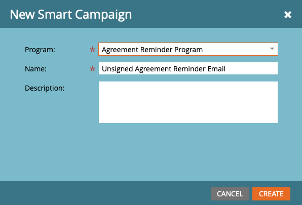

# Enviar lembretes usando o Acrobat Sign para Salesforce e o Guia de configuração do Marketo

Saiba como enviar um lembrete de email da Marketo quando um contrato permanece não assinado após um período de tempo. Essa integração usa o Acrobat Sign, o Acrobat Sign para Salesforce, o Marketo e a sincronização do Marketo e do Salesforce.

## Pré-requisitos

1. Instale o Marketo Salesforce Sync.

   Informações e o plug-in mais recente para o Salesforce Sync estão disponíveis [aqui.](https://experienceleague.adobe.com/docs/marketo/using/product-docs/crm-sync/salesforce-sync/understanding-the-salesforce-sync.html)

1. Instale o Acrobat Sign para Salesforce.

   Informações sobre este plug-in estão disponíveis [aqui.](https://helpx.adobe.com/ca/sign/using/salesforce-integration-installation-guide.html)

## Localizar o objeto personalizado

Quando as configurações do Marketo Salesforce Sync e do Acrobat Sign para Salesforce estiverem concluídas, várias novas opções serão exibidas no Marketo Admin Terminal.


1. Clique em **Sincronizar Esquema** se esta for a primeira vez. Caso contrário, clique em **Atualizar Esquema**.

   

1. Se a sincronização global estiver em execução, desabilite clicando em **Desabilitar sincronização global**.

   

1. Clique em **Atualizar Esquema**.

   

## Sincronizar o objeto personalizado

No lado direito, consulte Objetos personalizados baseados em Lead, Contato e Conta.

**Habilite a Sincronização** para os objetos no Lead se desejar enviar um lembrete quando um Lead não tiver assinado um contrato no Salesforce.

**Habilite a Sincronização** para os objetos em Contato se desejar enviar um lembrete quando um Contato não tiver assinado um contrato no Salesforce.

**Habilite a Sincronização** para os objetos em Conta se desejar enviar um lembrete quando uma Conta não tiver assinado um contrato no Salesforce.

1. **Habilite a Sincronização** para o objeto **Contrato** mostrado no Pai desejado (Lead, Contato ou Conta). Faça isso para qualquer outro objeto personalizado que você gostaria de sincronizar.

   

1. Os seguintes ativos mostram como **Habilitar a sincronização**.

   

   

## Expor os campos de objeto personalizados a acionadores

1. Enquanto a Sincronização global está desativada, selecione o objeto personalizado do contrato para o qual a sincronização foi habilitada e **Editar campos visíveis**.

1. Marque o campo “Nome do contrato” na coluna do acionador para exibi-lo aos acionadores de ação de campanha. Verifique outros campos pelos quais deseja filtrar e **Salve**.

   

   

1. Quando terminar de ativar a sincronização nos objetos personalizados e expor os valores de acionamento, lembre-se de reativar a sincronização:

   

## Criar o programa e o token

1. Na seção Atividades de Marketing do Marketo, clique com o botão direito do mouse em **Atividades de Marketing** na barra esquerda, selecione **Nova Pasta de Campanhas** e dê um nome a ela.

   

1. Clique com o botão direito na pasta criada, selecione **Novo Programa** e dê um nome a ela. Deixe tudo como padrão e clique em **Criar**.

   

   

1. Clique em **Meus Tokens** e arraste o **Script de Email** sobre a tela.

   

1. Dê um nome a ele e clique em **Clique para editar**.

   

1. Expanda os **Objetos personalizados** no lado direito e expanda o objeto de **Contrato**. Localize e arraste Nome do contrato, Status do contrato, Data de assinatura e URL de assinatura para a tela.

1. Escreva um script Velocity usando esses tokens para exibir o URL de um contrato que fica sem assinatura por uma semana. Aqui está um exemplo que compara a data atual com a Data de Envio:

   ```
   #foreach($agreement in $echosign_dev1__SIGN_Agreement__cList)
       #if($agreement.echosign_dev1__Status__c == "Out for Signature")
           #set($todayCalObj = $date.toCalendar($date.toDate("yyyy-MM-dd",$date.get('yyyy-MM-dd'))) )
           #set($dateSentCalObj = $date.toCalendar($date.toDate("yyyy-MM-dd",$agreement.echosign_dev1__DateSent__c)) )
           #set($dateDiff = ($todayCalObj.getTimeInMillis() - $dateSentCalObj.getTimeInMillis()) / 86400000 )
   
           #if($dateDiff >= 7)
               #set($agreementName = $agreement.Name)
               #set($agreementURL = $agreement.echosign_dev1__Signing_URL__c.substring(8))
               #break
           #else
           #end
       #else
       #end
   #end
   
   #if(${agreementName})
       <a href="https://${agreementURL}">${agreementName}</a>
   #else
       Please contact us. 
   #end
   ```

1. Clique em **Salvar**.

## Criar o lembrete e adicionar personalização

Os exemplos de personalização incluem: o nome do signatário, o nome do contrato, um link para o contrato etc.

1. Clique com o botão direito no programa que você criou e clique em **Novo Ativo Local** e selecione **Email**.

   

1. Na nova guia, insira um **Nome** e uma **Descrição** para o email e selecione um modelo no seletor de modelos. Clique em **Criar**.

   

1. Defina o **De Nome** e o **De Endereço**.

   

1. Clique no corpo da mensagem para ativar o Editor. Clique no botão **Inserir token**, encontre o token de URL de contrato personalizado que você criou e clique em **Inserir**. Conclua a personalização de seu email e clique em **Salvar**.

   

1. Visualize usando um perfil que tenha um contrato atribuído a ele. Você verá um link para o URL com o Nome do contrato como rótulo.

   

## Configurar o filtro da Campanha inteligente

1. Clique com o botão direito no programa que você criou e clique em **Nova Campanha Inteligente**.

   

1. Dê um nome de sua escolha e clique em **Criar**.

   

1. Pesquise por e, em seguida, clique e arraste **Tem contrato** para a Smart List.

   

1. Os campos que você expôs para o gatilho agora devem estar disponíveis em **Adicionar Restrição**. Selecione o **Status do contrato** e qualquer outro campo pelo qual você deseja filtrar. Para cada campo adicionado, defina os valores pelos quais filtrar. Nesse caso, ele só será acionado quando o **Status do contrato** estiver Enviado para assinatura e a **Data de envio** estiver no passado antes de 7 dias.

   

   >[!NOTE]
   >
   > adicione um identificador exclusivo às restrições, como **Nome do contrato**, se desejar que esta campanha seja executada apenas para determinados contratos.

1. Confirme o público da campanha e veja quem se qualificará na guia Programação.

   

## Configurar o fluxo de campanha inteligente

Como o filtro de campanha **Dias Não Assinados** foi usado, você pode usar uma recorrência agendada para a campanha.

1. Clique na guia **Fluxo** da Campanha Inteligente. Pesquise e arraste o fluxo **Enviar Email** para a tela e selecione o email de lembrete que você criou na seção anterior.

   

1. Clique na guia **Agendar** na Campanha Inteligente. Verifique se o fluxo de campanha é limitado a ser executado somente uma vez por pessoa nas **Configurações de Campanha Inteligente**. Depois, clique na guia **Agendar Recorrência**.

   

1. Defina o **Agendamento** como Diário, escolha um dia e uma hora de início e uma data de término para a campanha, se necessário.

   

