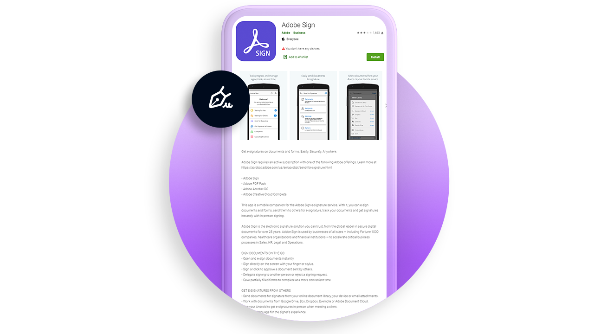

# Visão geral móvel

Envie documentos para assinatura, monitore o progresso das assinaturas eletrônicas e receba atualizações em tempo real diretamente no dispositivo móvel.

<table style="table-layout:fixed">
<tr>
  <td>
    
    

    <a href="liquidmode.md"><strong>Liquid Mode no Acrobat Sign</strong></a>
    

    <em>Saiba como o Liquid Mode melhora a experiência de assinatura em dispositivos móveis</em>
     
  </td>
  <td>
    
    

    <a href="https://itunes.apple.com/br/app/adobe-sign/id481082197?mt=8" target="_blank"><strong>Baixar o aplicativo Acrobat Sign Mobile para iOS</strong></a>
     
  </td>
  <td>
    
    

    <a href="https://play.google.com/store/apps/details?id=com.adobe.echosign&amp;hl=pt_BR" target="_blank"><strong>Baixar o aplicativo Acrobat Sign Mobile para Android</strong></a>
     
  </td>
  <td>
    
    

     
  </td>
</tr>
</table>
