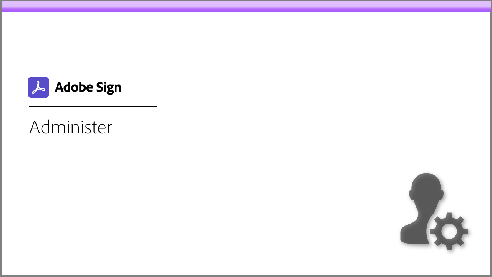

# Tutoriais do Acrobat Sign

O Acrobat Sign, uma solução da Adobe Document Cloud, é dimensionável para atender às necessidades da sua organização com integrações, APIs, autenticação avançada, recursos administrativos adicionais e muito mais. Aqui você encontra uma ampla variedade de experiências de aprendizado projetadas para atualizar rapidamente iniciantes e administradores no Acrobat Sign.

## Caminhos de aprendizado

<table style="table-layout:fixed">
<tr>
  <td>
    
  </td>
  <td>
    
  </td>  
  <td>
    
  </td>
  <td>
    
  </td>
</tr>
<tr>
  <td>
    
  </td>
  <td>
    
  </td>
  <td>
    
  </td>
   <td>
    
  </td>
</tr>
<tr>
  <td>
    
  </td>  
</tr>
</table>
