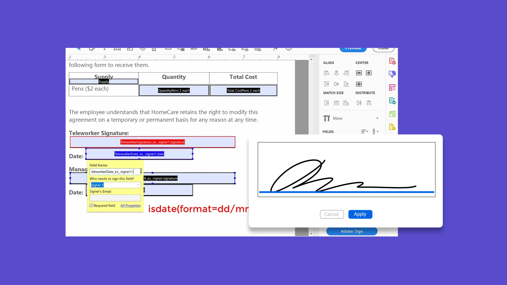

# Marcação de texto do Acrobat Sign

Neste webinar gravado (sem registro necessário), saiba como criar campos de formulário do Acrobat Sign com tags de texto usando o Adobe Acrobat. A marcação de texto reduz significativamente o tempo necessário para criar e revisar documentos com vários campos de formulário. Os remetentes de documentos não precisam inserir campos individuais em todos os documentos, o que economiza tempo de forma significativa. Outros benefícios incluem validação de campo de formulário (coleta de dados precisa e sem erros) e consistência de design de formulário profissional. Sinta-se à vontade para nos enviar suas perguntas durante o webinar através do pod de Perguntas e Respostas. Clique na imagem abaixo para começar a assistir à gravação.

[Assistir ao webinar gravado de Marcação de Texto do Acrobat Sign](https://event.on24.com/wcc/r/2338276/415BE4603F60A61A546C0A91528B444F)

>[!TIP]
>
>Este vídeo faz parte das playlists [Tarefas Avançadas para Usuários](https://experienceleague.adobe.com/pt-br/playlists/acrobat-sign-get-started-business-users) e [Tarefas Avançadas para Administradores](https://experienceleague.adobe.com/pt-br/playlists/acrobat-sign-perform-advanced-tasks-administrators), disponíveis gratuitamente no Experience League!
