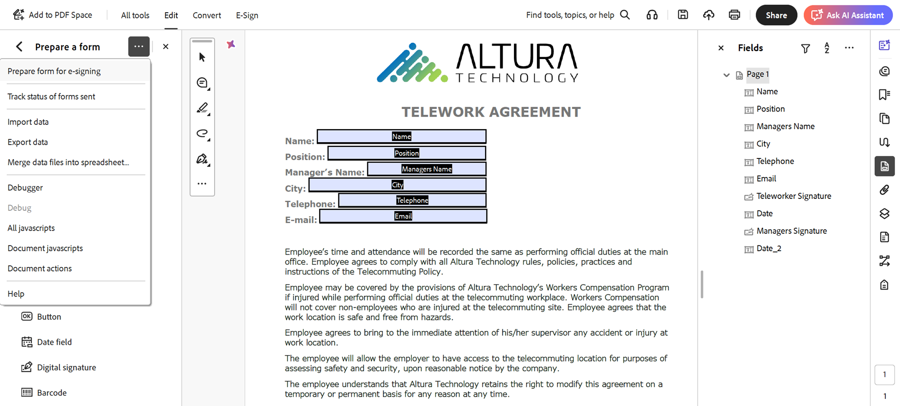

# Marcação de texto do Acrobat Sign

Saiba como criar campos de formulário do Acrobat Sign com tags de texto. As tags de texto podem ser adicionadas diretamente às ferramentas de criação, como Microsoft Word, Adobe InDesign ou se você tiver um PDF no Acrobat. Eles podem reduzir significativamente o esforço envolvido na preparação de documentos usados no Acrobat Sign. Depois de fazer upload de um documento marcado no Acrobat Sign, ele pode ser configurado como um modelo, eliminando a necessidade de adicionar campos aos documentos.

## Introdução

Tags de texto são partes de texto formatadas de maneira exclusiva, colocadas em qualquer lugar de um documento
reconhecidos automaticamente como campos quando carregados no Acrobat Sign.

    

As tags de texto podem ser adicionadas diretamente às ferramentas de criação, como Microsoft Word, Adobe InDesign ou
você tem um PDF — Acrobat. As tags de texto reduzem significativamente o esforço de preparação
documentos usados no Acrobat Sign.

## Adicionar tags no Microsoft Word

Para adicionar tags de texto a um documento do Microsoft Word, confira este [tutorial em vídeo](text-tagging-word.md).

## Adicionar tags no Acrobat

O Adobe Acrobat tem um ambiente robusto de criação de formulários com a função arrastar e soltar. Aplicar tags de texto no Acrobat permite que você aproveite os recursos adicionais disponíveis no Acrobat Sign.

1. Abra o formulário no Acrobat.

1. Selecione **[!UICONTROL Preparar um formulário]** no painel **[!UICONTROL Todas as ferramentas]**.

1. Selecione **[!UICONTROL Criar formulário]**.

1. Selecione **[!UICONTROL Preparar formulário para assinatura eletrônica]** na lista suspensa do painel **[!UICONTROL Opções]**.

   

1. Selecione **[!UICONTROL Avançar]** para confirmar.

   

1. Clique duas vezes em um campo para abrir a caixa de diálogo **[!UICONTROL Propriedades]**.

   Use a sintaxe detalhada no [Guia de tags de texto do Acrobat Sign](https://helpx.adobe.com/br/sign/using/text-tag.html) para alterar o nome do campo do formulário.

1. Por exemplo, você pode digitar *OInt_es_:signer1:optinitials* no nome do campo para tornar um campo inicial opcional.

   

   Tags de texto são adicionadas ao nome do campo de formulário e, diferentemente da sintaxe que você usaria no Microsoft Word (ou outras ferramentas de criação), as chaves não são incluídas.

   Tags de texto também podem ser adicionadas ao painel Campos simplesmente renomeando o campo de formulário.

   

1. Salve e feche o arquivo.

1. Faça upload do arquivo no Acrobat Sign e crie um modelo reutilizável conforme descrito na próxima seção.

## Criar um modelo reutilizável

Depois de criar um documento marcado, configure-o como um modelo reutilizável, eliminando a necessidade de adicionar campos aos documentos.

Para criar um modelo reutilizável, confira este [tutorial em vídeo](../sign-advanced-users/create-a-template.md).
