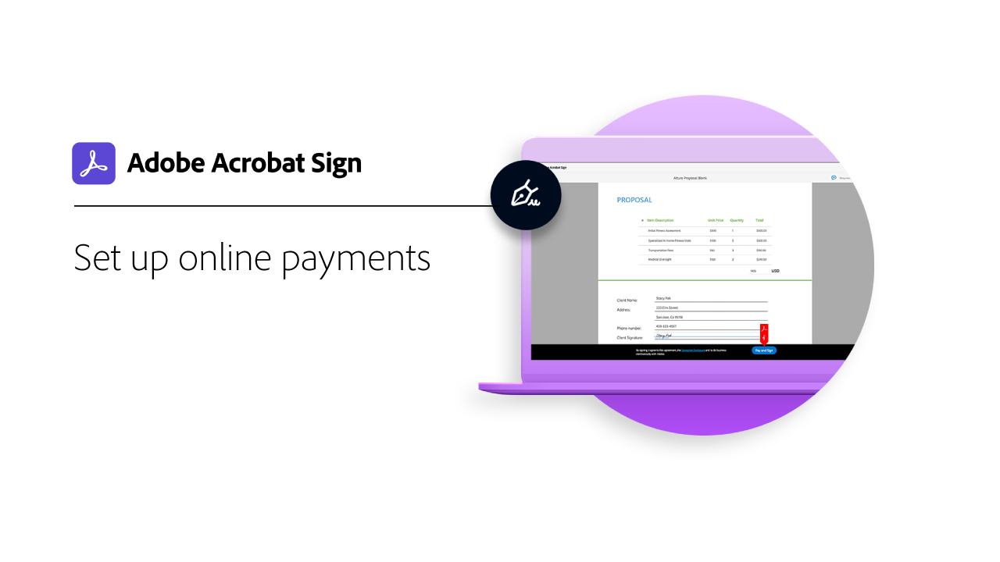

# Visão geral de tarefas avançadas

Saiba como enviar um documento para assinatura a centenas de destinatários ao mesmo tempo, configurar um documento pronto para assinatura para seu site, gerenciar transações de assinatura e criar e gerenciar modelos de documento. Esses tutoriais são para qualquer pessoa que já esteja familiarizada com os conceitos básicos de envio e solicitação de assinaturas e queira aprender mais maneiras do Acrobat Sign trabalhar para elas.

## Novidades

* [Envio em massa](megasign.md)
Saiba como coletar milhares de assinaturas de uma só vez para qualquer documento em poucas etapas
* [Métodos de autenticação no Acrobat Sign](authentication-methods.md)
Saiba mais sobre a variedade de métodos disponíveis no Acrobat Sign para autenticar a identidade de alguém que assina um documento

## Enviar

<table style="table-layout:fixed">
<tr>
  <td>
    
    

    <a href="setting-up-routing.md"><strong>Configurando a ordem de assinatura</strong></a>
    

    <em>Configurar a ordem de assinatura para vários signatários</em>
     
  </td>
  <td>
      
    

    <a href="delegate-signature.md"><strong>Uso da função de delegador</strong></a>
    

    <em>Use a função de delegador para enviar um documento para um intermediário que pode encaminhar o documento para assinatura</em>
     
  </td>
  <td>
    
    

    <a href="add-an-approver.md"><strong>Usando a função de aprovador</strong></a>
    

    <em>Adicionar uma função de aprovador ao seu processo de aprovação de contrato</em>
     
  </td>
  <td>
    
    

    <a href="authentication-methods.md"><strong>Métodos de autenticação no Acrobat Sign</strong></a>
    

    <em>Conheça a variedade de métodos de autenticação de identidade disponíveis no Acrobat Sign</em>
     
  </td>
</tr>
<tr>
  <td>
      
      

      <a href="manage-form-data.md"><strong>Gerenciar dados de formulário</strong></a>
      

      <em>Saiba como consolidar dados de formulário de seus documentos</em>
       
    </td>
  <td>
    
    

    <a href="set-up-online-payments.md"><strong>Configurar pagamentos online</strong></a>
    

    <em>Saiba como configurar e aceitar pagamentos online em seus documentos</em>
     
  </td>
  <td>
      
      

      <a href="megasign.md"><strong>Envio em massa</strong></a>
      

      <em>Colete milhares de assinaturas de uma só vez para qualquer documento em poucas etapas</em>
       
  </td>
 <td>
      
      

      <a href="webform.md"><strong>Criar um formulário da Web</strong></a>
      

      <em>Saiba como criar um documento que pode ser assinado eletronicamente diretamente no seu site</em>
       
  </td>
</tr>
<tr>
  <td>
      
      

      <a href="adobe-sign-text-tagging.md"><strong>Marcação de texto do Acrobat Sign</strong></a>
      

      <em>Criar campos de formulário do Acrobat Sign com marcação de texto usando o Adobe Acrobat</em>
       
    </td>
  <td>
    
    

    <a href="text-tagging-word.md"><strong>Usar tags de texto no [!DNL Microsoft Word]</strong></a>
    

    <em>Saiba como criar um modelo de documento reutilizável adicionando tags de texto do Acrobat Sign em [!DNL Microsoft Word]</em>
     
  </td>
  <td>
    
    

     
  </td>
  <td>
    
    

     
  </td>
</tr>
</table>

## Gerenciar

<table style="table-layout:fixed">
<tr>
<td>
    
    

    <a href="creating-a-report.md"><strong>Criação de um relatório</strong></a>
    

    <em>Saiba como criar seus próprios relatórios para ter visibilidade sobre o processo de assinatura do documento</em>
     
  </td>
  <td>
    
    

    <a href="edit-a-template.md"><strong>Gerenciar modelos de documento</strong></a>
    

    <em>Editar ou excluir um modelo da sua biblioteca</em>
     
  </td>
  <td>
    
    

    <a href="modify-webform.md"><strong>Modificar um formulário web existente</strong></a>
    

    <em>Saiba como desativar, editar e reativar um formulário web existente</em>
     
  </td>  
  <td>
    
    

    <a href="manage-webform-data.md"><strong>Gerenciamento de dados de formulários da Web</strong></a>
    

    <em>Saiba como rastrear, gerenciar e exportar dados de um formulário da Web</em>
     
  </td>  
</tr>
</table>