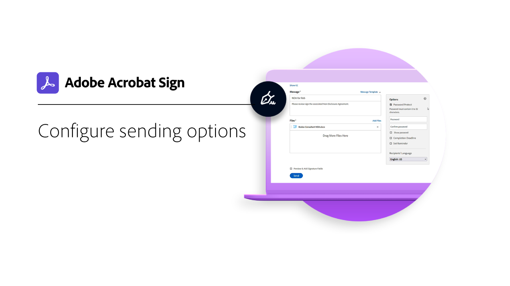
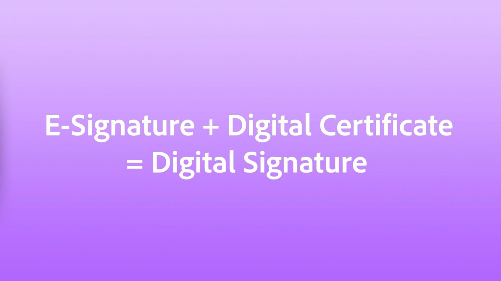

# Visão geral de introdução

Saiba como enviar, assinar e monitorar documentos com estes breves tutoriais passo a passo. Faça um tour rápido pelo Acrobat Sign e comece a enviar um documento para uma ou mais pessoas. Esse conteúdo foi desenvolvido para facilitar os fluxos de trabalho de assinatura eletrônica.

## Novidades

>[!BEGINTABS]

>[!TAB Introdução ao Acrobat Sign]

É novo no uso do Acrobat Sign? Este [tutorial](new-sender.md)) é um ótimo lugar para começar.

>[!TAB Definir prazos e lembretes]

Saiba como enviar [lembretes e prazos](set-deadlines-reminders.md) por email regulares para ajudar a obter a assinatura rápida de seus documentos.

>[!ENDTABS]

## Enviar

<table style="table-layout:fixed">
<tr>
 <td>
    
    

    <a href="quick-tour.md"><strong>Noções básicas do espaço de trabalho</strong></a>
    

    <em>Faça um tour rápido pelo espaço de trabalho do Acrobat Sign para começar a trabalhar</em>
     
  </td>
  <td>
    
    

    <a href="new-sender.md"><strong>Introdução ao Acrobat Sign</strong></a>
    

    <em>Este tutorial abrangente é um ótimo lugar para começar para novos remetentes no Acrobat Sign</em>
     
  </td>
  <td>
    
    

    <a href="send-to-single-recipient.md"><strong>Enviando para um único destinatário</strong></a>
    

    <em>Entre e saiba como é fácil enviar um documento para assinatura</em>
     
  </td>
  <td>
    
    

    <a href="send-to-multiple-recipients.md"><strong>Envio para vários destinatários</strong></a>
    

    <em>Envie um documento para assinatura eletrônica a mais de uma pessoa exatamente na ordem desejada</em>
     
  </td>
</tr>
<tr>
  <td>
    
    

    <a href="sending-options.md"><strong>Configurar opções de envio</strong></a>
    

    <em>Saiba como configurar várias opções ao enviar um documento para assinatura</em>
     
  </td>
  <td>
    
    

    <a href="adding-fields.md"><strong>Adicionando campos aos documentos</strong></a>
    

    <em>Saiba como adicionar diferentes tipos de campos aos documentos</em>
     
  </td>
  <td>
    
    

    <a href="modify-in-flight.md"><strong>Modificando um documento após o envio</strong></a>
    

    <em>Modificar um documento que já está em andamento</em>
     
  </td>
  <td>
    
    

    <a href="replace-signer.md"><strong>Substituindo um signatário</strong></a>
    

    <em>Saiba como alterar o signatário de um documento que já está em andamento</em>
      
  </td>
</tr>
<tr>
  <td>
      
      

      <a href="set-deadlines-reminders.md"><strong>Definir prazos e lembretes</strong></a>
      

      <em>Saiba como enviar lembretes de email regulares e prazos finais para ajudar a assinar seus documentos rapidamente</em>
       
    </td> 
  <td>
      
      

       
    </td>
    <td>
      
      

       
    </td>
    <td>
      
      

       
    </td>
</tr>
</table>

## Assinar

<table style="table-layout:fixed">
<tr>
  <td>
    
    

    <a href="electronically-sign-a-document.md"><strong>Assinar um documento eletronicamente</strong></a>
    

    <em>Saiba como é fácil assinar um documento enviado para você com o Acrobat Sign</em>
     
  </td>
  <td>
    
    

    <a href="fill-and-sign.md"><strong>Preencher e assinar um documento</strong></a>
    

    <em>Preencha formulários e adicione sua assinatura eletrônica aos documentos</em>
     
  </td>
  <td>
    
    

    <a href="sign-in-person.md"><strong>Obtendo uma assinatura presencialmente</strong></a>
    

    <em>Obtenha a assinatura de outra pessoa usando o aplicativo Acrobat Sign para dispositivos móveis</em>
     
  </td>
  <td>
    
    

    <a href="delegate-signing.md"><strong>Delegar assinatura para outra pessoa</strong></a>
    

    <em>Saiba como delegar a assinatura de um documento a outra pessoa</em>
     
  </td>
</tr>
<tr>
  <td>
    
    

    <a href="sign-with-a-digital-signature.md"><strong>O que é uma assinatura digital</strong></a>
    

    <em>Saiba mais sobre assinaturas digitais baseadas em certificado</em>
     
  </td>
  <td>
    
    

    <a href="sign-with-a-stamp.md"><strong>Assinatura usando um carimbo</strong></a>
    

    <em>Usar carimbos para marcar um documento aprovado ou concluído</em>
      
  </td> 
 <td>
    
    

     
  </td>
  <td>
    
    

     
  </td>
</tr>  
</table>

## Gerenciar

<table style="table-layout:fixed">
<tr>
  <td>
    
    

    <a href="manage-and-track.md"><strong>Gerenciar e monitorar seus contratos</strong></a>
    

    <em>Saiba como gerenciar e rastrear contratos enviados para assinatura</em>
     
  </td>
  <td>
    
    

    <a href="../sign-advanced-users/create-a-template.md"><strong>Criando um modelo de documento</strong></a>
    

    <em>Crie um modelo de documento reutilizável para fornecer velocidade e consistência à sua organização</em>
     
  </td>
  <td>
    
    

     
  </td>
  <td>
    
    

     
  </td>
</tr>
</table>
