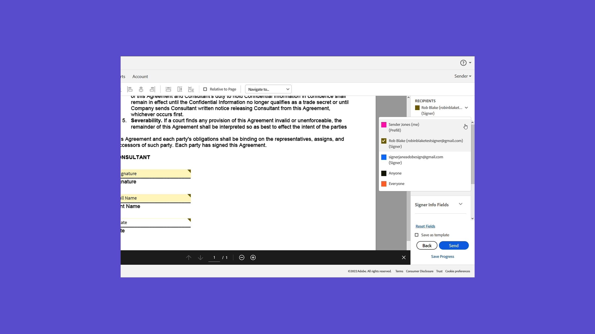
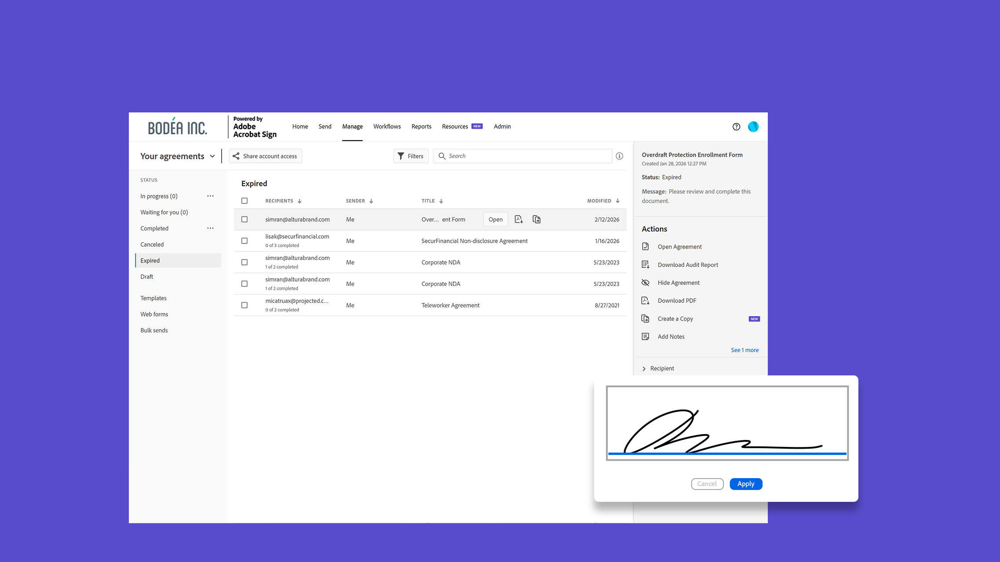
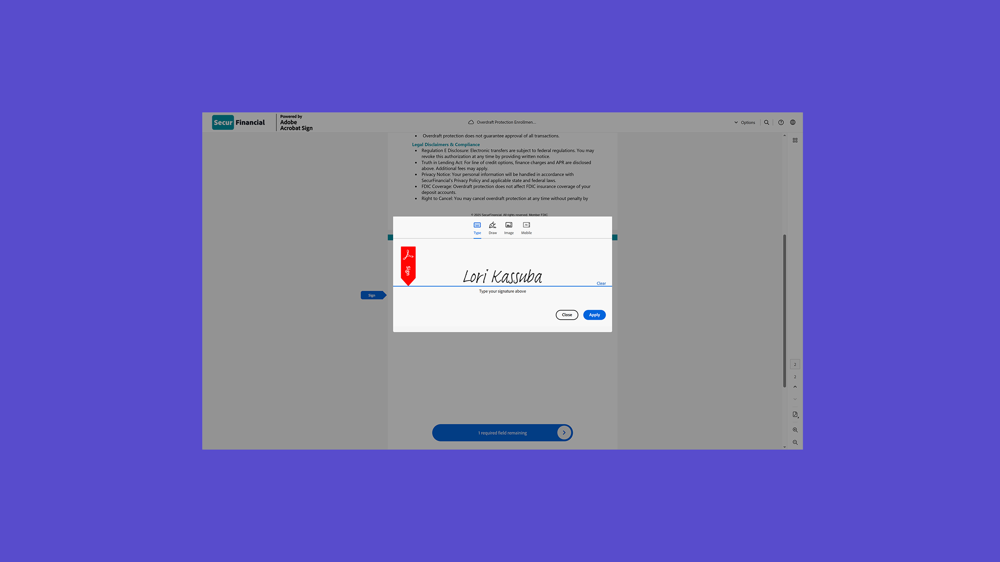

# Visão geral de introdução

Saiba como enviar, assinar e monitorar documentos com estes breves tutoriais passo a passo. Faça um tour rápido pelo Acrobat Sign e comece a enviar um documento para uma ou mais pessoas. Esse conteúdo foi desenvolvido para facilitar os fluxos de trabalho de assinatura eletrônica.

## Novidades

>[!BEGINTABS]

>[!TAB Quando usar Criar uma cópia]

Saiba como usar o [Criar uma cópia](../sign-beginner-tutorials/create-a-copy.md) para duplicar qualquer contrato existente. Você pode ajustar o que precisa ser alterado e reenviá-lo em segundos. Não recriar do zero.

>[!TAB Modificar um documento após enviar]

Saiba como [modificar um documento](../sign-beginner-tutorials/manage-and-track.md) que já foi enviado para assinatura.

>[!TAB Gerenciar e monitorar contratos]

Saiba como [gerenciar e rastrear contratos](../sign-beginner-tutorials/manage-and-track.md) enviados para assinatura.

>[!TAB Assinar um documento eletronicamente]

Saiba como é fácil [assinar](../sign-beginner-tutorials/electronically-sign-a-document.md) um documento que é enviado para você com o Acrobat Sign.

>[!ENDTABS]

## Enviar

<table style="table-layout:fixed">
<tr>
  <td>
    
    

    <a href="new-sender.md"><strong>Introdução ao Acrobat Sign</strong></a>
    

    Este tutorial é um ótimo ponto de partida para os novos usuários do Acrobat Sign
     
  </td>
 <td>
    
    

    <a href="quick-tour.md"><strong>Noções básicas do espaço de trabalho</strong></a>
    

    Faça um tour rápido pelo espaço de trabalho do Acrobat Sign para começar a usar o produto
     
  </td>
  <td>
    
    

    <a href="send-to-single-recipient.md"><strong>Enviar um documento para um signatário único</strong></a>
    

    Aprenda como é fácil enviar um documento para assinatura
     
  </td>
  <td>
    
    

    <a href="send-to-multiple-recipients.md"><strong>Enviar para vários signatários</strong></a>
    

    Envie um documento para assinatura eletrônica para mais de uma pessoa exatamente na ordem desejada
     
  </td>
</tr>
<tr>
  <td>
    
    

    <a href="sending-options.md"><strong>Configurar opções de envio</strong></a>
    

    Aprenda como configurar várias opções ao enviar um documento para assinatura
     
  </td>
  <td>
    
    

    <a href="adding-fields.md"><strong>Adicionando campos aos documentos</strong></a>
    

    Saiba como adicionar diferentes tipos de campos aos documentos
     
  </td>
  <td>
    
    

    <a href="modify-in-flight.md"><strong>Modificar um documento após enviar</strong></a>
    

    Saiba como modificar um documento que já está em andamento
     
  </td>
  <td>
    
    

    <a href="replace-signer.md"><strong>Substituindo um signatário</strong></a>
    

    Saiba como alterar o signatário de um documento que já está em andamento
      
  </td>
</tr>
<tr>
  <td>
      
      

      <a href="set-deadlines-reminders.md"><strong>Definir prazos e lembretes</strong></a>
      

      Saiba como enviar lembretes e prazos regulares por email para ajudar a assinar seus documentos rapidamente
       
    </td> 
  <td>
    
    

    <a href="../sign-advanced-users/create-a-template.md"><strong>Criar um modelo reutilizável</strong></a>
    

    Crie um modelo de documento reutilizável para proporcionar agilidade e consistência à sua organização
     
  </td>
  <td>
     
    

    <a href="checkbox-groups.md"><strong>Guiar seleções necessárias com grupos de caixas de seleção</strong></a>
    

    Saiba como usar grupos de caixas de seleção para controlar quantas opções um signatário pode selecionar em um formulário
     
    </td>
  <td>
     
    

    <a href="create-a-copy.md"><strong>Quando usar Criar uma cópia</strong></a>
    

    Saiba como usar Criar uma cópia para duplicar qualquer contrato existente
     
    </td>
</tr>
</table>

## Assinar

<table style="table-layout:fixed">
<tr>
  <td>
    
    

    <a href="electronically-sign-a-document.md"><strong>Assinar um documento eletronicamente</strong></a>
    

    Aprenda como é fácil assinar um documento enviado a você com o Acrobat Sign
     
  </td>
  <td>
    
    

    <a href="fill-and-sign.md"><strong>Preencher e assinar um documento</strong></a>
    

    Preencha formulários e adicione sua assinatura eletrônica aos documentos
     
  </td>
  <td>
    
    

    <a href="sign-in-person.md"><strong>Obtendo uma assinatura presencialmente</strong></a>
    

    Obtenha a assinatura de outra pessoa usando o aplicativo Acrobat Sign para dispositivos móveis
     
  </td>
  <td>
    
    

    <a href="delegate-signing.md"><strong>Delegar assinatura para outra pessoa</strong></a>
    

    Saiba como delegar a assinatura de um documento a outra pessoa
     
  </td>
</tr>
<tr>
  <td>
    
    

    <a href="sign-with-a-digital-signature.md"><strong>O que é uma assinatura digital</strong></a>
    

    Saiba mais sobre assinaturas digitais com base em certificado
     
  </td>
  <td>
    
    

    <a href="sign-with-a-stamp.md"><strong>Assinatura usando um carimbo</strong></a>
    

    Usar carimbos para marcar um documento aprovado ou concluído
      
  </td> 
 <td>
    
    

     
  </td>
  <td>
    
    

     
  </td>
</tr>  
</table>

## Gerenciar

<table style="table-layout:fixed">
<tr>
  <td>
    
    

    <a href="manage-and-track.md"><strong>Gerenciar e monitorar seus contratos</strong></a>
    

    Aprenda como gerenciar e acompanhar contratos enviados para assinatura
     
  </td>
  <td>
    
    

     
  </td>
  <td>
    
    

     
  </td>
  <td>
    
    

     
  </td>
</tr>
</table>
